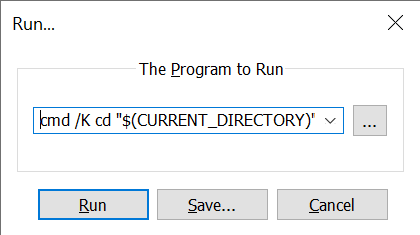
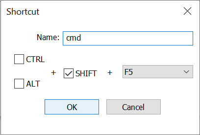

# Installatie

Voor deze cursus heb je **Python** nodig en een **editor**. Hieronder staan verschillende opties om de benodigdheden te installeren.

## Problemen?

Heb je problemen met de installatie:

- check dan bij de assistenten en je docent
- ga naar de laptophelpdesk, dinsdag en donderdag 12:00--13:00 in B1.27A
- als niks helpt, neem dan **direct** contact op via <mailto:python@proglab.nl>

Een mislukte installatie is géén reden voor een uitzondering op de deadlines!

## Python

-   Als je **Ubuntu** gebruikt, dan heb je mogelijk al een oude versie van Python. Check dit door in een terminal het commando `python3 -V` te geven. Waarschijnlijk heb je dan Python 3.10 of lager. Installeer daarom de nieuwste versie via de "deadsnakes" software repository:

        sudo apt update
        sudo add-apt-repository ppa:deadsnakes/ppa
        sudo apt install python3.12 python3.12-distutils

-   Als je met **macOS** werkt, dan heb je waarschijnlijk al Python. Check dit door in een terminal het commando `python3 -V` te geven. Misschien heb je Python 3.10 of eerder. In dat geval is het aan te raden een nieuwe versie te installeren, en liefst Python 3.11.

    Als je gaat installeren, doe dit dan door op de Python-homepage een Python installer te downloaden en uit te voeren: <https://www.python.org/downloads/>. Hiermee heb je meteen de nieuwste versie.

-   Als je met **Windows** werkt, dan heb je misschien al Python. Check dit door in de command prompt (`cmd.exe`) het commando `python -V` te geven. Misschien heb je Python 3.10 of eerder. In dat geval is het aan te raden een nieuwe versie te installeren, en liefst Python 3.11.

    Als je gaat installeren, doe dit dan door op de Python-homepage een Python installer te downloaden en uit te voeren: <https://www.python.org/downloads/>. Hiermee heb je meteen de nieuwste versie.
    
    **Kies "Add python to PATH" tijdens de eerste stap van de installatie.**

## Een simpele editor

Voor beginnende programmeurs is het **niet** aan te raden om te werken met Visual Studio Code. Dat komt omdat VSCode veel automatische tools installeert om jou het leven "makkelijk" te maken. Maar als je niet begrijpt wat er gebeurt, dan helpt het niet. Ook kan het je hinderen in het leren programmeren.

Laat je dus vooral niet verleiden door iemand die het wel even voor je instelt, en gebruik tools die je goed begrijpt, zodat je je lekker kan richten op waar het om gaat :-)

Daarom is de beste aanrader voor beginners om een goede, maar simpele editor te gebruiken. Voor elk besturingssysteem zijn er diverse opties, maar we geven er hier ééntje.

-   Als je **Ubuntu** gebruikt, dan is Notepadqq een goede optie. Installeer deze via:

        sudo apt update
        sudo apt install notepadqq

-   Als je **macOS** gebruikt, dan is Textmate een goede optie. Installeer deze via de website <https://macromates.com>.

    -   Als je een redelijk nieuwe Mac hebt, installeer dan ook Rosetta, zodat de tools die bij Textmate bijgeleverd zijn goed werken. Gebruik het commando `softwareupdate --install-rosetta` in de Terminal.

    -   Heb je je programmeer-directory geopend in Textmate? Druk dan op **ctrl-shift-O** (letter, niet cijfer) om een terminal te openen. Dan sta je direct op de juiste plek om je programma te runnen met `python3 programma.py`.

-   Als je **Windows** gebruikt, dan is Notepad++ een goede optie. Installeer deze via de website <https://notepad-plus-plus.org>.

    Zodra je Notepad++ hebt gestart kun je een commando toevoegen om de "command line" te openen waarmee je Python kunt runnen.
    
    1. Druk op F5 (of kies menu Run->Run)
    
    2. Tik het commando in: `cmd /K cd "$(CURRENT_DIRECTORY)"`
    
        
    
    3. Druk niet op Run maar op Save...
    
    4. Geef de naam `cmd` en kies SHIFT + F5 als shortcut om de command line te openen.

        

    5. Sluit het Run-venster en dan kun je SHIFT+F5 intikken. Vanuit het opdrachtvenster kun je Python starten via `py jouwprogramma.py`.

Maak in alle gevallen een speciale directory om aan je Python-opdrachten te werken, liefst een directory die automatisch wordt gebackupt (Dropbox, Surfdrive, Onedrive, enz.). 
