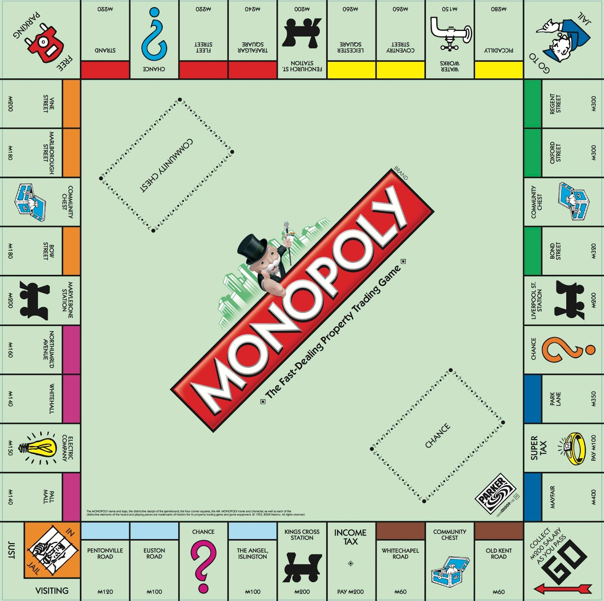
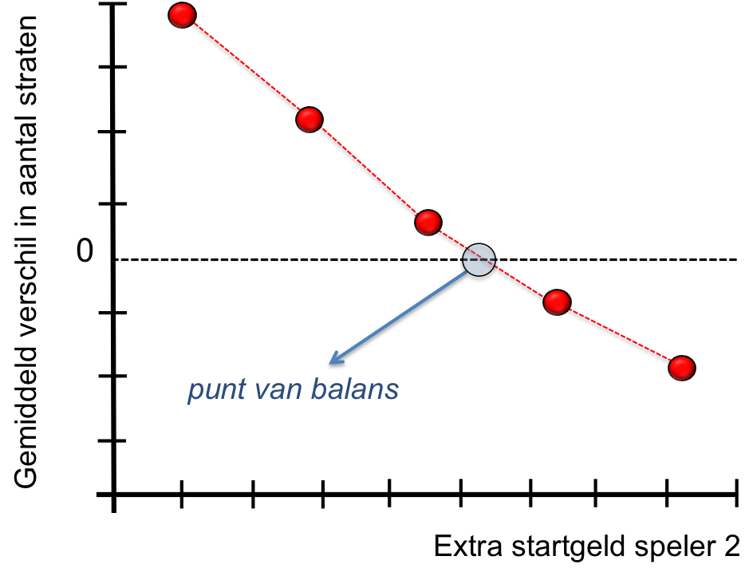

# Over Monopoly

> **Studeertip.** De challenges zijn alleen voor studenten die het vrij makkelijk vinden tot nu toe. Specifiek deze week heb je lijsten nodig, die eigenlijk nog niet tot de stof horen. Je kunt wel alvast kijken in je boek, hoofdstuk 7. Als je een challenge hebt gemaakt, klop dan bij het laptopcollege bij je docent aan om 'm door te spreken.

{:.inline}{: style="width:50%"}

Bij banken, verzekeraars en het centraal planbureau worden modellen opgesteld
die onze economie beschrijven. Alle facetten die een rol spelen krijgen een
plek en met behulp van een computer worden verschillende scenario's
doorgerekend (gesimuleerd) om zo risico's in te schatten bij bepaalde
gebeurtenissen of om het effect van nieuwe maatregelen te onderzoeken.

Door de onderlinge afhankelijkheid van de parameters in dat soort modellen
wordt het al snel ondoenlijk om het met de hand door te rekenen. Zeker als het
effect van maatregelen een random component heeft. Met behulp van een computer
gaat dat snel en kan je zelfs de settings vinden waarin je dingen kan
optimaliseren: dat kan het maximaliseren van je winstkansen zijn, maar ook het
minimaliseren van de kans dat je failliet gaat. Of een mix van die scenario's.

In deze module gaan we een simpel voorbeeld doorrekenen: Monopoly met twee
spelers, waarbij we stap voor stap meer complexiteit toevoegen. Voor degene die
de smaak te pakken heeft en nu al droomt van een baan op de risico-analyse-divisie van JP Morgan hebben we nog wat suggesties. Je kunt trouwens wiskunde gebruiken om Monopoly slimmer te spelen, door bijvoorbeeld te berekenen waar je het beste geld aan uit kan geven. [Deze video van Stand-up maths](https://www.youtube.com/watch?v=ubQXz5RBBtU&pp=ygUUbnVtcGVycGhpbGUgbW9ub3BvbHk%3D) legt uit hoe.

Twee dingen om alvast te weten voor je aan deze opdracht begint:

1.  Om goed te zien of je code werkt zul je vaak dingen printen. Erg handig, want het stelt je in staat te kijken of in elke nieuwe stap die je implementeert de 'logica' van je programma inderdaad zo werkt zoals jij het voor ogen had. Zodra je er eenmaal van overtuigd bent dat een bepaalde stap werkt kan je het print-statement weghalen. Dat is dan ook weer handig, want het printen kost veel tijd en is erg onoverzichtelijk voor uitgebreide simulaties.

2.  Deze module werkt toe naar een redelijk complexe simulatie van Monopoly. Om te zorgen dat je zelf de code goed begrijpt is het belangrijk om eenvoudig te beginnen en steeds een nieuwe component of laag van complexiteit toe te voegen aan het programma. Om de werkende code van elke opdracht te bewaren zullen we je bij elke nieuwe opdracht vragen het oude bestand op te slaan en in een nieuw bestand verder te gaan. De nieuwe opdracht, in een eigen bestand, is vaak een uitbreiding van de bestaande code tot dan toe.

## Deel 1: Donald Trump editie

Dit is vernoemd naar Donald Trump toen hij nog eindeloos veel geld leek te hebben.

Schrijf een programma dat een groot aantal potjes van een vereenvoudigde versie van het spel Monopoly simuleert.

    Monopoly simulator: 1 speler, Trump-mode
    We hebben 10,000 potjes gesimuleerd
    Gemiddeld duurde het XXX worpen voor de speler alle straten in zijn bezit had

### Achtergrond

We gaan een groot aantal potjes Monopoly simuleren waarin we 1 speler rond laten lopen en straten laten kopen. We spelen in de zogenaamde Trump-mode. De speler heeft oneindig veel geld, er is geen concurrentie. Doel van deze opdracht is om te bepalen wat het gemiddeld aantal worpen is
waarna *alle* straten zijn gekocht.

### Specificatie

- Maak een nieuw bestand genaamd `monopoly.py`

- Schrijf een functie `simuleer_groot_aantal_potjes_monopoly()` die een groot aantal potjes kan simuleren.

- De functie `simuleer_groot_aantal_potjes_monopoly()` heeft één argument:

	- `aantal_potjes` het aantal potjes dat gesimuleerd wordt

- De functie `simuleer_groot_aantal_potjes_monopoly(aantal_potjes)` moet het gemiddeld aantal worpen teruggeven dat nodig was om alle straten in je bezit te krijgen (via `return`).

### Dobbelstenen

Elke beurt in het spel begint met het gooien van twee dobbelstenen. Dat zijn dus twee random getallen tussen 1 en 6. Dat zouden we kunnen regelen met behulp van de `random()`-functie die we eerder hebben leren kennen, maar er wordt bij Python ook een speciale random-functie voor gehele getallen meegeleverd: `randint(start, end)`.

{: .language-python}
    import random
    dobbelsteen = random.randint(1, 6)

**Schrijf** een functie `worp_met_twee_dobbelstenen()` zonder parameters die een worp met twee dobbelstenen teruggeeft. In je code zou je deze functie als volgt willen gebruiken:

      resultaat = worp_met_twee_dobbelstenen()
      print(f"Totaal aantal ogen van twee dobbelstenen: {resultaat}")

**Schrijf** om te testen een functie `oefenen_met_de_dobbelstenen()` die duizend
worpen simuleert en voor elke worp steeds twee dobbelstenen gooit. Zorg dat op
het scherm voor elke worp het aantal ogen geprint wordt en maak duidelijk aan
de gebruiker als er een zogenaamde 'dubbel' gegooid wordt (het aantal ogen op
beide dobbelstenen is gelijk). Houd het aantal 'dubbelen' bij en print dat aan
het eind van het programma op het scherm.

{: .language-python}
    worp 1: totaal van 2 dobbelstenen =  5
    worp 2: totaal van 2 dobbelstenen =  9
    worp 3: totaal van 2 dobbelstenen = 10
            Yes, we hebben een dubbele: 5+5
    worp 4: ...
    worp 5: ...
    ..
    worp 1000: totaal van 2 dobbelstenen = 3

    print "Het percentage dubbele worpen = xx.xx procent"

Let op: de functie `oefenen_met_de_dobbelstenen()` heb je in de rest van de
opgave niet meer nodig. Je kunt hem in je programma laten staan of gewoon
helemaal weghalen.

### Rondlopen op een leeg bord

We beginnen nu onze simulatie door een nieuwe functie te definiëren:
`simuleer_potje_monopoly()` Deze functie zullen we langzaam uitbreiden tot we
een 'echt' potje Monopoly simuleren. We beginnen simpel door eerst een rondje
te lopen met één speler op een Monopolybord en steeds te kijken op welke
positie de speler zich bevindt.

Gooi steeds met twee dobbelstenen en hou bij op welk veld de speler staat.
Print dat op het scherm. Hierbij is "start" positie 0, de gevangenis positie 10
en de Kalverstraat positie 39.

    Na worp 1: positie 6
    Na worp 2: positie 9
    Na worp 3: positie 17
    Na worp 4: ...

Let op: zorg dat je positie altijd tussen de 0 en de 39 zit, ook al heb je
meerdere rondjes gemaakt. Positie 40 wordt dan dus positie 0, positie 41 wordt positie 1, etc.
Je zou hiervoor bijvoorbeeld de modulo (`%`) operator kunnen gebruiken die je kent uit module 1.

### Rondlopen op het 'echte' bord

Niet elke positie op het bord correspondeert met een bezitting (straat, station
of water/electriciteit). De hoekpunten van het bord zijn niet te koop en ook de
"Kans" en "Algemeen fonds" kaarten en de belastingen zijn niet te koop. Maak een
lijst van lengte 40, waarbij je voor elke positie op het bord laat zien welke
waarde aan de plek op het bord verbonden is.

{: .language-python}
    bord_waardes = [0, 60, 0, 60, 0, 200, 100, 0, 100, 120, 0, 140, 150, 140, 160, 200, 180, 0, 180, 200, 0, 220, 0, 220, 240, 200, 260, 260, 150, 280, 0, 300, 300, 0, 320, 200, 0, 350, 0, 400]

Als de waarde in de lijst gelijk is aan nul dan is dat een zogenaamd leeg veld (niet te koop).

Voor elke positie op het bord kan je dan het volgende uitprinten:

    Na worp 1: positie  6 (straat)
    Na worp 2: positie  9 (straat)
    Na worp 3: positie 17 (leeg)
    Na worp 4: ...

Implementeer dit in je programma.

### Rondlopen op het bord en kopen

We gaan nu de functie `simuleer_potje_monopoly()` uitbreiden zodat we ook
straten kunnen kopen en daarbij bijhouden welke straten er wel/niet zijn
verkocht. We beginnen daarmee door in de zogenaamde Donald Trump-mode over het
bord te stappen: we kunnen alles kopen, zijn de enige speler in het spel en we
wandelen net zo lang door tot we alles in ons bezit hebben. De vraag die we in
deze opdracht willen beantwoorden is de volgende: "hoe lang (hoeveel worpen)
duurt het voor we alle straten in ons bezit hebben?".

Het is hierbij cruciaal dat we bijhouden hoeveel straten (en welke) we al in
ons bezit hebben. Dit kunnen we doen met behulp van een lijst (weer lengte 40)
waarbij je voor elke plek op het bord bijhoudt of deze in het bezit is van de
speler. Die lijst begint als een lijst met 40 nullen.

{: .language-python}
    bezittingen = [0, 0, 0, 0, ....., 0, 0]

Elke keer als je op een nieuwe positie komt dan kun je nagaan:

- is er op die positie iets te koop: straat, station, water/electriciteit ?
- zo ja, is het nog 'op de markt'?

Als je bijvoorbeeld na één worp op plek 3 komt en Whitechapel Road koopt (of
Brink, in de Nederlandse versie) dan kun je je lijst met bezittingen updaten.
Meteen daarna ziet de lijst er zo uit:

{: .language-python}
    bezittingen = [0, 0, 1, 0, ....., 0, 0]

Als er op de positie niks te koop is of als je de straat al in je bezit hebt
dan gooien we gewoon opnieuw en wandelen we verder. Zorg dat je na elke worp
waarbij je op een veld komt dat nog te koop is het op het scherm geprint wordt
en ook gelijk hoeveel velden je in totaal in je bezit hebt na die aankoop.

    Na worp 1: positie 3 (straat).
               speler 1 heeft 1 huis in zijn/haar bezit. Er staan nu nog 27 velden te koop.

Omdat je weet hoeveel straten er in totaal te koop zijn in het spel weet je nu ook wanneer je alle straten in je bezit hebt. Stop met gooien als dat gebeurt en print op het scherm hoeveel beurten je nodig had.

### Rapporteer het resultaat

Zorg nu dat de functie `simuleer_potje_monopoly()` na afloop het **aantal
worpen** teruggeeft waarbij het potje afgelopen was. Je zou het ook direct
kunnen `print`en in de functie, maar dat is niet de bedoeling! Verderop in de
opgave gaan we namelijk een groot aantal potjes Monopoly simuleren en dan
willen we niet dat bij elke simulatie een printje verschijnt. Gebruik `return`
dus.

In je code moet het dus als volgt werken:

{: .language-python}

    aantal_worpen = simuleer_potje_monopoly()
    print(f"Klaar! Na worp {aantal_worpen} had de speler alle straten in zijn bezit")

### Meerdere potjes en gemiddeld aantal worpen

We hebben met de functie `simuleer_potje_monopoly()` nu de mogelijkheid om een enkel potje Monopoly te simuleren. Als je dit een paar keer doet zul je zien dat het aantal worpen dat je nodig hebt om alle straten in je bezit te krijgen sterk varieert omdat je aan het eind van het spel natuurlijk maar net op dat laatste overgebleven vakje terecht moet komen. Het doel van deze opdracht is om uit te zoeken hoeveel worpen de speler *gemiddeld* nodig zou hebben om alle velden in zijn bezit te krijgen. Om deze vraag te beantwoorden zullen we een groot aantal potjes moeten simuleren.

Schrijf een functie `simuleer_groot_aantal_potjes_monopoly(aantal_potjes)` die een groot aantal potjes kan simuleren door steeds de functie `simuleer_potje_monopoly()` aan te roepen:

    for potje in range(0, aantal_potjes):
        aantal_worpen = simuleer_potje_monopoly()

1.  Begin met 1 potje en voer dat dan op naar 2, 10 en uiteindelijk naar 10,000 als je er zeker van bent dat je programma goed werkt.

2.  Hou voor elk potje bij (in een lijst) hoeveel worpen er nodig waren om alle straten in bezit te krijgen.

3.  Maak een grafiek (histogram) van die lijst als alle potjes gesimuleerd zijn.

4.  Bepaal dan ook het gemiddeld aantal worpen dat nodig was om alle straten in bezit te krijgen en print het resultaat op het scherm, in het format dat aan het begin van de opgave gespecificeerd was:

        Monopoly simulator: 1 speler, Trump-mode
        We hebben 10,000 potjes gesimuleerd
        Gemiddeld duurde het XXX worpen voor de speler alle straten in zijn bezit had

Tip: als je een groot aantal potjes simuleert is het handig als het programma laat zien waar het mee bezig is. Aan de andere kant moet er niet teveel informatie over het scherm scrollen. Een manier om dat op te lossen is bijvoorbeeld door elke 500 potjes even naar het scherm te printen dat je nu Monopoly-potje X van in totaal Y potjes aan het simuleren bent.

### En dan: de uitkomst teruggeven

Zorg tot slot dat de functie `simuleer_groot_aantal_potjes_monopoly(aantal_potjes)` het gemiddeld aantal worpen teruggeeft dat nodig was om alle straten in je bezit te krijgen (via `return`).

### Testen

Lever je opdracht nu in om de tussenresultaten te checken. Maak voor het inleveren alvast een lege file `monopoly_realistisch.py`. Deze ga je pas later gebruiken maar het is noodzakelijk deze alvast in te leveren.

## Opdracht 2: Startgeld toevoegen

{:.inline}{: style="width:20%"}

In een officieel potje Monopoly krijg je 1500 euro startgeld en verdien je 200 euro
elke keer dat je START passeert (dus niet alleen als je precies op start komt). Zo'n eindige hoeveelheid startgeld heeft invloed op de snelheid waarmee je nieuwe straten kan kopen. In deze opdracht zoeken we uit welk effect dit precies heeft.

**Let op:** we gaan nu een aanpassing aan de bestaande code maken uit opdracht 1; een uitbreiding. Je hoeft dus geen nieuw bestand aan te maken en aan het eind van deze opdracht lever je de code `monopoly.py` in. Die bevat dus opdracht 1 en 2 tegelijk.

Pas in je nieuwe programma de functie `simuleer_potje_monopoly()` zo aan dat je elk potje
begint met een bepaalde hoeveelheid startgeld en dat je gedurende het spel bijhoudt hoeveel geld je op elk moment hebt. Evalueer nu ook elke keer dat je op een veld terechtkomt die nog te koop staat of je wel genoeg geld heeft om het te kopen. De verwachting is dat je in een potje nu gemiddeld iets meer worpen nodig hebt om alle straten te kopen dan in opdracht 1 waarin geld geen rol speelde.

Voor een **enkel** potje ziet de code er dus ongeveer zo uit:

    aantal_worpen = simuleer_potje_monopoly(startgeld_speler)

Ook hier zullen we weer net als in opdracht 1 een groot aantal potjes simuleren. Zorg dat het startgeld van de speler meegeven wordt als inputwaarde: `simuleer_groot_aantal_potjes_monopoly(aantal_potjes, startgeld_speler)`. Deze functie zal dit startgeld op zijn beurt dan weer doorgeven aan de functie die een individueel potje simuleert.

Begin met 3000 euro startgeld en verlaag dat steeds met 500 euro: 2500, 2000, 1500, 1000, 500 tot 0 euro. Simuleer voor elke keuze van het startgeld 25000 potjes om zo nauwkeurig mogelijk het gemiddeld aantal worpen te bepalen dat nodig is om alle straten te kopen en print telkens je resultaten om te zien of ze logisch zijn.

In het officiële Monopolyspel krijgt elke speler 1500 euro. Print voor die specifieke
hoeveelheid startgeld het aantal worpen dat je nodig hebt om alle straten te kopen en
print dat als volgt op het scherm:

{: .language-python}
	Monopoly simulator: 1 speler, 1500 euro startgeld, 10,000 potjes
    Gemiddeld duurde het XXX worpen voor de speler alle straten in zijn bezit had

Gebruik het verschil tussen het gemiddeld aantal worpen met 1000 euro of 2000 euro startgeld om een idee te krijgen wat het effect is (aantal worpen dat het spel er korter/langer over doet) voor elke 100 euro meer of minder startgeld.

**Tips:**

   1. Je mag de hoeveelheid startgeld in deze opdracht steeds met de hand aanpassen.

   2. Je kan je code testen door de speler een enorme hoeveelheid startgeld mee te geven. Met een miljoen euro creëer je namelijk effectief eenzelfde situatie als in opdracht 1 waarin geld geen rol speelt.

### Testen

Lever je opdracht nu in om de tussenresultaten te checken.

## Deel 3: Twee spelers

In het echt wordt het spel Monopoly gespeeld door twee spelers. Doel van deze opdracht is om eerst te evalueren wat het voordeel is van de speler die begint met gooien en vervolgens te bestuderen hoe we in het spel dit nadeel voor speler 2 kunnen herstellen.

{:.inline}{: style="width:35%"}

Let op: we gaan nu de code uit opdracht 1 en 2 aanpassen. Om te zorgen dat die werkende code bewaard blijft gaan we deze opdracht maken in een nieuw bestand. Maak een nieuw Python-bestand aan, `monopoly_realistisch.py`, kopieer de code die je tot nu toe hebt en ga verder in dit nieuwe bestand.

### Voordeel van speler 1

Voeg eerst een tweede speler toe in je simulaties, laat beide spelers beginnen met 1500 euro startgeld en bepaal het verschil in aantal straten tussen speler 1 en speler 2 op het moment dat alle straten verkocht zijn. Dit verschil zal elk potje verschillen. Simuleer daarom 10,000 potjes om een goede schatting te krijgen van het gemiddelde verschil. Je zal zien dat speler 1 inderdaad een klein voordeel heeft op speler 2.

Het doel is om dit verschil te achterhalen door een groot aantal potjes te simuleren:
{: .language-python}
	Monopoly simulator: twee spelers, 1500 euro startgeld, 10,000 potjes
    Gemiddeld heeft speler 1 X.XX meer straten in bezit als alle straten verdeeld zijn

**Strategie:**

  - Aanpassing aan *input* functie `simuleer_potje_monopoly()`

    De functie die een potje Monopoly simuleert heeft nu natuurlijk van beide spelers de hoeveelheid startgeld nodig. Geef beide als input variabelen mee aan de functie:
   `simuleer_potje_Monopoly(startgeld_speler_1,startgeld_speler_2)`

 - Aanpassing aan *ouput* functie `simuleer_potje_monopoly()`

   Tot nu toe hebben we de functie gevraagd het aantal worpen dat het potje geduurd heeft terug te geven als return waarde. Nu zijn we alleen geïnteresseerd in het verschil in aantal straten tussen speler 1 en speler 2: `delta = aantal_straten_speler_1 - aantal_straten_speler_2`. Dat is dat ook de variabele die we terug gaan geven als return waarden. **Let op:** deze waarde kan nu zowel positief als negatief zijn.

       delta = simuleer_potje_monopoly(startgeld_speler_1,startgeld_speler_2)
       print 'Na dit potje had speler 1 %d meer straten dan speler 2' % (delta)

 - Bijhouden hoeveelheid geld en posities van beide spelers:

   Hou voor beide spelers de hoeveelheid geld en positie bij. In het begin van het spel bijvoorbeeld geldt voor de posities van de spelers: `positie_1 = 0` en `positie_2 = 0`, maar de dapperen onder jullie kunnen de posities ook bijhouden in lijsten zoals `positie_lijst = [0,0]`. Dezelfde twee opties heeft u bij de hoeveelheid geld dat speler1 en speler 2 heeft tijdens het spel. Standaard is twee losse variabelen, maar je mag ook lijsten gebruiken.

Test de code altijd voor een enkel potje en bekijk goed of het doet wat je denk dat het zou moeten doen. Ga pas dan het aantal potjes vergroten. Gebruik daarvoor weer dezelfde opzet als je had in de functie uit de eerste opdracht en geeft nu naast het aantal potjes ook het startgeld van beide spelers mee: `simuleer_groot_aantal_potjes_monopoly(aantal_potjes,startgeld_speler_1,startgeld_speler_2)` en zorg ervoor dat je de vraag kunt beantwoorden.

Print uiteindelijk het verschil naar het scherm:
{: .language-python}
	Monopoly simulator: twee spelers, 1500 euro startgeld, 10,000 potjes
    Gemiddeld heeft speler 1 X.XX meer straten in bezit als alle straten verdeeld zijn

### Nadeel van speler 2 repareren

De vraag is nu of en zo ja hoe we deze 'oneerlijke' situatie kunnen repareren. Een van de 'knoppen' waar je aan kan draaien in dit spel is de hoeveelheid startgeld die de spelers krijgen. Als speler 2 meer startgeld krijgt kan hij iets van zijn achterstand repareren. Bepaal de hoeveelheid extra startgeld die we aan speler 2 moeten geven aan het begin van het spel zodat hij gemiddeld net zoveel straten in zijn bezit heeft als speler 1 op het moment dat alle straten verdeeld zijn.

Definieer een nieuwe functie `evenwicht()` waarin je de functie `simuleer_groot_aantal_potjes_monopoly(aantal_potjes,startgeld_speler_1,startgeld_speler_2)`
steeds aanroept met verschillende waardes van startgeld voor speler 2. Speler 1 houdt gewoon 1500 euro startgeld. Probeer dit voor 'extra' geld voor speler 2 van 0, 50, 100, 150, 200 euro en print steeds het gemiddelde verschil als volgt op het scherm:

    Startgeld [1500,1550]: speler 1 gemiddeld X.XX meer straten (speler 2 heeft 50 euro extra)
    Startgeld [1500,1600]: speler 1 gemiddeld X.XX meer straten (speler 2 heeft 100 euro extra)
    Startgeld [1500,1650]: speler 1 gemiddeld X.XX meer straten (speler 2 heeft 150 euro extra)
    Startgeld [1500,1700]: speler 1 gemiddeld X.XX meer straten (speler 2 heeft 200 euro extra)

Als je een paar simulaties hebt gedraaid heb je een kleine data-set waarmee je bovenstaande grafiek kan reproduceren en een goede schatting kan maken van de hoeveelheid extra geld dat we speler 2 moeten geven aan het begin van het spel om het evenwicht te herstellen.

Er is natuurlijk een bedrag waarbij het voordeel ineens bij speler 2 komt te liggen. Gebruikt dat bedrag (en het bedrag ervoor) om een schatting te maken van het bedrag waar het evenwicht ligt. Neem zoals gezegd stappen van 50 en kies als schatting het bedrag wat exact tussen deze stappen van 50 in zit (dus als het tussen 0 en 50 ligt is het bedrag 25).

**Let op dat je voor je berekening zoveel iteraties doet dat het programma elke keer hetzelfde antwoord geeft! Anders wordt het afgekeurd door de checks.**

{: .language-python}
	Monopoly simulator: 2 spelers
    Als we speler 2 XXX euro meer startgeld meegeven hebben beide spelers gemiddeld evenveel straten in bezit

**Let op dat je voor je berekening zoveel iteraties doet dat het programma elke keer hetzelfde antwoord geeft! Anders wordt het afgekeurd door de checks.**

### Testen

Je kunt nu definitief inleveren.

## Samenvatting

De simulatie die we hier gedaan hebben is een versimpelde versie van de vaak zeer complexe
modellen waarmee grote financiële partijen risico's inschatten en hun strategie bepalen.
Tegelijkertijd worden deze simulaties ook gebruikt door politieke partijen om de effecten
van hun keuzes door te rekenen in verschillende scenario's.
