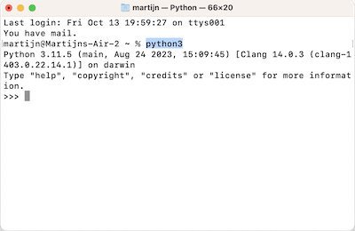

# Python opstarten

> **Studeertip.** Begrijp je niet wat je moet doen? Of begrijp je een instructie uit de opdracht niet? Bespreek dit dan gerust met je medestudenten en schakel altijd een assistent of docent in als het nodig is. Dat is hoe de universiteit werkt! Stel veel vragen en maak gebruik van de kennis en ervaring van anderen om goed te kunnen leren.

Zorg nu eerst dat je weet hoe je Python kunt opstarten en daarin experimenteren. Open een **Terminal** en start Python op.

- Op Windows klik je op het startmenu, je begint te tikken `cmd` en dan Enter. Je krijgt de "Command Prompt" te zien, een venster met zwarte achtergrond waarin je Python zou moeten kunnen opstarten met het commando `py`. Dan word je begroet met de prompt van Python `>>>`.

    {: style="width: 30rem"}

- Op Mac tik je Cmd+Spatie en dan zoek je naar "Terminal". Je krijgt dan een scherm met een witte achtergrond waar je opdrachten kunt geven. Je krijgt een prompt (vraag) die eindigt met `%`. Tik `python3` en Enter om Python op te starten. Dan word je begroet met de prompt van Python `>>>`.

    

- Op Linux (Ubuntu) open je een Terminal en dan geef je het commando `python3.12`. Dan word je begroet met de prompt van Python `>>>`.

## Experimenteren

Bij elke `>>>` van Python kun je code intikken. Als je op Enter drukt wordt deze uitgevoerd. Gebruik Python om te beginnen eens als calculator:

    >>> 5 / 2
    2.5
    >>> 17.0 - 10.0
    7.0

**Opdracht.** Probeer een paar dingen uit te rekenen met hulp van Python. Lever een screenshot in van je terminal met uitprobeersels, om te laten zien dat je met de cursus bent gestart. Om je screenshot in te leveren ga je naar de Submit-tab bovenaan deze pagina.

Om Python af te sluiten geef je het commando `quit()` met ronde haakjes.
