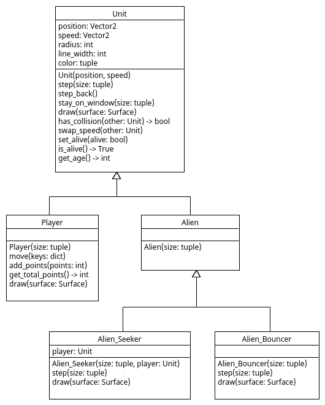

# Points

Voor het spelelement in ons spel krijgt de `Player` nu 1 punt als het
met een `Alien_Bouncer` bots, en verliest 2 punten als het met een
andere alien bots. De aliens gaan ook dood na zo'n botsing. Om dit te
implementeren is de `handle_collision()` functie in [main.py](main.py)
uitgebreid:

~~~python
def handle_collision(unit, other):
    """ Handles the collision of 'unit' stepping into 'other'. 
    """
    unit.swap_speed(other)
    unit.step_back()
    
    # When Player hits an Alien_Bouncer it gets 1 point and the Alien_Bouncer dies
    if (type(unit) is Player and type(other) is Alien_Bouncer):
        unit.add_points(1)
        other.set_alive(False)
    elif (type(unit) is Alien_Bouncer and type(other) is Player): # reverse
        other.add_points(1)
        unit.set_alive(False)

    # When Player hits any other alien type it looses 2 points and the alien dies
    elif (type(unit) is Player and isinstance(other, Alien)):
        unit.add_points(-2)
        other.set_alive(False)
    elif (isinstance(unit, Alien) and type(unit) is Player): # reverse
        other.add_points(-2)
        unit.set_alive(False)
~~~

# Test op type

In deze functie wordt op twee manieren getest op het type van een unit:

- `type(unit) is Player`: test of `unit` van het type `Player` is
- `isinstance(unit, Alien)`: test of `unit` van het type `Alien` is of dat het een subclass van `Alien` is

Subclasses van class 'X' zijn alle classes die onder class 'X' staan
in de inheritance hierarchie zoals weergegeven in een UML class
diagram:

Een code voorbeeldje test het type van een `Alien_Bouncer` object:

~~~python
from Alien import Alien 
from Alien_Bouncer import Alien_Bouncer
from Player import Player

a = Alien_Bouncer( (1,1) )

print( type(a) is Alien      ) # False, 'a' is NOT an Alien
print( isinstance(a, Alien)  ) # True, 'a' is a subclass of Alien 
print( isinstance(a, Player) ) # False, 'a' is NOT a subclass of Player
~~~

## Player class

Om het puntentotaal bij te houden en te tekenen als een rode balk
boven in het window, is ook de `Player` class in
[Player.py](Player.py) uitgebreid met methoden:

~~~python
    def add_points(self,points):
        """ Adds 'points' to the 'total_points'. """
        self.total_points += points
        self.total_points = max(self.total_points, 0) # total_points remains non-negative

    def get_total_points(self):
        """ Returns the 'total_points'. """
        return self.total_points
    
    def draw(self, surface):
        """ Draws the player on the 'surface' and a bar with the 'total_points'. """
        super().draw(surface)
        # draw total_point in red using a bar
        border = 2
        offset = 8
        bar_width = 12
        rect = pygame.Rect(offset, offset, border+self.get_total_points()*8, bar_width)
        red = (255,0,0)
        pygame.draw.rect(surface, red, rect)
        rect = pygame.Rect(offset, offset, border*2+400, bar_width)
        white = (255,255,255)
        pygame.draw.rect(surface, white, rect, border)
~~~

## Opdracht: Unit class

De gegeven code werkt al, alleen gaan de aliens nog niet dood. Schrijf
de implementatie voor methoden:

- `set_alive(alive)`
- `is_alive()`

in de `Unit` class in [Unit.py](Unit.py) zodat bijgehouden wordt welke
aliens dood en levend zijn, maak hiervoor eventueel een nieuwe
‘instance variabelen’/'attribute' aan. Het resultaat moet zijn dat
aliens die dood zijn, aan het einde van de loop in de `main()`
functie, niet meer worden meegenomen naar de volgende tijdstap door
toedoen van regel:

~~~python
units = [unit for unit in units if unit.is_alive()]  # only keep alive units for the next time step
~~~

Deze aliens verdwijnen dus uit het spel.

## Opdracht: Alien_Seeker dood Alien

Pas de `handle_collision()` functie aan zodat een `Alien` object dood gaat als
het botst met een `Alien_Seeker` object.

## Opdracht: Verwijder oude aliens

Schrijf ook de implementatie voor methode:

- `get_age()`

in de `Unit` class zodat het voor elke unit wordt bijgehouden hoeveel
seconden het al in het spel is. Voeg daarvoor bijvoorbeeld attribute
'birth_time' toe wat voor elke unit bijhoudt wanneer het in het spel
werd gebracht. Maak hierbij gebruik van functie `time.time()` die
het aantal seconden sinds de 'Epoch' (donderdag 1 januri 1970 0:00
uur UTC) returned:

~~~python
import time

print( time.time() )
~~~

Voeg vervolgens code aan de `main()` functie toe zodat alle aliens die
langer dan 10 seconden in het spel zijn, dood gaan en uit het spel
verwijderd worden.

