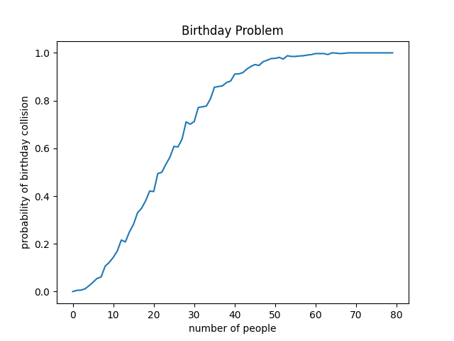

# Birthday Problem

In het [Birthday Problem](https://en.wikipedia.org/wiki/Birthday_problem) wordt de kans berekend dat een groep mensen een overlappende verjaardag heeft. Youtube video [The Birthday Paradox](https://youtu.be/ofTb57aZHZs) van Vsauce2 legt uit hoe dit wiskundig kan worden berekened.

[](https://youtu.be/ofTb57aZHZs)

In deze opdracht gaan we de kans niet wiskundig berekenen maar in plaats daarvan de kans schatten door veel verschillende experimenten uit te voeren.

## Opdracht

1) Schrijf de functie `def get_random_birthday() -> int:` die een
random verjaardag geeft als een getal in het interval [1 ; 365].

2) Schrijf de function `def add_birthday(birthdays: list[int],
birthday: int) -> bool:` die aan de lijst `birthdays` een verjaardag
`birthday` toevoegt. Deze functie returned `True` als deze verjaardag
al in de lijst `birthdays` voorkwam, anders `False`.

Let hier op. In onderstaande code-voorbeeld is te zien dat:

- list `example_list` als argument wordt meegegeven aan functie `example_function()`
- deze functie de list aanpast met `append(4)`, maar deze list **niet** returned 
- deze list toch na de functie-aanroep is aangepast zoals weergegeven met `print(example_list)`


    def example_function(example_list: list[int]) -> None:
        example_list.append(4)
        # no return

    example_list = [1, 2, 3]
    example_function(example_list)
    print(example_list) # [1, 2, 3, 4]


Dat de list toch is aangepast door het aanroepen van de functie komt
doordat een list *mutable* is, hierover later meer. Op dezelfde manier
kan de `add_birthday()` functie dus ook de `birthdays` lijst aanpassen
zonder deze te hoeven returnen.

3) Schrijf de functie `def has_birthday_collision(nr_people: int) ->
bool:` die voor `nr_people` mensen een random verjaardag toevoegt. De
functie stopt als twee mensen een overlappende verjaardag hebben en
retured dan `True`. Als geen van de mensen overlappende verjaardag
heeft returned de functie `False`.

4) Schrijf de functie `def
get_birthday_collision_probability(nr_people: int, nr_runs: int=1000)
-> float:` die voor `nr_people` aantal mensen de kans berekent dat
twee (of meer) een overlappende verjaardag hebben door `nr_runs`
random experimenten (met `has_birthday_collision()`) uit te voeren. De
functie returned de ratio van het aantal experimenten waarbij
tenminste twee mensen dezelfde verjaardag hadden.

5) Schrijf de functie `def get_probability(max_nr_people: int=80,
nr_runs: int=1000) -> list[float]:` die de lijst van geschatte kansen
returned waarop 1 t/m 80 mensen een overlappende verjaardag
hebben. Deze lijst zou er ongeveer zo uit moeten zien:

```python
[0.0, 0.005, 0.006, 0.011, 0.024, 0.039, 0.055, 0.061, 0.106, 0.122, 0.143, 0.17, 0.216, 0.208, 0.25, 0.281, 0.33, 0.349, 0.38, 0.421, 0.419, 0.494, 0.5, 0.533, 0.563, 0.608, 0.606, 0.639, 0.711, 0.701, 0.712, 0.771, 0.774, 0.777, 0.807, 0.856, 0.859, 0.862, 0.876, 0.882, 0.911, 0.912, 0.917, 0.932, 0.943, 0.951, 0.947, 0.963, 0.969, 0.976, 0.977, 0.981, 0.974, 0.988, 0.985, 0.985, 0.987, 0.988, 0.991, 0.993, 0.997, 0.997, 0.997, 0.993, 1.0, 0.999, 0.997, 0.998, 1.0, 1.0, 1.0, 1.0, 1.0, 1.0, 1.0, 1.0, 1.0, 1.0, 1.0, 1.0]
```

Hier is bijvoorbeeld te zien dat 2 personen een geschatte kans van 0.005 hebben dat ze een overlappende verjaardag hebben, terwijl 80 mensen een geschatte kans van 1.0 hebben dat ze een overlappende verjaardag hebben.

6) Gebruik [matplotlib](https://matplotlib.org/stable/tutorials/pyplot.html#sphx-glr-tutorials-pyplot-py) om met jouw eigen lijst van geschatte kansen de onderstaande grafiek te maken.


