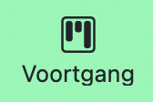
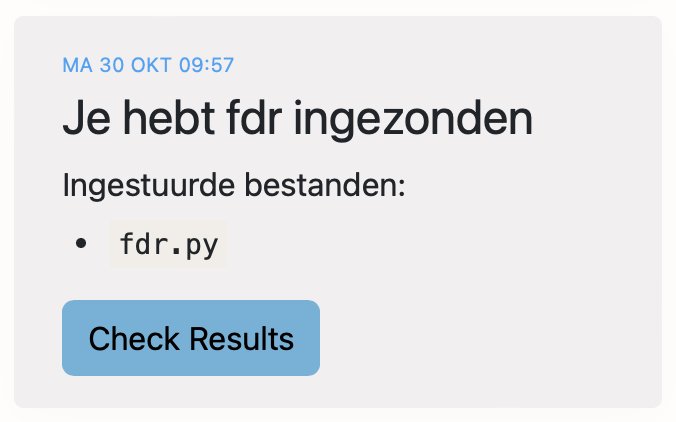
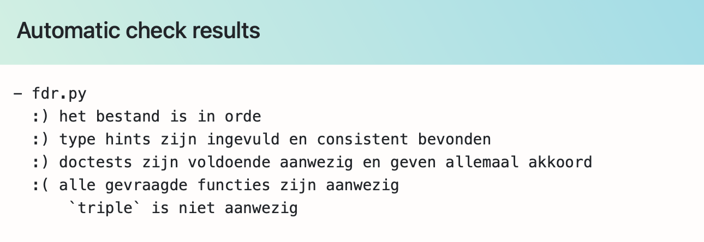

# Inleveren en controleren

Als het goed is heb je de opdrachten *Opstarten*, *Function Design Recipe*, *Weken*, *Cafeïne* en *Vakantie* allemaal ingeleverd op de vorige pagina's.

Na het inleveren worden alle opdrachten automatisch gecontroleerd op allerlei aspecten. Je moet alles helemaal goed hebben om de opdracht af te vinken. Je krijgt ook een mailtje als de opdracht afgekeurd wordt.

**Zorg dat je alle opdrachten helemaal netjes maakt zodat ze door de website worden goedgekeurd.**

Om de gedetailleerde resultaten te bekijken ga je naar de pagina Voortgang:

[{: style="width:40px"}](/submissions)

Dan krijg je een timeline van jouw ingestuurde opdrachten en de resultaten. Hieronder bijvoorbeeld de resultaten van de opdracht `fdr`:

{: style="width:350px"}

Klik op de knop, en je krijgt de resultaten van de automatische controles. Hieronder zie je dat:

* het bestand is in orde (regels zijn niet te lang, indentatie is goed)
* de type hints zijn aanwezig en ook correct gekozen
* de doctests voor elke functie zijn aanwezig en akkoord

Daarna zie je dat er een check **faalt**. Dat is de check die kijkt of de juiste functies aanwezig zijn in de uitwerking. Omdat deze check faalt zijn er verder geen checks gedaan, maar die zijn er wel! Verbeter je opdracht en bekijk dan opnieuw de resultaten.

