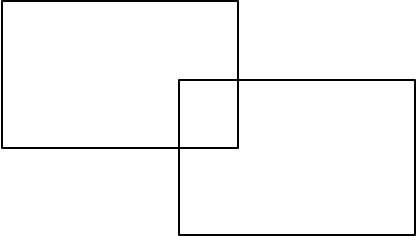

# Determining overlap

{: width="215"}

The coordinates of a rectangle can be described in the following way: `rectangle A1 = ((x1,y1), (x2,y2), (x3,y3), (x4,y4))`, where each x,y-pair represents a corner of the rectangle.
However, since we're describing a rectangle, some of the value pairs are redundant to denote because they naturally follow from other pairs. A more concise description of a rectangle is given by `rectangle A2 = ((x5,y5), (x6,y6))`. The two x,y-pairs represent corners that are opposite to each other and the remaining two corners can be constructed using those pairs.

Two rectangles in the same surface can be overlapping. Determining whether they overlap by drawing the rectangles and visually confirming overlap can be very time consuming however.
Using the coordinates can be a much faster and easier way of determining overlap between two rectangles.

## Assignment

Implement, in a file named `overlap.py`, a program that determines whether there is overlap between two rectangles based on their coordinates.
Each rectangle is constructed with two pairs of x,y coordinates that are input by the user in the format of `x,y`. You may assume the user always inputs a valid bottom left coordinate followed by a valid top right coordinate.

With the help of those coordinates you can then check whether the rectangles share any overlap. Such an overlap exists when both a coordinate of a rectangle on the x-axis lies between the coordinates of the other rectangle, and a coordinate of a rectangle on the y-axis lies between the coordinates of the other rectangle.

This means you have to approach your checks from the perspectives of both rectangles; is one of the corners of rectangle a in between the corners of ractangle b, or is a corner of rectangle b in between the corners of rectangle a.

Try and draw the different situation using pen and paper, in case you find it difficult to see the problem clearly!

## Code

For this assignment you will have to implement three functions and prompt the user for 2 different x,y-pairs for 2 different rectangles. That means you have to prompt for 4 x,y-pairs.

Design your program as described below. As can be seen, there are two TODO's where you would normally find the return type hints. You will have to determine what the types of the outputs should be for these functions.

    def check_xaxis(ax1: int, ay1: int, ax2: int, ay2: int, bx1: int, by1: int, bx2: int, by2: int) -> TODO:
        """
        Checks whether there is overlap on the x-axis.
        """

    def check_yaxis(ax1: int, ay1: int, ax2: int, ay2: int, bx1: int, by1: int, bx2: int, by2: int) -> TODO:
        """
        Checks whether there is overlap on the y-axis.
        """

    def check_overlap(x_overlap: bool, y_overlap: bool) -> bool:
        """
        Checks whether two rectangles overlap based on existing overlap on the x and y axes.
        """

    if __name__ == '__main__':
        <Your Program>

## Tips

* To unpack the `x,y` coordinates from the user input you can use the split the pair on the comma; `a, b = "3,5".split(",")`.
* You can use logical operators to connect multiple conditions.
* Test each check function individually before checking for complete overlap between the rectangles.
* The `check_overlap()` function takes two booleans as input, what does that imply about the output of the other two functions?

## Examples

Ultimately, your program has to produce output like the examples below.

    $ python overlap.py
    What is the bottom left coordinate for rectangle 1? 1,2
    What is the top right coordinate for rectangle 1? 4,4
    What is the bottom left coordinate for rectangle 2? 2,3
    What is the top right coordinate for rectangle 2? 5,8
    There is overlap between the two rectangles

    $ python overlap.py
    What is the bottom left coordinate for rectangle 1? 1,2
    What is the top right coordinate for rectangle 1? 4,4
    What is the bottom left coordinate for rectangle 2? 5,3
    What is the top right coordinate for rectangle 2? 6,5    
    There is no overlap between the two rectangles
