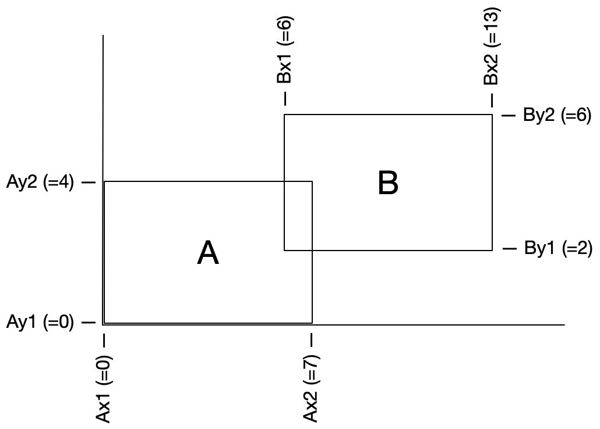

# Gelijke rechthoeken

{: width="415"}

We gaan een programma schrijven om te bepalen of twee rechthoeken dezelfde afmetingen hebben.
Als je naar het voorbeeld hierboven kijkt zie je dat de rechthoeken ongeveer even groot lijken.
We kunnen dit precies bepalen als we de coördinaten van de rechthoeken hebben.

In dit geval hebben we ook de getallen staan, zoals de positie van de *linkerzijde* van A (Ax1) en *rechterzijde* van A (Ax2).
Trek je deze van elkaar af, dan heb je één van de beide afmetingen van A:

    Ax2 - Ax1 = 7

Met hulp van de coordinaten Ay1 en Ay2 kun je de andere zijde berekenen van die rechthoek. Daarna volgen de zijdes van rechthoek B. Zijn ze inderdaad gelijk?

## Opdracht

    $ python rechthoeken.py
    Geef de x-coordinaten van A: 0,7
    Geef de y-coordinaten van A: 0,4
    Geef de x-coordinaten van B: 6,13
    Geef de y-coordinaten van B: 2,6
    De rechthoeken zijn gelijk!

Schrijf, in een bestand genaamd `rechthoeken.py`, een programma dat op basis van de gegeven coördinaten bepaalt of twee rechthoeken dezelfde afmetingen hebben.
Het is daarnaast mogelijk dat de rechthoeken ook vierkanten zijn van dezelfde afmetingen, en in dat geval moet dat ook gemeld worden.
Mocht er helemaal niks interessants te melden zijn over de rechthoeken dan melden we dat maar.
Je mag ervan uitgaan dat de gebruiker gehele getallen invoert per paar. Met bovenstaande invoer geeft de gebruiker aan dat Ax1 = 0 en Ax2 = 7.

## Code

Je schrijft een hoofdprogramma dat de invoer vraagt en netjes maakt. Daarnaast zijn er drie hulpfuncties die je vanuit je hoofdprogramma gebruikt.

Zoals je kan zien staan er twee TODO's in; hier moet je zelf bedenken wat het type van de functie moet zijn.

    def is_same_rectangle(ax_length: int, ay_length: int, bx_length: int, by_length: int) -> TODO:
        """
        Controleert of de lengtes van de zijdes gelijk zijn
        """

    def is_square(ax_length: int, ay_length: int, bx_length: int, by_length: int) -> TODO:
        """
        Controleert of beide rechthoeken hetzelfde vierkant zijn
        """

    def calculate_length(c1: int, c2: int) -> int:
        """
        Berekent de lengte van een zijde op basis van twee coördinaten
        """

    if __name__ == '__main__':
        <Hoofdprogramma>

## Hints

- Je kunt geen berekeningen doen met strings, dus één stap van het netjes maken van de data is om de input te converteren naar integers.

- Bij de functie `lengte` weet je niet welke coördinaat groter is (denk aan de case: c1 = 5, c2 = 3). Zorg dat de uitvoer van de functie wel altijd positief is. Je kunt het zelf een stukje code uitschrijven hiervoor, of een standaard Python-functie gebruiken.

## Voorbeelden

Je programma moet uiteindelijk werken zoals in de voorbeelden hieronder.

    $ python rechthoeken.py
    Geef de x-coordinaten van A: 0,7
    Geef de y-coordinaten van A: 0,4
    Geef de x-coordinaten van B: 6,13
    Geef de y-coordinaten van B: 2,6
    De rechthoeken zijn gelijk!

    $ python rechthoeken.py
    Geef de x-coordinaten van A: 0,7       
    Geef de y-coordinaten van A: 0,7
    Geef de x-coordinaten van B: 6,13
    Geef de y-coordinaten van B: 2,9
    De rechthoeken zijn gelijk!
    En ze zijn ook nog vierkant!

    $ python rechthoeken.py
    Geef de x-coordinaten van A: 0,7
    Geef de y-coordinaten van A: 0,7
    Geef de x-coordinaten van B: 6,15
    Geef de y-coordinaten van B: 2,9
    Er is niks aan :(
