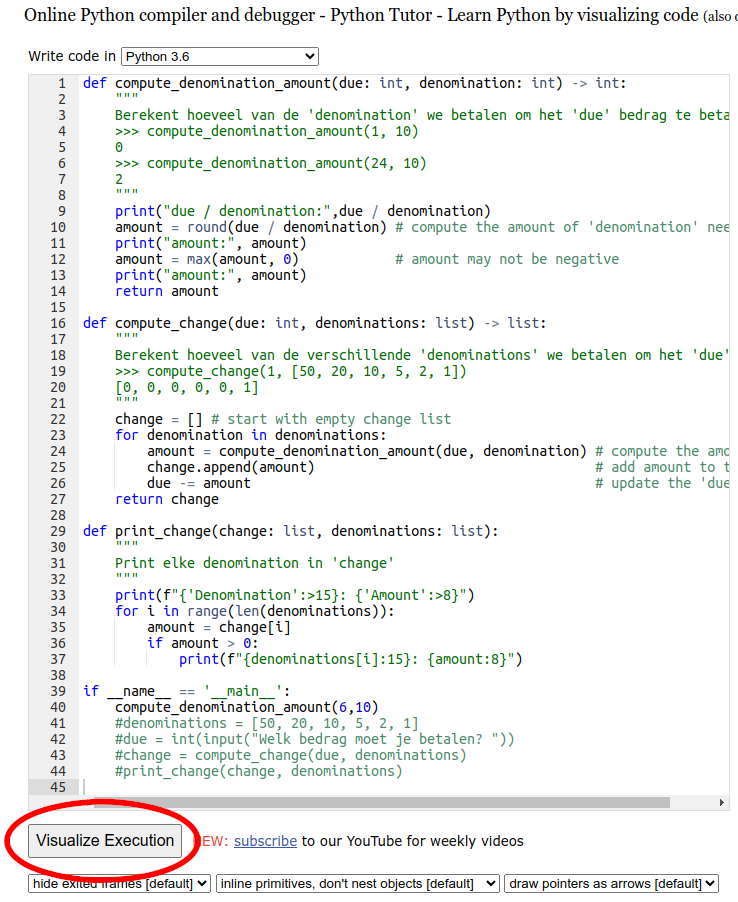
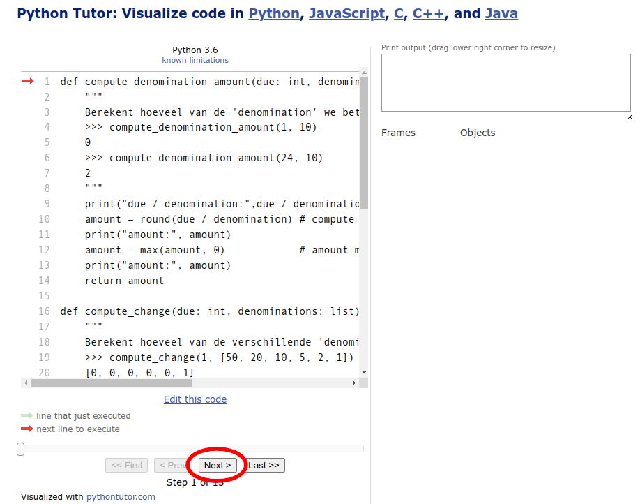
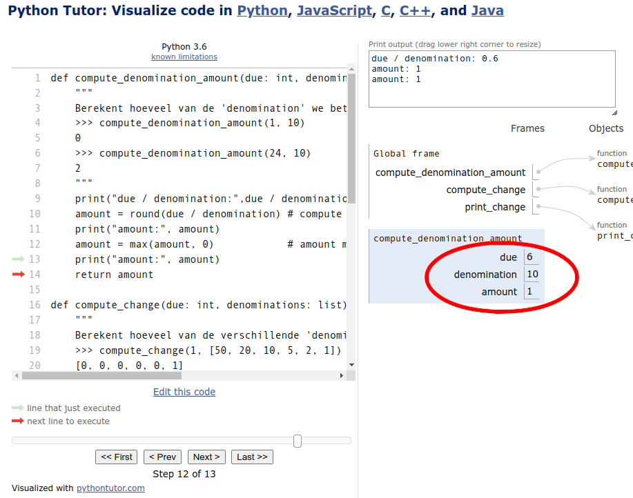

# Debug Oefening

Iedere programmeur maakt fouten. Een goede programmeur kan zijn/haar
fouten snel ontdekken en oplossen. We gaan naar enkele techieken
hiervoor kijken die we toepassen op een voorbeeldprogramma. Het is de
bedoeling dat je echt even mee met deze techieken oefent zodat je deze
zelf in latere opdrachten kunt gebruiken. Dit kan veel tijd besparen.

# Voorbeeldprogramma

We gaan de technieken toepassen op een programma wat berekent in welke
denominaties een bedrag kan worden betaald. Een bedrag van
bijvoorbeeld 46euro kan met biljetten en munten (denominaties) van
50euro, 20euro, 10 euro, 5euro, 2euro en 1euro worden betaald als:

    Denomination:   Amount
             20:        2
              5:        1
              1:        1
              
dus 2 biljetten van 20, 1 biljet van 5 en 1 munt van 1 euro zorgt voor
een total van 46.

Het is de bedoeling dat programma
[compute_change.py](compute_change.py) dit voor elke bedrag kan
uitrekenen:

    def compute_denomination_amount(due: int, denomination: int) -> int:
        """
        Berekent hoeveel van de 'denomination' we betalen om het 'due' bedrag te betalen.
        >>> compute_denomination_amount(1, 10)
        0
        >>> compute_denomination_amount(24, 10)
        2
        """
        amount = round(due / denomination) # compute the amount of 'denomination' needed to pay 'due'
        amount = max(amount, 0)            # amount may not be negative
        return amount
    
    def compute_change(due: int, denominations: list) -> list:
        """
        Berekent hoeveel van de verschillende 'denominations' we betalen om het 'due' bedrag te betalen.
        >>> compute_change(1, [50, 20, 10, 5, 2, 1])
        [0, 0, 0, 0, 0, 1]
        """
        change = [] # start with empty change list
        for denomination in denominations:
            amount = compute_denomination_amount(due, denomination) # compute the amount of 'denomination'
            change.append(amount)                                   # add amount to the change list
            due -= amount                                           # update the 'due' value
        return change
    
    def print_change(change: list, denominations: list):
        """
        Print het aantal van elke denomination in 'change'
        """
        print(f"{'Denomination':>15}: {'Amount':>8}")
        for i in range(len(denominations)):
            amount = change[i]
            if amount > 0:
                print(f"{denominations[i]:15}: {amount:8}")
    
    if __name__ == '__main__':
        denominations = [50, 20, 10, 5, 2, 1
        due = int(input("Welk bedrag moet je betalen? "))
        change = compute_change(due, denominations)
        print_change(change, denominations)

## Syntax Error

Als we het bovenstaande programma uitvoeren:

    $ python compute_change.py
    File "./compute_change.py", line 37
    denominations = [50, 20, 10, 5, 2, 1
                    ^
    SyntaxError: '[' was never closed
    
krijgen we een 'SyntaxError' die probeert uit te leggen wat er mis
is. Soms helpt het om een websearch (`SyntaxError [ was never closed`)
te doen als je de uitleg niet helemaal begrijpt. Let bij een error
vooral op de filename (`compute_change.py`) en het regelnummer (`line
37`) om snel de plek in de code te vinden waar de error zich
voordoet. Soms krijg je meerdere regels met filenames en regelnummers,
begin dan onderdaan.

**Opdracht1** Los deze Syntax Error op.

## Logic Error

Na de Syntax Error te hebben opgelost kunnen we het programma
uitvoeren en er wordt gevraagd om een bedrag, kies daar '46':

    $ python compute_change.py
    Welk bedrag moet je betalen? 46
    Denomination:   Amount
              50:        1
              20:        2
              10:        4
               5:        8
               2:       16
               1:       15

Het programma werkt maar het is duidelijke dat de
denominatie-aantallen niet kloppen want het totaal is hoger dan 46, er
zit dus een logische fout (bug) in het pogramma. Maar deze fout kan
overal zitten. Doctests kunnen helpen te bepalen welke functies nog
een bug bevatten.

## Doctest

We beginnen bij de eenvoudigste functie `compute_denomination_amount()`:

    def compute_denomination_amount(due: int, denomination: int) -> int:
        """
        Berekent hoeveel van de 'denomination' we betalen om het 'due' bedrag te betalen.
        """
        
deze heeft al 2 doctest:

    >>> compute_denomination_amount(1, 10)
    0
    >>> compute_denomination_amount(24, 10)
    2
    
De eerst controlleert dat we bij het betalen van 1€ 0
biljetten van 10€ gebruiken en de twee dat we voor 24€ 2
biljetten van 10€ gebruiken. We kunnen alle doctest runnen met:

    $ python -m doctest compute_change.py
    
wat niks print als alle test slagen. Voeg een '-v' (verbose) toe om
meer details te zien:

    $ python -m doctest compute_change.py -v
    Trying:
    compute_change(1, [50, 20, 10, 5, 2, 1])
    Expecting:
    [0, 0, 0, 0, 0, 1]
    ok
    Trying:
        compute_denomination_amount(1, 10)
    Expecting:
        0
    ok
    Trying:
        compute_denomination_amount(24, 10)
    Expecting:
        2
    ok
    2 items had no tests:
        compute_change
        compute_change.print_change
    2 items passed all tests:
    1 tests in compute_change.compute_change
    2 tests in compute_change.compute_denomination_amount
    3 tests in 4 items.
    3 passed and 0 failed.
    Test passed.

## Meer Doctests

Alle doctest slagen maar er zit nog wel een bug in het programma. 

**Opdracht2** Voeg meer doctest toe om te proberen te ontdekken of
`compute_denomination_amount()` een bug heeft.

Daarbij is het belangrijk om vooral de randgevallen te testen, dus
waarden die aan beide kanten van een waardeovergang liggen,
bijvoorbeeld:

Voor 999€ kan ik 99 biljetten van 10€ gebruiken, maar bij 1€
meer vind er een overgang plaats, voor 1000€ kan ik 100 bijetten
van 10€ gebruiken.

Als je met een doctest een bug ontdekt, is het nuttig om de test te
proberen te versimpelen op zo'n manier dat de bug behouden blijft. Het
voorbeeld van 999€ is niet erg simpel omdat het zo'n groot begrag
is, probeer een lagere waarde te vinden met behoud van de bug. Bij
simpelere tests is het namelijke makkelijker om bij een fout de
oorzaak te ontdekken.

## Prints

Als het goed is heb je met doctests ontdekt dat er een bug zit in de
`compute_denomination_amount()` functie. Zo niet, probeer het dan echt
eerst zelf voor je verder leest.

Dit is de meeste simpele doctest die ik kon vinden met behoud
van de bug:

    >>> compute_denomination_amount(6, 10)
    0

Voor een bedrag van 6€ heb ik 0 biljetten van 10€ nodig, maar
de functie geeft foutief het aantal '1'.

Om beter te begrijpen wat in deze functie gebeurt kunnen we
print-statements toevoegen voor variabelen en expressies die
interesant lijken. Voeg bij print-statements voor een beter overzicht
ook de naam van de variabele toe die je print, dus:

    print("variabele:", variabele)

in plaats van alleen:

    print(variabele)

Voor `compute_denomination_amount()` zou dat er zo uit kunnen zien:

    def compute_denomination_amount(due: int, denomination: int) -> int:
        print("due / denomination:", due / denomination)
        amount = round(due / denomination) # compute the amount of 'denomination' needed to pay 'due'
        print("amount:", amount)
        amount = max(amount, 0)            # amount may not be negative
        print("amount:", amount)
        return amount

in de main willen we nu alleen deze functie aanroepen daarom commenten
we de andere code tijdelijk uit:

    if __name__ == '__main__':
        compute_denomination_amount(6, 10)
        #denominations = [50, 20, 10, 5, 2, 1]
        #due = int(input("Welk bedrag moet je betalen? "))
        #change = compute_change(due, denominations)
        #print_change(change, denominations)
    
het runnen van het programma resulteert dan in deze prints waardoor we
hopelijk een beter idee krijgen van wat de functie doet:
    
    due / denomination: 0.6
    amount: 1
    amount: 1

**Opdracht3** Voeg de print-statements toe en pas de main aan zodat je
deze ouput krijgt. Zie al waarom het verkeerde aantal biljetten wordt
teruggegeven door de functie?

## PythonTutor

Soms begrijp je code beter door stapsgewijs door de code te lopen
terwijl deze wordt uitgevoerd dan door alleen print-statements
te toevoegen. Dat kan bijvoorbeeld met
[PythonTutor](https://pythontutor.com/). Klik op deze webpagina op
'Python', kopieer het hele programma in het invoerveld, en druk op
'Visualize Execution':

{: style="width:20rem;"}

Elke keer als we op 'Next' drukken drukken, wordt de volgende regel
(waar de rode pijl naar wijst) van het programma uitgevoerd.

{: style="width:20rem;"}

Na een aantal keer 'Next' klikken komen we in de
`compute_denomination_amount()` functie waar we precies kunnen zien
welke variabelen er zijn en hoe hun waarden veranderen bij het
uitvoeren van de regels. Dit geeft meer inzicht dan alleen
print-statements en kan helpen om te begrijpen waarom de functie een
verkeerde waarde terug geeft. Klik ook op 'Prev' om een regel terug te
stappen.

{: style="width:20rem;"}

PythonTutor kan in het begin wat ingewikkeld lijken, maar investeer nu
wat tijd om er bekend mee te reken want dat kan veel tijd besparen bij
het vinden en verwijderen van bugs.

**Opdracht4** Experimenteer met
[PythonTutor](https://pythontutor.com/) want is een nuttig stuk
gereedschap wat we later nog nodig zullen hebben.

## Oplossing

Heb je kunnen ontdekken hoe we de bug kunnen oplossen? zo niet,
probeer het dan echt eerst zelf voor je verder leest.

Na enig denkwerk zouden we met alle informatie tot de conclusie moeten
kunnen komen dat 0.6 naar beneden moet worden afgerond voor het juiste
aantal bankbiljetten en niet naar het dichtsbijzijnde gehele getal. Dit
kan na `import math` toevoegen met:

    amount = math.floor(due / denomination)

**Opdracht5** 
- Slagen alle doctests nu wel?
- Hebben we genoeg randgevallen getest zodat we vrij zeker zijn dat er
geen bugs meer zitten in `compute_denomination_amount()`?
- Zo ja, verwijder dan de print-statements uit deze functie en
  un-commenten de code in main.

## Nog een bug

Er zit ook een bug in de `compute_change()` functie. 

De enige doctest die er nu al staat, slaagt: 

    >>> compute_change(1, [50, 20, 10, 5, 2, 1])
    [0, 0, 0, 0, 0, 1]

we kunnen namelijk 1€ betalen met:

- 0 biljetten van 50€
- 0 biljetten van 20€
- 0 biljetten van 10€
- 0 biljetten van  5€
- 0 munten van     2€
- 1 munten van     1€

Welke simpele doctests kunnen we toevoegen om aan te tonen dat deze
functie een bug heeft?

Welke print-statements zijn nuttig om beter te begrijpen wat er gebeurt
in deze functie? 

Deze print-statement in de for-loop hielp mij om een beter begrip van
de functie te krijgen:

    for denomination in denominations:
        print("due:", due, "denominations:", denominations, "change:", change)
        
Wat voor 46€ deze output geeft, maar voeg zelf vooral print-statements
die helpen voor jouw eigen begrip:
        
    Welk bedrag moet je betalen? 46
    due: 46 denominations: [50, 20, 10, 5, 2, 1] change: []
    due: 46 denominations: [50, 20, 10, 5, 2, 1] change: [0]
    due: 44 denominations: [50, 20, 10, 5, 2, 1] change: [0, 2]
    due: 40 denominations: [50, 20, 10, 5, 2, 1] change: [0, 2, 4]
    due: 32 denominations: [50, 20, 10, 5, 2, 1] change: [0, 2, 4, 8]
    due: 16 denominations: [50, 20, 10, 5, 2, 1] change: [0, 2, 4, 8, 16]
    Denomination:   Amount
              20:        2
              10:        4
               5:        8
               2:       16
               1:       16

Helpt PythonTutor om te begrijpen wat er hier mis gaat?

Welke code-aanpassing kunnen we tenslotte doen zodat het programma wel
goed werkt voor alle (positieve en hele euro) bedragen?

**Opdracht6** Gebruik bovenstaande technieken om de bug te vinden en
te verwijderen.

## Moeilijk

Het kan best moeilijk zijn om bugs te vinden en op te lossen. Het kost
soms veel tijd/energie/frustratie om te begrijpen wat er in code moet
gebeuren en wat er mis gaat. Toch is dit een van de belangrijkste
programmeervaardigheden. Met oefening wordt je hier vanzelf beter in
en wordt dit ook makkelijker. Wat helpt is precies werken en
regelmaltig testen en debuggen. Dus test steeds na maar een paar
nieuwe regels code geschreven te hebben. Dat kost over het algemeen
minder tijd dan pas achteraf veel regels tegelijk testen (zoals in het
bovenstaande programmma).

## Correctheid

Met tests kunnen we alleen aantonen dat er nog een bug in code zit,
maar we kunnen niet zeker weten dat een programma helemaal bug vrij
is. Misschien zijn we namelijke een belangrijke test vergeten voor een
speciaal geval.

Om meer zekerheid te krijgen kunnen we in veel gevallen wel code
schrijven die automatisch veel test uitvoert. Hieronder voorbeeld-code
die van een 'change'-lijst het 'due' bedrag terug-berekent. Deze
waarde zou natuurlijk gelijk moeten zijn aan het originele 'due'
bedrag van de 'change'-lijst. We kunnen dit vervolgens testen voor
bijvoorbeeld 100000 verschillende random gekozen waarden voor
'due'. Als het voor al die waarden goed werkt kunnen we toch een hoge
mate van vertrouwen krijgen dat de code correct is, maar helemaal
zeker weten doen we dat in het algmeen niet, zeker niet voor grote
complexe programma's.

    import random

    def compute_change_total(change: list, denominations: list) -> int:
        """
        Berekent het totaal van alle change.
        """
        total = 0
        for i in range(len(denominations)):
            total += change[i] * denominations[i]
        return round(total)
    
    
    def test_change_total_for_due(due: int, denominations: list) -> bool:
        """
        Test of 'due' gelijk is aan het totaal van de berekende 'change' van 'due'.
        """
        change = compute_change(due, denominations)
        total = compute_change_total(change, denominations)
        return total == due
    
    
    def test_change_total_for_n_random_dues(n: int, denominations: list) -> bool:
        """
        Voert 'n' test_change_for_due() tests voor random 'due' waarden.
        """
        for i in range(n):
            due = round(random.random() * 1000)
            if not test_change_total_for_due(due, denominations):
                return False
            return True

    print("All test succeed: ", test_change_total_for_n_random_dues(100000, [50, 20, 10, 5, 2, 1]))
