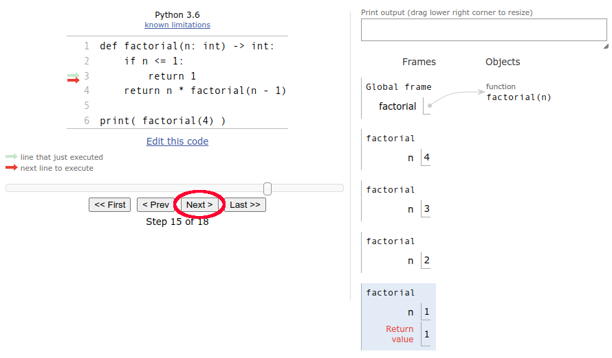
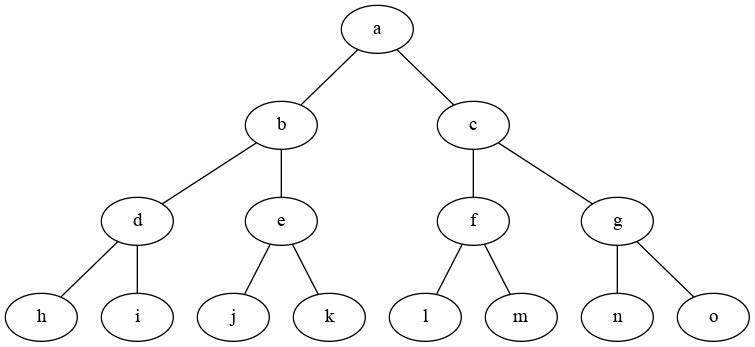
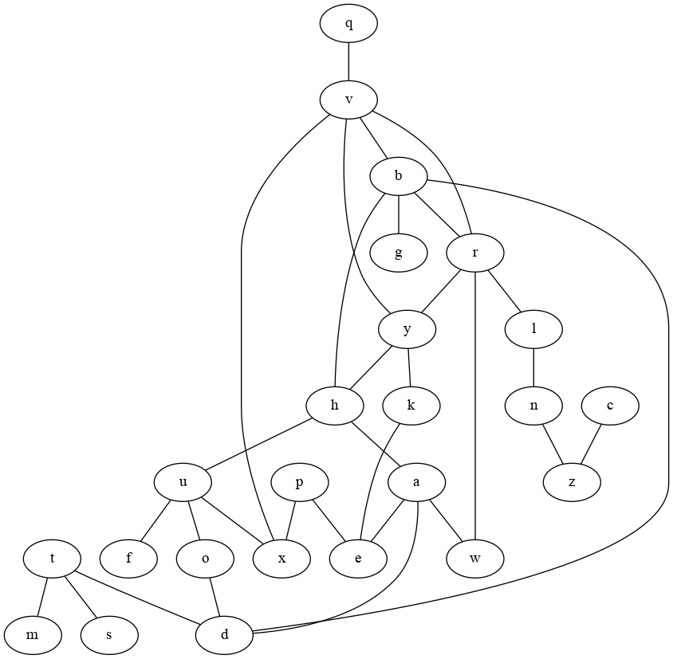

# Iteratie en Recursion

Sommige problemen kunnen met iteratie of met recursie worden
opgelost.

## Factorial
Bijvoorbeeld het berekenen van een factorial. De factorial
van '4' (het aantal volgorden waarop we 4 verschillende dingen kunnen
leggen) is bijvoorbeeld:

```
factorial(4) = 4 * 3 * 2 * 1 = 24
```

Dit kunnen we makkelijk berekenen met gebruik van de 'math' module:

```
import math

print( math.factorial(4) ) # 24
```

maar als we zelf de functie zouden willen schrijven kunnen we dat
**iteratief** doen met:

```
def factorial(n: int) -> int:
    result = 1
    for i in range(1, n+1):
        result *= i
    return result

print( factorial(4) ) # 24
```

of **recursief** doen met:

```
def factorial(n: int) -> int:
    if n <= 1: # base case 
        return 1
    return n * factorial(n - 1) # recursive case


print( factorial(4) ) # 24
```

Het resultaat is hetzelfde. Een recursieve functie is een functie die
zichzelf (direct of indirect) aanroept. Om te voorkomen dat de functie
zichzelf oneindig blijft aanroepen hebben we een 'base case' nodig,
een conditie waarbij het zichzelf aanroepen ophoudt. De 'base case' is
hierin dit geval `n <= 1`, als deze conditie `True` is returnen we '1'.

Als deze 'base case' conditie `False` is komen we bij de 'recursieve
case'. Hier wordt het probleem doorgaans opgesplits in kleinere
problemen. In het geval van `factorial(n)` splitsen we het probleem op
in `n` vermenigvuldigd met `factorial(n - 1)`.

Als we `factorial(4)` met de hand zouden uitschrijven zou dat er dus
zo uitzien:

```
factorial(4) = 4 * factorial(3)
factorial(4) = 4 * 3 * factorial(2)
factorial(4) = 4 * 3 * 2 * factorial(1)
factorial(4) = 4 * 3 * 2 * 1
factorial(4) = 4 * 3 * 2
factorial(4) = 4 * 6
factorial(4) = 24
```

## Stack

Elke aanroep van een functie heeft zijn eigen waarden voor de
verschillende variabelen van de functie. Om de verschillende waarden
voor variabelen per functie-aanroep op te slaan, wordt de *stack*
('stapel' in het Nederlands) gebruikt om deze waarden op te
stapelen. We kunnen Python Tutor gebruiken om de stack te
visualiseren:




**opdracht**: Voer zelf het [recursieve factorial programma in Python
Tutor](https://pythontutor.com/render.html#code=def%20factorial%28n%3A%20int%29%20-%3E%20int%3A%0A%20%20%20%20if%20n%20%3C%3D%201%3A%0A%20%20%20%20%20%20%20%20return%201%0A%20%20%20%20return%20n%20*%20factorial%28n%20-%201%29%0A%0Aprint%28%20factorial%284%29%20%29&cumulative=false&curInstr=1&heapPrimitives=nevernest&mode=display&origin=opt-frontend.js&py=3&rawInputLstJSON=%5B%5D&textReferences=false)
uit door herhaaldelijk op 'next' te klikken om te zien hoe de stack
groeit en weer afneemt tijdens de uitvoer.

Dus al is er maar 1 variabele 'n' te lezen in het programma, er staan
op het hoogtepunt wel 4 verschillende waarden van 'n' op de stack
omdat de functie 4 keer wordt aangeroepen.

## Debug Prints

Het kan best lastig zijn om in een recursieve functie duidelijker weer
te geven wat er gebeurt door het toevoegen van debug print
statements. Dit is mijn poging:

```
def factorial(n: int) -> int:
    print(f'factorial({n})')
    if n <= 1:
        print(f'factorial({n}) return 1 (base case)')
        return 1
    result = factorial(n - 1)
    print(f'{n} * {result}')
    new_result = n * result
    print(f'factorial({n}) return {new_result}')
    return new_result


print( factorial(4) )
```

wat deze uitvoer oplevert:

```
factorial(4)
factorial(3)
factorial(2)
factorial(1)
factorial(1) return 1 (base case)
2 * 1
factorial(2) return 2
3 * 2
factorial(3) return 6
4 * 6
factorial(4) return 24
24
```

**opdracht**: Herschrijf zelf de originele `factorial()` functie en
voeg debug print statements toe om duidelijker weer te geven hoe deze
werkt.


## Has Member

De functie `has_member(value: int, collection: list[int]) -> bool` zou
`True` of `Flase` moeten returnen afhankelijk van of `value` voorkomt
in de `collection`. We kunnen de function op een iteratieve manier
schijven als:

```
def has_member(value: int, collection: list[int]) -> bool:
    for v in collection:
        if value == v:
            return True
    return False

print( has_member(3, [1,2,3,4]) ) # True
print( has_member(5, [1,2,3,4]) ) # False
```

**opdracht** Schrijf de `has_member()` functie op een recursieve manier.

*tip:* Split het probleem op in kleinere problemen door te testen of
 `value` vooraan in de collection staat (`collection[0]`), of dat het
 in het overige deel van de collection staat (`collection[1:]`).

## Permutations

Een recursieve manier lijkt vaak ingewikkelder, maar in sommige
gevallen is het de makkelijkste manier om een probleem op te
lossen. Stel we willen alle mogelijke permutaties van letters 'a', 'b', en 'c'
vinden tot een bepaalde lengte. We kunnen dit recursief schrijven als:

```
def permutations(length: int, values: list[str], result: str) -> None:
    if len(result) >= length: # base case
        print(result)
    else:
        for v in values:
            permutations(length, values, result + v)

permutations(3, ['a','b','c'], '')
```

waarbij we in een for-loop bij de recursieve aanroep steeds ieder van de values
toevoegen aan `result` in de onderstaande volgorder van 1 t/m 39:


Dit programma is recursief veel makkelijker te schrijven dan op een
iteratieve manier.

**opdracht** Pas het programma aan zodat het alle permutaties met lengte 4
geeft zonder permutaties waar een letter zichzelf opvolgt. Dus
bijvoorbeeld geen 'aabc' (bad: 'a' volgt na 'a'), maar wel 'abac'.

## Routebepaling



```
edges = ['ab', 'ac', 'bd', 'be', 'cf', 'cg', 'dh', 'di', 'ej', 'ek', 'fl', 'fm', 'gn', 'go']
```

**opdracht** Schrijf een programma wat de route print van 'a' naar 'k'.




```
edges = ['yk', 'pe', 'tm', 'td', 'bd', 'hu', 'vb', 'br', 'od', 'ae', 'ha', 'yh', 'bg', 'wr', 'ux', 'qv', 'bh', 'rl', 'ts', 'aw', 'yv', 'uf', 'ry', 'vr', 'ln', 'nz', 'ke', 'cz', 'vx', 'uo', 'ad', 'px']
```
**opdracht** Schrijf een programma wat alle routes print van 'a' naar 'k' waarbij een route niet meer dan 1 keer over dezelfde letter mag gaan.
