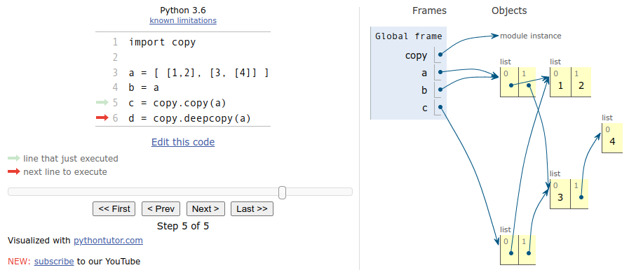

# Memory Model

Python maakt onderscheid tussen *mutable* en *immutable* types. Een
waarde van een *immutable* type kan **niet** worden aangepast zonder dat
er een kopie van gemaakt wordt. Een waarde van een *mutable* type kan
**wel** worden aangepast zonder een kopie te maken. We gaan in deze
tekst zien waarom het belangrijk is om je bewust te zijn van de
(im)mutabiliteit van de types waarmee je werkt.

Elk type in Python is *mutable* of *immutable*. 

Immmutable types zijn: `bool`, `int`, `float`, `str`, `tuple`,
`frozenset`, enkele andere types

Mutable types zijn: `list`, `set`, `dictionary`, alle andere types

## int (immutable type)

In dit voorbeeldprogramma verwijzen variabelen `a` en `b` naar een
waarde van het type `int` wat een *immutable* type is.

~~~python
a = 1
b = a
a += 100
print("a:", a, "b:", b)
~~~

Als we dit programma uitvoeren in
[PythonTutor](https://pythontutor.com/) met de optie "render all
objects on the heap" zien we wat er gebeurt. Na regel 1 verwijst
variabele `a` naar waarde `1`.

Na regel 2 verwijst variabele `b` naar dezelfde waarde:

Op regel 3 wordt de waarde waar `a` naar wijst aangepast (`+= 100`),
en omdat `a` naar een *immutable* type verwijst wordt eerst een kopie
van deze waarde gemaakt zodat de waarde waar `b` naar verwijst, niet
wordt aangepast:

Als we op regel 4 `a` en `b` vervolgens printen zien we dat ze inderdaad twee
verschillende waarden hebben.

## str (immutable type)

Hetzelfde voorbeeld maar nu verwijzen `a` en `b` naar een waarde van
het type `str` wat ook een *immutable* type is.

~~~python
a = "hello"
b = a
a += " world"
print(f"a: '{a}' b: '{b}'")
~~~

Omdat een `str` net als een `int` *immutable* is, gebeurt hier
hetzelfde en zien we na het printen dat `a` en `b` hier ook twee
verschillende waarden hebben.

Geen verassingen tot nu toe.

## list (mutable type)

Maar, in dit voorbeeldprogramma verwijzen `a` en `b` naar een waarde
van het type `list` wat een `mutable` type is. Het resultaat is nu
anders.

~~~python
a = [1, 2, 3]
b = a
a += [100]
print("a:", a, "b:", b)
~~~

Na uitvoeren van regel 1 verwijst variabele `a` naar de lijst
`[1, 2, 3]`.

Na regel 2 verwijst variabele `b` naar dezelfde waarde:

Op regel 3 wordt de waarde waar `a` naar wijst aangepast door daar 100
toe te voegen (`+= [100]`), en omdat `a` naar een 'mutable' type
verwijst wordt **geen** kopie van deze waarde gemaakt en dus wordt de
waarde waar `b` naar verwijst **ook** aangepast.

Bij het printen op regel 4 zien we dan ook dat variabele `a` en `b`
dezelfde waarde hebben wat dus in de eerdere voorbeeldprogramma's met
*immutable* types niet het geval was.

## Kopieeren

Als we willen dat `a` en `b` wel ieder hun eigen waarde hebben dan
moeten we expliciet een kopie maken met functie `copy.copy()` vooraf
aan de aanpassing van `a`.

~~~python
import copy

a = [1, 2, 3]
b = copy.copy(a)
a += [100]
print("a:", a, "b:", b)
~~~

## Motivatie

Een rede waarom er geen kopie van een 'mutable' type wordt gemaakt
vooraf aan een aanpassing is om te voorkomen dat bijvoorbeeld een
grote lijst bij elke kleine aanpassing steeds helemaal gekopieerd moet
worden, want dat zou een programma heel traag maken. De *immutable*
types zijn meestal klein waardoor het kopiëren wel snel kan.

## Functie aanroep

Dit verschil tussen *mutable* en *immutable* types zorgt ook
voor een verschil bij het aanroepen van functies. In het onderstaande
voorbeeldprogramma roepen we functie `add_100()` aan met een waarde van
een *immutable* en *mutable* type.

~~~python
def add_100(immu: int, mu: list) -> None:
    immu +=  100
    mu   += [100]
    print("2) immu:", immu, "mu:", mu)
    
immutable =  1
mutable   = [1, 2, 3]
print("1) immutable:", immutable, "mutable:", mutable)
add_100(immutable, mutable)
print("3) immutable:", immutable, "mutable:", mutable)
~~~

Vooraf aan de functie-aanroep worden de waarden geprint als:

    1) immutable: 1 mutable: [1, 2, 3]
    
In de functie worden beide waarden aangepast (100
toegevoegd) en geprint als:

    2) immu: 101 mu: [1, 2, 3, 100]

Maar omdat in de functie vooraf aan de aanpassing van de waarde van
het *immutable* type een kopie wordt gemaakt, wordt de originele
waarde buiten de functie niet aangepast. In de print na de
functieaanroep is dan ook alleen de waarde van het *mutable* type
aangepast:

    3) immutable: 1 mutable: [1, 2, 3, 100]

## Voorkom bugs

Om bugs te voorkomen is het dus belangrijk om tijdens het programmeren
te weten of je een waarde van een *mutable* of *immutable* type
aanpast. Bij *mutable* types wil je altijd in je hoofd de verwijzingen
voor je zien als pijltjes zoals het wordt weergegeven in
PythonTutor. Bij *immutable* types is dat niet nodig, omdat toch
altijd eerst een kopie wordt gemaakt kan een aanpassing nooit een
ongewenst effect hebben op andere variabelen.

Het is goed om de *immutable* types uit je hoofd te leren, alle andere
types zijn dan mutable.

Immutable types zijn: `bool`, `int`, `float`, `str`, `tuple`,
`frozenset`, enkele andere types

De 'enkele andere types' laten we verder achterwegen, want die komen
niet voor in dit vak.

## Deepcopy

Bij geneste *mutable* types zijn er meerdere kopieer-opties, ieder met
een ander effect, waar je uit kunt kiezen. In het onderstaande
programma is `a` een geneste lijst (lijst van lijsten van ...) die we
op verschillende manieren gaan "kopiëren" naar variabelen `b`, `c` en
`d`.

~~~python
import copy

a = [[1, 2], [3, [4]]]
b = a
c = copy.copy(a)
d = copy.deepcopy(a)
~~~

Na regel 3 is `a` een verwijzing naar de geneste lijst:

Op regel 4 wordt `b` een verwijzing naar `a`, dus ze delen beide alle
waarden:

Op regel 5 wordt `c` een 'shallow copy' van `a`. Bij een 'shallow
copy' wordt alleen de eerste lijst gekopieerd. De onderliggende
lijsten zijn wel nog steeds gedeeld. Het statement `c = a.copy()`
geeft precies hetzelfde resultaat voor sommige types (`list`, `set`,
`dict`), maar de `copy.copy()` functie is voor veel meer verschillende
types te gebruiken.

Op regel 6 wordt `d` een 'deep copy' van `a`. Bij een 'deep copy'
wordt de lijst en alle onderliggende waarden gekopieerd zodat er geen
waarden meer worden gedeeld.

Voor iedere situatie kun je nu zelf kiezen welke kopieer-optie het beste
is. Hoe meer je kopieert hoe langzamer het programma wordt, maar hoe
minder waarden er gedeeld worden. Het niet delen kan soms belangrijk
zijn, in de 'feestagenda' opdracht gaan we daar voorbeelden van zien.
