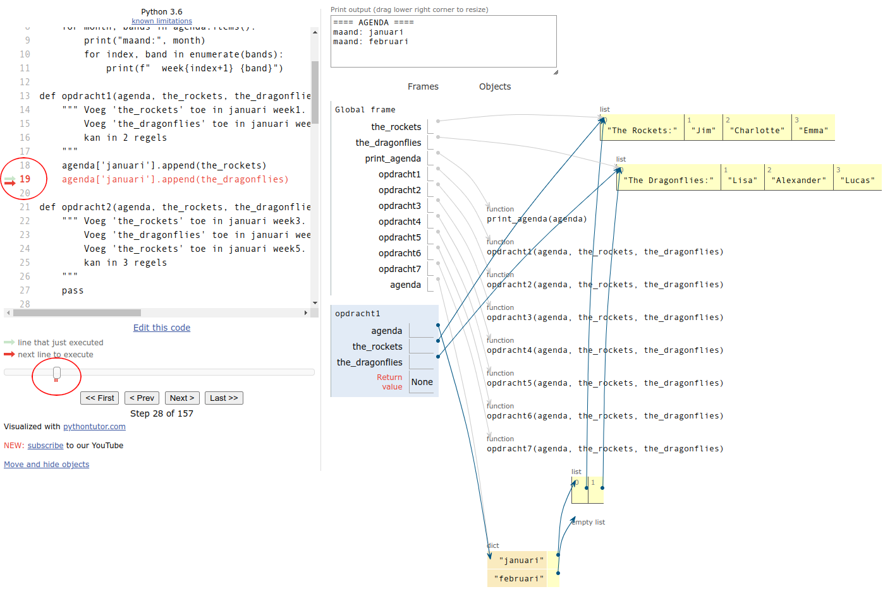

# Feestagenda

In deze opdracht oefenen we met het memory model, we gaan een
feestagenda invullen.

In de main van onderstaande programma [feestagenda.py](feestagenda.py)
wordt een lege feestagenda gemaakt die we gaan vullen met bands. In de
functies `opdracht1()` t/m `opdracht7()` gaan we steeds de agenda iets
aanpassen. Lees de docstring documentatie van ieder opdracht-functie
om te zien wat er moet gebeuren. Functie `opdracht1()` werkt nu al
correct. Bij elke opdracht-functie is ook aangegeven in hoeveel regels
deze kan worden geimplementeerd. Met een slimme aanpak zijn er maar
weinig regels nodig. Probeer de opdracht-functies zo kort mogelijk te
houden.

    def main():
        agenda = {'januari': [], 'februari': []} # lege agenda met 'januari' en 'februari'
        print_agenda(agenda)
        
        # de bands:
        the_rockets     = ['The Rockets:', 'Jim', 'Charlotte', 'Emma']
        the_dragonflies = ['The Dragonflies:', 'Lisa', 'Alexander', 'Lucas']
    
        print("opdracht1:")
        opdracht1(agenda, the_rockets, the_dragonflies)
        print_agenda(agenda)
    
        print("opdracht2:")
        opdracht2(agenda, the_rockets, the_dragonflies)
        print_agenda(agenda)
    
        print("opdracht3:")
        opdracht3(agenda, the_rockets, the_dragonflies)
        print_agenda(agenda)
    
        print("opdracht4:")
        opdracht4(agenda, the_rockets, the_dragonflies)
        print_agenda(agenda)
    
        print("opdracht5:")
        opdracht5(agenda, the_rockets, the_dragonflies)
        print_agenda(agenda)
    
        print("opdracht6:")
        opdracht6(agenda, the_rockets, the_dragonflies)
        print_agenda(agenda)
    
        print("opdracht7:")
        opdracht7(agenda, the_rockets, the_dragonflies)
        print_agenda(agenda)
    
    def print_agenda(agenda):
        """ Print de agenda """
        print("==== AGENDA ====")
        for month, bands in agenda.items():
            print("maand:", month)
            for index, band in enumerate(bands):
                print(f"  week{index+1} {band}")
    
    def opdracht1(agenda, the_rockets, the_dragonflies):
        """ Voeg 'the_rockets' toe in januari week1.
            Voeg 'the_dragonflies' toe in januari week2.
            kan in 2 regels
        """
        agenda['januari'].append(the_rockets)
        agenda['januari'].append(the_dragonflies)
    
    def opdracht2(agenda, the_rockets, the_dragonflies):
        """ Voeg 'the_rockets' toe in januari week3.
            Voeg 'the_dragonflies' toe in januari week4.
            Voeg 'the_rockets' toe in januari week5.
            kan in 3 regels
        """
    
    def opdracht3(agenda, the_rockets, the_dragonflies):
        """ 'Lisa' verandert haar artiestennaam naar 'LiZA' in alle optredens.
            kan in 1 regel
        """
        
    def opdracht4(agenda, the_rockets, the_dragonflies):
        """ Voeg gastartiest 'Thomas' toe aan 'the_rockets' maar alleen in week3.
            kan in 2 regels
        """
    
    def opdracht5(agenda, the_rockets, the_dragonflies):
        """ In 'februari' roosteren we dezelfde bands als in 'januari'.
            kan in 1 regel
        """
    
    def opdracht6(agenda, the_rockets, the_dragonflies):
        """ Voor 'februari' roosteren we maar 4 weken, verwijder week5 in 'februari' maar niet in 'januari'.
            kan in 2 regels
        """
    
    def opdracht7(agenda, the_rockets, the_dragonflies):
        """ In 'maart' roosteren we dezelfde bands als in 'januari', maar in elk optreden voegen we gastartiest 'Maya' toe. 
            kan in 4 regels
        """

if __name__ == "__main__":
    main()

## Testen

Het testprogramma [feestagenda_test.py](feestagenda_test.py) kan
worden gebruikt om je programma te testen. Als we het uitvoeren zien
we dat 'opdracht1' al correct is, maar 'opdracht2' en volgende
opdrachten nog niet.

    $ python feestagenda_test.py
    opdracht1: correct
    opdracht2:
    ERROR, wrong number of lines
    -------- your result:
    "==== AGENDA ====
    maand: januari
      week1 ['The Rockets:', 'Jim', 'Charlotte', 'Emma']
      week2 ['The Dragonflies:', 'Lisa', 'Alexander', 'Lucas']
    maand: februari
    "
    -------- should be:
    "==== AGENDA ====
    maand: januari
      week1 ['The Rockets:', 'Jim', 'Charlotte', 'Emma']
      week2 ['The Dragonflies:', 'Lisa', 'Alexander', 'Lucas']
      week3 ['The Rockets:', 'Jim', 'Charlotte', 'Emma']
      week4 ['The Dragonflies:', 'Lisa', 'Alexander', 'Lucas']
      week5 ['The Rockets:', 'Jim', 'Charlotte', 'Emma']
    maand: februari
    "

## PythonTutor

Gebruik de [PythonTutor](https://pythontutor.com/) voor een goed
overzicht van alle verwijzingen in de agenda. Als je in de PythonTutor
op een regelnummer klikt wordt deze rood en verschijnt er een rood
streepje in de timeline zodat je snel naar deze regel kan springen
zonder herhaaldelijk op 'Next' te hoeven drukken:

{: style="width:20rem;"}

## Geen Type Hints

Omdat PythonTutor tot Python versie 3.6 ondersteunt, begrijpt het
sommige type hints niet. Daarom gebruiken we geen type hints en geen
'mypy' type checks in deze opdracht.
