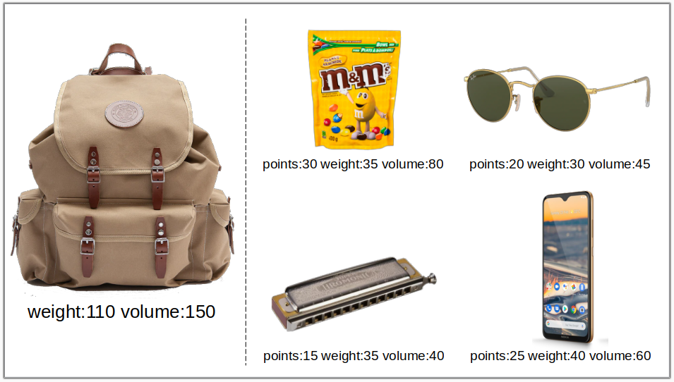
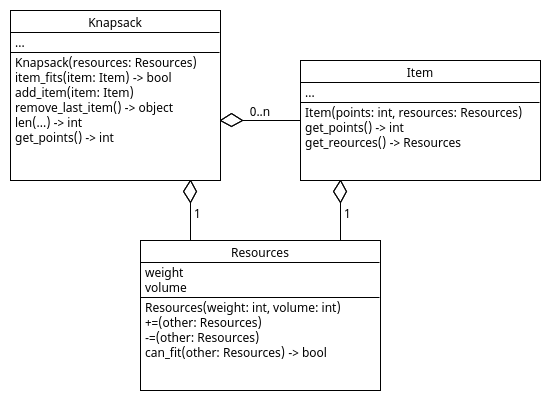

# Knapsack

> **Let op: het is altijd noodzakelijk om een main toe te voegen waarin de code wordt "gestart".**

Bij een knapsack-probleem krijgen we punten voor elk item dat we
inpakken in de knapsack. Een item mag maar één keer worden
ingepakt. Om een item in te pakken is er in de knapsack een bepaalde
hoeveelheid 'volume' en 'weight' nodig, anders past het item
niet. 'Volume' en 'weight' gezamelijk noemen we 'resources'. De
knapsack heeft maar een beperkte hoeveelheid resources waardoor niet
alle items kunnen worden ingepakt. Het totaal aan benodigde resources
van ingepakte items mag namelijk de resources van de knapsack niet
overschrijden.

Welke items (rechts) in onderstaand figuur zou jij inpakken om een zo
hoog mogelijk puntentotaal in de knapsack (links) te krijgen?

{: style="width:40rem;"}

De data in dit figuur is beschikbaar in file
[knapsack_small.csv](knapsack_small.csv). De data van grotere
knapsack-problemen is beschikbaar in files
[knapsack_medium.csv](knapsack_medium.csv) en
[knapsack_large.csv](knapsack_large.csv).

## Object-Oriented Programming

We gaan met Object-Oriented Programming een knapsack-inpakking
proberen te vinden met een zo hoog mogelijk aantal punten. Bij
Object-Oriented Programming definiëren we verschillende types die
overeenkomen met de concepten in het probleem-domein en geven die
nuttige *instance variables* en *methods*. De nuttige types die we in
deze opdracht voor het knapsackprobleem kiezen zijn `Knapsack`,
`Item` en `Resources`. Een UML class diagram geeft hun relatie weer:

{: style="width:40rem;"}

## Resources Type

We definiëren eerst het nieuwe type `Resources` als:

    class Resources:
        """ Holds the recources for a Knapsack problem. """

        def __init__(self, weight: int, volume: int):
            """ Creates a resources object with weight and volume. """
            self.weight=weight
            self.volume=volume

        def __repr__(self) -> str:
            """ Prints the instance variables of this class. """
            return f"Resources(weight:{self.weight} volume:{self.volume})"
            
        def __iadd__(self, other: 'Resources') -> 'Resources':
            """ Implements the '+=' operator. """
            self.weight += other.weight
            self.volume += other.volume
            return self

        def __isub__(self, other: 'Resources') -> 'Resources':
            """ Implements the '-=' operator. """
            self.weight -= other.weight
            self.volume -= other.volume
            return self

        def can_fit(self, other: 'Resources') -> bool:
            """ Tests if the volume and weight of 'other' are both smaller or equal to that of 'self'.
                Useful to test if an item can still fit in the knapsack.
            """
            return other.weight <= self.weight and other.volume <= self.volume
            
Met dit type kunnen we nu gemakkelijk resources op en aftellen en
testen of resources in andere resources passen zoals in dit voorbeeld:

    def resources_example() -> None:
        r1 = Resources(100, 200)
        print(r1)                # Resources(weight:100 volume:200)
        r2 = Resources(25, 50)
        r1 += r2
        print(r1)                # Resources(weight:125 volume:250)
        print(r2.can_fit(r1))    # True   (item with resources r1 would     fit in a knapsack with resources r2)
        print(r1.can_fit(r2))    # False  (item with resources r2 would not fit in a knapsack with resources r1)
        r1 -= r2
        print(r1)                # Resources(weight:100 volume:200)

**Opdracht1:** Neem deze definitie over en voeg doctests toe die
testen of dit type goed werkt.

## Item Type

Met dit type `Resources` maken we type `Item`. 'Item' type is alleen maar
een container om points en resources in op te slaan en heeft verder
geen functionaliteit, desondanks is dit een nuttig type waarmee we een
item (zoals beschreven in het Knapsack probleemdomein) kunnen
representeren.

    class Item:
        """ A Knapsack Item with points and resources. """

        def __init__(self, points: int, resources: Resources):
            """ Creates an item object with points and resources. """

        def __repr__(self) -> str:
            """ Prints the instance variables of this class. """
            
        def get_points(self) -> int:
            """ Returns the points. """

        def get_resources(self) -> Resources:
            """ Returns the resources. """

**Opdracht2:** Implementeer dit type zodat we een `Item` kunnen
aanmaken, printen, en punten en resources kunnen opvragen zoals wordt
gedaan in dit voorbeelden:

    def item_example() -> None:
        item = Item(20, Resources(100, 200))
        print(item)                   # Item(points:20 resources:Resources(weight:100 volume:200))
        print(item.get_points())      # 20
        print(item.get_resources())   # Resources(weight:100 volume:200)

## Knapsack Type

Aan een object van type `Knapsack` moeten we items kunnen toevoegen en
verwijderen waarbij steeds de resources die overblijven goed moeten worden
bijgehouden. We willen ook kunnen vragen of een item nog mag worden
toegevoegd, en wat het puntentotaal van de knapsack is.

**Opdracht3:** Implementeer type `Knapsack` op basis van de gegeven docstrings.

    class Knapsack:
        """ Knapsack to which Items can be added. Keeps track of points and available resources."""

        def __init__(self, resources: Resources):
            """ Creates an empty knapsack with resources. """

        def __repr__(self) -> str:
            """ Prints the instance variables of this class. """

        def item_fits(self, item: Item) -> bool:
            """ Returns True if item can still be add to the knapsack given 
                the remaining resources, False otherwise. """

        def add_item(self, item: Item) -> None:
            """ Adds item to the knapsack and updates resources (and maybe points). """

        def remove_last_item(self) -> object:
            """ Removes and returns the last item from the knapsack and updates 
                resources (and maybe points). Returns None if the knapsack has no items. """
                
        def __len__(self) -> int:
            """ Implements 'len(knapsack)' function, where knapsack is of type Knapsack,
                to return the number of items in the knapsack. """

        def get_points(self) -> int:
            """ Returns the total number of points of all items in the knapsack. """

Een voorbeeld van het gebruik van type `Knapsack` is:

    def knapsack_example() -> None:
        knapsack = Knapsack(Resources(100, 200))
        print( knapsack )                          # (afhankelijk van jouw implementatie)
        print( len(knapsack) )                     # 0
        print( knapsack.get_points() )             # 0
        item1 = Item(10, Resources(40, 70))
        knapsack.add_item( item1 )
        print( knapsack )                          # (afhankelijk van jouw implementatie)
        print( len(knapsack) )                     # 1
        print( knapsack.get_points() )             # 10
        item2 = Item(20, Resources(45, 90))
        knapsack.add_item( item2 )
        print( knapsack )                          # (afhankelijk van jouw implementatie)
        print( len(knapsack) )                     # 2
        print( knapsack.get_points() )             # 30
        print( knapsack.item_fits(item2) )         # False
        item = knapsack.remove_last_item()
        print( knapsack.item_fits(item2) )         # True
        print( knapsack )                          # (afhankelijk van jouw implementatie)
        print( len(knapsack) )                     # 1
        print( knapsack.get_points() )             # 10
        item = knapsack.remove_last_item()
        print( knapsack )                          # (afhankelijk van jouw implementatie)
        print( len(knapsack) )                     # 0
        print( knapsack.get_points() )             # 0
    
## Laad een Knapsackprobleem

**Opdracht4:** Lees de data in de
[knapsack_small.csv](knapsack_small.csv) file in. Hiervoor kan deze
functie als startpunt gebruikt worden. Breid deze functie uit en
return de knapsack en items bv met gebruik van lijst en/of tuple:

    def load_knapsack(filename):
        with open(filename,'r') as file:
            header = file.readline()
            for line in file:
                splits = line.split(',')
                if len(splits)>3:
                    element = splits[0].strip()
                    points = int(splits[1])
                    weight = int(splits[2])
                    volume = int(splits[3])
                    print(f"element:{element} points:{points} weight:{weight} volume:{volume}")

Deze en onderstaande functies zijn functies en geen *methods*, deze
hoeven dus niet in een class komen te staan. Voeg deze functies toe
onder de classes zodat de classes al gedefinieerd zijn wanneer deze
functies door python worden gelezen.

## Inpakken

**Opdracht5:** Schrijf de functie:

    def solve_knapsack(filename):
        """ Returns the highest number of points found while trying different ways of
        packing the knapsack with items as described in file 'filename' """

en eventuele helperfuncties om een zo hoog mogelijk aantal punten te
vinden voor het inpakken van de knapsack. Een voorbeeld van een
eenvoudig algoritme hiervoor is:

*   start met een lege knapsack

*   voeg de items in willekeurige volgorde aan de knapsack toe totdat er niks meer bij kan

*   werk het tot-nu-toe-hoogste-aantal-gevonden-punten bij met het aantal punten van de knapsack

*   haal alle items weer uit de knapsack

*   herhaal dit process een zelfgekozen aantal keer (bv enkele minuten)

Test dit eerst met het [knapsack_small.csv](knapsack_small.csv)
probleem en pas het daarna toe op het grotere
[knapsack_medium.csv](knapsack_medium.csv) probleem.

Tip: Pas goed op dat je geen items dubbel inpakt en dat er geen items
verdwijnen of bijkomen.

## Optioneel: Beter Inpakken

**Opdracht6:** Bedenk zelf een beter algoritme om een zo hoog mogelijk
aantal punten voor de knapsack te vinden. Zo kun je misschien het
aantal punten van een ingepakte knapsack verder verhogen door er eerst
weer wat items uit te halen. Voeg eventueel hiervoor eigen methodes
toe aan de classes, bv "remove_random_item()" aan class Knapsack. 

Tip: Begin simpel en test steeds je algoritme goed voordat je deze
slimmer/ingewikkelder maakt.

Wat is het hoogste aantal punten wat je kunt vinden voor het
[knapsack_large.csv](knapsack_large.csv) probleem? Vergelijk je
resultaat met andere.

## Theorie: Voordelen van Object-Oriented Programming 

We hadden het Knapsack-probleem ook kunnen oplossen zonder gebruik van
object-georiënteerd programmeren (dus zonder gebruik van classes). Dan
waren er mogelijk minder regels code nodig geweest. Welke voordelen
zijn er dan waardoor we hier toch kiezen voor Object-Oriented
Programming?

### 1) Types uit Probleemdomein

De gekozen types `Resources`, `Knapsack` en `Item` komen overeen met
concepten uit het probleemdomein waardoor het makkelijker is om over
de code na te denken. Het vraagt wel enige oefening om voor een
probleem de juiste types te kiezen, let daarbij op de
zelfstandignaamwoorden in de probleembeschrijving voor *classes* en
*instance variables* en op werkwoorden voor de *methods*.

### 2) Encapsulation

Met *encapsulation* wordt bedoeld dat een class implementatiedetails
verborgen houdt voor de gebruiker van een class. Eerder zagen we dit
bij functies, we kunnen een functie gebruiken zonder dat we hoeven te
weten hoe deze functie is geïmplementeerd. Maar anders dan functies
kan een class ook waarden (ook wel *state* genoemd) in de vorm van
*instance variables* verbergen.

Een gebruiker van een class hoeft bij het aanroepen van *methods* dus
niks te weten over hoe waarden in een class zijn opgeslagen. De
implementatie van een class kan daardoor makkelijker veranderen zonder
dat dat effect heeft op andere delen van de code. Bij Object-Oriented
Programming is een groot programma daardoor vaak beter in
compartimenten opgedeeld waarbij veranderingen in één compartiment
minder snel leiden tot verandering in een ander compartiment. Enkele
voorbeelden hiervan:

*   De class `Resources` heeft nu alleen *instance variables* weight
    en volume, als daar nog meer variabelen bij zouden komen (bv
    *price*) zouden deze relatief gemakkelijk in de Resouces class
    kunnen worden toegevoegd zonder dat veel code buiten de Resources
    class aangepast hoeft te worden.
    
*   In de `Knapsack` class heb je waarschijnlijk een *list* gebruikt
    om alle items op te slaan, maar een random element uit een *list*
    verwijderen kan langzaam zijn als de *list* erg lang is. Bij hele
    grote knapsackproblemen kan een *set* of een andere implementatie
    sneller zijn. Omdat deze *list* is verborgen in de Knapsack class,
    en dus niet gebruikt wordt in code buiten deze class, zal de
    aanpassing naar *set* geen effect hebben op code buiten de
    Knapsack class.

## Afronding

**Opdracht7:** Voeg doctests toe die testen of je code goed werkt.
