# Memory Model

## int

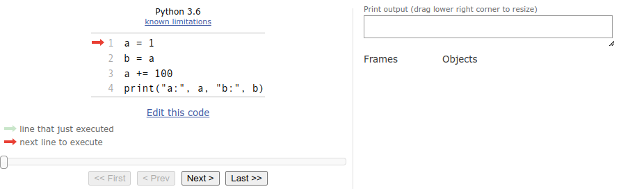{: style="width:20rem;"}
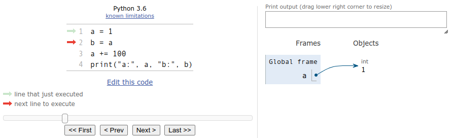{: style="width:20rem;"}
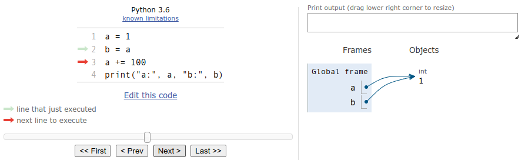{: style="width:20rem;"}
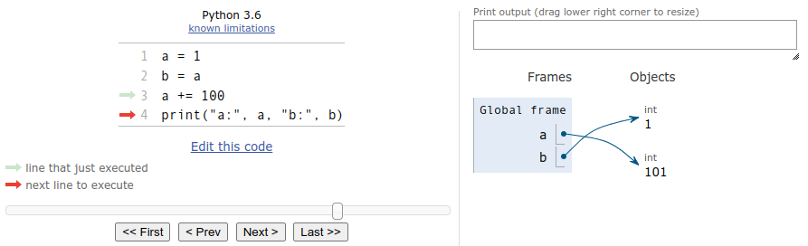{: style="width:20rem;"}
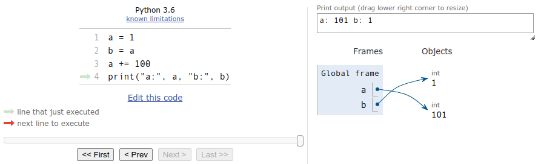{: style="width:20rem;"}

## str

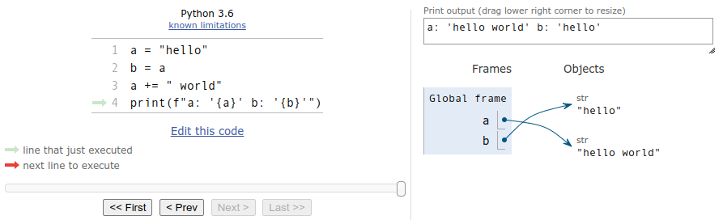{: style="width:20rem;"}

## list

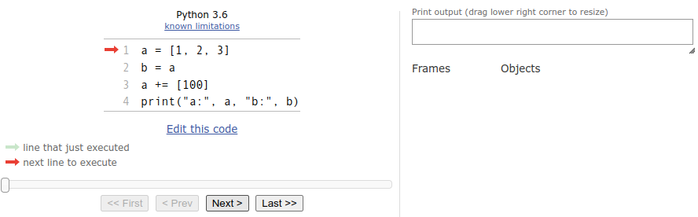{: style="width:20rem;"}
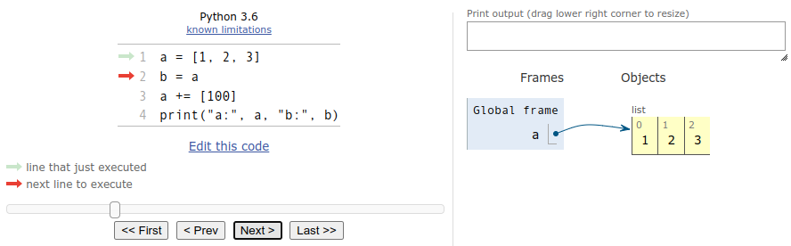{: style="width:20rem;"}
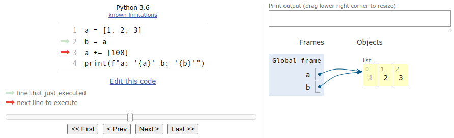{: style="width:20rem;"}
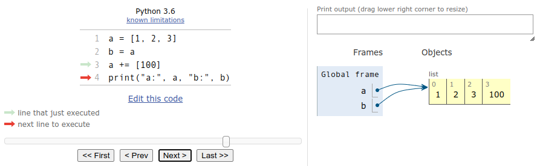{: style="width:20rem;"}
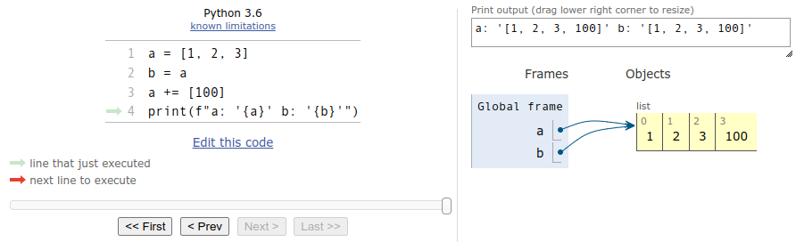{: style="width:20rem;"}

