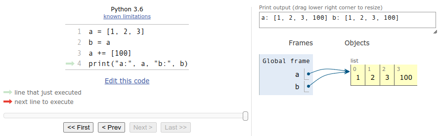

# Memory Model

Python maakt onderscheid tussen 'mutable' en 'immutable' types. Een
waarde van een immutable type kan niet worden aangepast zonder dat er
een kopie van gemaakt wordt. Een waarde van een mutable type kan wel
worden aangepast zonder een kopie te maken.

Elke type is mutable of immutable. 

immutable types: `bool`, `int`, `float`, `str`, `tuple`, enkele andere types

mutable types: `list`, `set`, `dictionary`, alle andere types

## int (immutable type)

In dit voorbeeldprogrammma verwijzen variabelen `a` en `b` naar een
waarde van het type `int` welke immutable is.

    a = 1
    b = a
    a += 100
    print("a:", a, "b:", b)

Als we dit programma uitvoeren in
[PythonTutor](https://pythontutor.com/) met de optie "render all
objects on the heap" zien we wat er gebeurt. Na uitvoeren van de
eerste regel verwijst variable `a` naar waarde `1`.

{: style="width:20rem;"}

Na de volgende regel verwijst variable `b` naar dezelfde waarde:

{: style="width:20rem;"}

Dan wordt de waarde waar `a` naar wijst aangepast (`+= 100`), en omdat
`a` naar een 'immutable' type verwijst wordt eerst een kopie van deze
waarde gemaakt zodat de waarde waar `b` naar verwijst, niet wordt
aangepast:

{: style="width:20rem;"}

Als we `a` en `b` vervolgens printen zien we dat ze inderdaad naar
twee verschillende waarden verwijzen.

{: style="width:20rem;"}

## str (immutable type)

In dit voorbeeldprogramma verwijzen `a` en `b` naar een waarde van het type `str`. 

    a = "hello"
    b = a
    a += " world"
    print(f"a: '{a}' b: '{b}'")
    
Omdat een `str` net als een `int` 'immutable' is, gebeurt hier
hetzelfde en zien we na het printen dat `a` en `b` opnieuw naar twee
verschillende waarden verwijzen.

{: style="width:20rem;"}

Geen verassingen tot nu toe.

## list (mutable type)

Maar in dit voorbeeldprogramma verwijzen `a` en `b` naar een waarde
van het type `list` wat een `mutable` type is. Het resultaat is nu
anders.

    a = [1, 2, 3]
    b = a
    a += [100]
    print(f"a: '{a}' b: '{b}'")

Na uitvoeren van de eerste regel verwijst variable `a` naar een lijst
`[1, 2, 3]`.

{: style="width:20rem;"}

Na de volgende regel verwijst variable `b` naar dezelfde waarde:

{: style="width:20rem;"}

Dan wordt de waarde waar `a` naar wijst aangepast (`+= [100]`), en
omdat `a` naar een 'mutable' type verwijst wordt **geen** kopie van
deze waarde gemaakt en dus wordt de waarde waar `b` naar verwijst ook
aangepast.

{: style="width:20rem;"}

Bij het printen zien we dan ook dat voor variable `a` en `b` dezelfde
waarde wordt geprint wat in de eerdere voorbeeldprogramma's met
'immutables' niet het geval was.

{: style="width:20rem;"}
