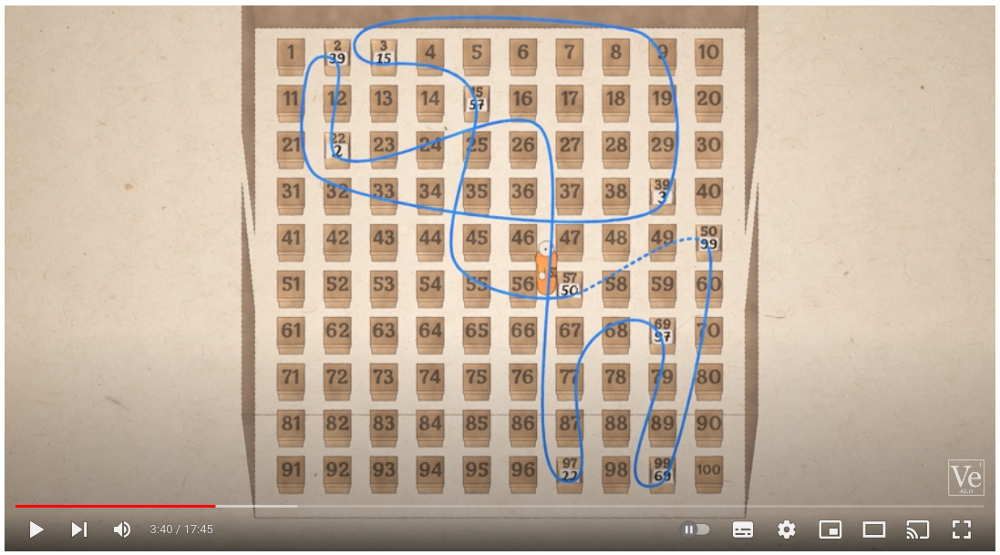

# 100 Prisoners Riddle

Youtube video [The Riddle That Seems Impossible Even If You Know The
Answer](https://youtu.be/iSNsgj1OCLA) van Veritasium beschrijft een
puzzel met 100 gevangenen die ieder hun eigen nummer moeten vinden in
100 dozen met ieder maar 50 zoekpogingen. De verassende
oplossings-stragegie van de puzzel wordt ook uitgelegd.

[](https://youtu.be/iSNsgj1OCLA)

Schrijf een programma dat controleert of deze strategie inderdaad
werkt. Voer 1000 keer de strategie uit met 100 gevangenen en 100 dozen
en houd bij hoe vaak het elke gevangene lukt om zijn of haar eigen
nummer te vinden. Geef daarmee een schatting van de kans dat met deze
strategie alle gevangen vrijkomen en print deze kans (waarde tussen 0
en 1).

Nummer de dozen en gevangenen van 0 t/m 99 in plaats van 1 t/m 100
omdat dat de Python code simpeler houdt. Verdeel de nummers van
gevangenen random over dozen met gebruik van de `random.shuffle()`
functie:

```python
import random

boxes = [0, 1, 2, 3, 4]
random.shuffle(boxes)
print(boxes)
```

Deel je programma zelf op in minimaal drie verschillende functies.
