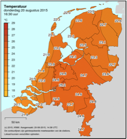

# Klimaatanalyse

Tijd voor analyse. Schrijf een programma genaamd `klimaat.py` dat een bestand `climate.csv` kan inlezen en de volgende analyse uitprinten:

    KLIMAATANALYSE

    Databestand
    -----------
    Bestandsnaam: climate.csv
    Eerste datum: 01-01-1901
    Laatste datum: 31-12-2019

    Basisinformatie
    ---------------
    Laagste temperatuur: -11.4° op 26-01-1942
    Hoogste temperatuur: 37.5° op 25-07-2019
    Gemiddelde temperatuur: 13.6°

    Extremen 2010-2019
    ------------------
    In 2010 varieerde de temperatuur tussen -6.1° op 02-12 en 34.4° op 09-07
    In 2011 varieerde de temperatuur tussen -0.1° op 31-01 en 32.2° op 28-06
    In 2012 varieerde de temperatuur tussen -5.1° op 03-02 en 33.0° op 19-08
    In 2013 varieerde de temperatuur tussen -2.8° op 17-01 en 34.0° op 02-08
    In 2014 varieerde de temperatuur tussen 1.0° op 03-12 en 32.9° op 19-07
    In 2015 varieerde de temperatuur tussen -1.3° op 23-01 en 33.1° op 01-07
    In 2016 varieerde de temperatuur tussen -0.8° op 29-12 en 32.9° op 20-07
    In 2017 varieerde de temperatuur tussen -1.9° op 18-01 en 31.9° op 27-05
    In 2018 varieerde de temperatuur tussen -4.6° op 28-02 en 35.7° op 26-07
    In 2019 varieerde de temperatuur tussen -1.1° op 24-01 en 37.5° op 25-07

## Aanwijzingen

- De checks zijn extreem streng: de output moet **exact** zo zijn als hierboven.

- Gebruik als input de file [climate.csv](climate.csv). Je programma moet ook werken als het bestand andere waarden bevat! Let op dat de temperaturen keer 10 vermeld zijn. Als er `-40` staat dan betekent dat -4.0 graden.

- De datums staan in het formaat `YYYYMMDD`. Dit kun je gewoon als string behouden. Je kunt vervolgens het jaartal eruit halen door `datum[0:4]` te doen (slicing dus, zoals eerder in het boek behandeld met lists, kan ook met strings).

- Maak een functie `print_basis_info(filename: str)` die de naam van het bestand meekrijgt en de secties "Databestand" en "Basisinformatie" print, inclusief de gegevens die hierboven in het voorbeeld vermeld zijn. Zorg dat deze functie slechts één keer door het bestand loopt.

- Maak een functie `extremen(filename: str) -> dict[int, list[int]]` die de naam van het bestand meekrijgt en alle informatie over elk jaar 2010-2019 in een `dict` verzamelt. Deze dictionary moet vervolgens teruggegeven worden met `return`. Zorg dat deze functie slechts één keer door het bestand loopt.

- Maak een functie `print_extremen(filename: str)` die de naam van het bestand meekrijgt, dan de functie `extremen()` aanroept en dan alle informatie van de sectie "Extremen" print, inclusief alle gegevens die hierboven in het voorbeeld vermeld zijn.

- Bedenk welke delen je eventueel nog in aparte functies kunt zetten, maar houd bovenstaande drie functies aan en roep ze aan in een if-name-is-main onderaan je code.

- Zorg dat alle types op orde zijn; doctests zijn alleen verplicht voor hulpfuncties naast de bovenstaande drie.
