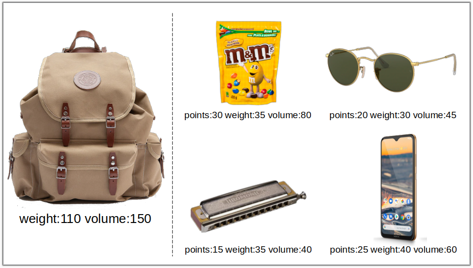

# Knapsack

> Puntentelling IK/KI
>
> - 9: Een werkende inzending die voldoet aan alle vereisten voor de opdracht, met zowel solide functionaliteit als een goede stijl, maar kleine fouten worden niet gerekend. De goede werking is aangetoond door doctests.
> - 7: Een werkende inzending die voldoet aan de meeste eisen voor de opdracht, mogelijk met wat problemen. Werking is aangetoond door doctests.
> - 5: Een werkende inzending die problemen heeft die ernstig genoeg zijn om niet aan de vereisten voor de opdracht te voldoen. Werking is aangetoond door doctests.
> - 3: Een werkende inzending die zeer ernstige problemen heeft, maar toch enige inspanning en begrip toont. Werking van onderdelen is aangetoond door doctests.
> - 0: Een inzending die weinig inspanning toont en niet duidelijk maakt dat er begrip is.

Bij een knapsack-probleem krijgen we punten voor elk item dat we
inpakken in de knapsack. Elk item mag maar één keer worden
ingepakt. De knapsack heeft beperkte resources waardoor niet alle
items kunnen worden ingepakt. Resources bestaan uit een 'weight' en
een 'volume'. Het totaal aan resources van de ingepakte items mag de
resources van de knapsack niet overschrijden. Welke items in
onderstaand figuur zou jij inpakken om een zo hoog mogelijk
puntentotaal in de knapsack te krijgen?

{: style="width:40rem;"}

De data in dit figuur is beschikbaar in file
[knapsack_small.csv](knapsack_small.csv). De data van grotere
knapsack-problemen is beschikbaar in files
[knapsack_medium.csv](knapsack_medium.csv) en
[knapsack_large.csv](knapsack_large.csv).

## Object-Oriented Programming

We gaan met Object-Oriented Programming een knapsack inpakking
proberen te vinden met een zo hoog mogelijk aantal punten. Bij
Object-Oriented Programming definiëren we verschillende types die
overeenkomen met de concepten in het probleem-domein en geven die
nuttige *instance variables* en *methods*. De nuttige types die we in
deze opdracht voor het knapsack-probleem kiezen zijn `Resources`,
`Item` en `Knapsack` (al zijn er ook andere manieren mogelijk om het
probleem op te delen).

## Resources type

We definiëren eerst het nieuwe type `Resources` als:

    class Resources:
        """ Holds the recources for a Knapsack problem. """
    
        def __init__(self, weight, volume):
            """ Creates a resources object with weight and volume. """
            self.weight=weight
            self.volume=volume

        def __repr__(self):
            """ Prints the instance variables of this class. """
            return f"Resources(weight:{self.weight} volume:{self.volume})"

        def __iadd__(self, other):
            """ Implements '+=' operator. """
            self.weight += other.weight
            self.volume += other.volume
            return self
    
        def __isub__(self, other):
            """ Implements '-=' operator. """
            self.weight -= other.weight
            self.volume -= other.volume
            return self

        def __lt__(self, other):
            """ Implements '<' operator. """
            return self.weight < other.weight and self.volume < other.volume
            
Met dit type kunnen we nu gemakkelijk resources op en aftellen en vergelijken, bijvoorbeeld:

    r1 = Resources(100, 200)
    r2 = Resources(25, 50)
    r1 += r2
    print(r1)        # Resources(weight:125 volume:250)
    print(r2 < r1)   # True
    print(r1 < r2)   # False
    r1 -= r2
    print(r1)        # Resources(weight:100 volume:200)

**Opdracht:** Neem deze definitie over en voeg doctests toe die testen of dit type goed werkt.

## Item type

Met type `Resources` maken we type `Item`. Dit type is alleen maar een
container om points en resources in op te slaan en heeft verder geen
functionaliteit, desondanks is dit een nuttig type waarmee we een item
(zoals beschreven in het Knapsack probleem-domein) kunnen representeren.

    class Item:
        """ A Knapsack Item with points and resources. """
    
        def __init__(self, points, resources):
            """ Creates an item object with points and resources. """
            pass
        
        def __repr__(self):
            """ Prints the instance variables of this class. """
            pass

        def get_points(self):
            """ Returns the points. """
            pass

        def get_resources(self):
            """ Returns the resources. """
            pass

**Opdracht:** Deze class werkt nog niet. Verwijder de `pass`
placeholders en implementeer deze class zodat we een `Item` kunnen
aanmaken, printen, en punten en resources kunnen opvragen,
bijvoorbeeld:

    item = Item(20, Resources(100, 200))
    print(item)                   # Item(points:20 resources:Resources(weight:100 volume:200))
    print(item.get_points())      # 20
    print(item.get_resources())   # Resources(weight:100 volume:200)

## Knapsack type

Aan een object van type Knapsack moeten we items kunnen toevoegen en
verwijderen waarbij de overgebleven resources worden bijgehouden. We
willen kunnen vragen of een item nog mag worden toegevoegd, en wat het
puntentotaal van de knapsack is.

**Opdracht:** Verwijder de `pass` placeholders en implementeer type
`Knapsack` op basis van de gegeven docstrings.

    class Knapsack:
        """ Knapsack to which Items can be added. Keeps track of points and available resources."""

        def __init__(self, resources):
            """ Creates an empty knapsack with resources. """
            pass
        
        def __repr__(self):
            """ Prints the instance variables of this class. """
            pass

        def item_fits(self, item):
            """ Returns True if item can still be add to the knapsack given 
            the remaining resources, False otherwise. """
            pass
    
        def add_item(self, item):
            """ Adds item to the knapsack and updates resources. """
            pass
        
        def remove_last_item(self):
            """ Removes and returns the last item from the knapsack and updates resources. 
            Returns None if the knapsack has no items. """
            pass

        def __len__(self):
            """ Implements 'len(knapsack)' function, where knapsack is of type Knapsack,
            to return the number of items in the knapsack. """
            pass

        def get_points(self):
            """ Returns the total number of points of all items in the knapsack. """
            pass

Een voorbeeld van het gebruik van type Knapsack is:

    knapsack = Knapsack(Resources(100, 200))
    print( knapsack )                          # (afhankelijk van jouw implementatie)
    print( len(knapsack) )                     # 0
    print( knapsack.get_points() )             # 0
    item1 = Item(10, Resources(40, 70))
    knapsack.add_item( item1 )
    print( knapsack )                          # (afhankelijk van jouw implementatie)
    print( len(knapsack) )                     # 1
    print( knapsack.get_points() )             # 10
    item2 = Item(20, Resources(45, 90))
    knapsack.add_item( item2 )
    print( knapsack )                          # (afhankelijk van jouw implementatie)
    print( len(knapsack) )                     # 2
    print( knapsack.get_points() )             # 30
    print( knapsack.item_fits(item2) )         # False
    item = knapsack.remove_last_item()
    print( knapsack.item_fits(item2) )         # True
    print( knapsack )                          # (afhankelijk van jouw implementatie)
    print( len(knapsack) )                     # 1
    print( knapsack.get_points() )             # 10
    item = knapsack.remove_last_item()
    print( knapsack )                          # (afhankelijk van jouw implementatie)
    print( len(knapsack) )                     # 0
    print( knapsack.get_points() )             # 0
    
## Load a Knapsack problem

**Opdracht:** Lees de data in de [knapsack_small.csv](knapsack_small.csv) file in. Hiervoor
kan deze functie als startpunt gebruikt worden:

    def load_knapsack(filename):
        with open(filename,'r') as file:
            header = file.readline()
            for line in file:
                splits = line.split(',')
                if len(splits)>3:
                    element = splits[0].strip()
                    points = int(splits[1])
                    weight = int(splits[2])
                    volume = int(splits[3])
                    print(f"element:{element} points:{points} weight:{weight} volume:{volume}")

Deze en onderstaande functies zijn functies en geen *methods*, deze
hoeven dus niet in een class komen te staan. Voeg deze functies toe
onder de classes zodat de classes al gedefinieerd zijn wanneer deze
functies door python worden gelezen.

## Inpakken

**Opdracht:** Schrijf de functie:

    def solve_knapsack(filename):
        """ Returns the highest number of points found while trying different ways of
        packing the knapsack in file 'filename' """
        pass

en eventuele helper-functies om een zo hoog mogelijk aantal punten te
vinden voor het inpakken van de knapsack. Een voorbeeld van een
eenvoudig algoritme hiervoor is:

*   start met een lege knapsack

*   voeg de items in willekeurige volgorde aan de knapsack toe totdat er niks meer bij kan

*   werk het tot-nu-toe-hoogste-aantal-gevonden-punten bij met het aantal punten van de knapsack

*   haal alle items weer uit de knapsack

*   herhaal dit process een zelf-gekozen aantal keer (bv enkele minuten)

Test dit eerst met het [knapsack_small.csv](knapsack_small.csv)
probleem (tip: pas goed op dat er geen items verdwijnen of bijkomen)
en pas het daarna toe op het grotere
[knapsack_medium.csv](knapsack_medium.csv) probleem.

## Optioneel: Beter inpakken

Bedenk zelf een beter algoritme om een zo hoog mogelijk aantal punten
voor de knapsack te vinden. Zo kun je misschien het aantal punten van
een ingepakte knapsack verder verhogen door er eerst weer wat items
uit te halen. Voeg eventueel hiervoor eigen methods toe aan de
classes, bv "remove_random_item()" aan class Knapsack. Tip: Begin simpel
en test steeds je algoritme goed voordat je deze slimmer/ingewikkelder
maakt.

Wat is het hoogst aantal punten wat je kunt vinden voor het
[knapsack_large.csv](knapsack_large.csv) probleem? Vergelijk je
resultaat met andere.

## Theorie: Voordelen van Object-Oriented Programming 

We hadden het Knapsack-probleem ook kunnen oplossen zonder gebruik van
object-georiënteerd programmeren (dus zonder gebruik van classes). Dan
waren er mogelijk minder regels code nodig geweest. Welke voordelen
zijn er dan toch waardoor we hier kiezen voor het object-georiënteerd
programmeren van het Knapsack-probleem?

### 1 Types uit probleem-domein

De types komen overeen met concepten uit het probleem-domein waardoor
het makkelijker is om over de code na te denken (dit vraagt wel enige 
oefening natuurlijk).

### 2 Encapsulation

Met *encapsulation* wordt bedoeld dat een class implementatie-details
verborgen houdt voor de gebruiker van een class. Eerder zagen we dit
bij functies, we kunnen een functie gebruiken zonder dat we hoeven te
weten hoe deze functie is geïmplementeerd. Maar anders dan functies
kan een class ook *instance variables* verbergen zodat we nu dus ook
waarden (ook wel *state* genoemd) kunnen verbergen.

Een gebruiker van een class hoeft bij het aanroepen van *methods* dus
niks te weten over hoe waarden in een class zijn geïmplementeerd. De
implementatie van een class kan daardoor makkelijker veranderen zonder
dat dat effect heeft op andere delen van de code. Bij Object-Oriented
Programming is code daardoor vaak beter in compartimenten opgedeeld
waarbij veranderingen in één compartimenten minder snel leiden tot
verandering in een ander. Enkele voorbeelden hiervan:

*   De class `Resources` heeft nu alleen *instance variables* weight
    en volume, als daar nog meer variabelen bij zouden komen (bv
    price) zouden deze relatief gemakkelijk in de Resouces class
    kunnen worden toegevoegd zonder dat veel code buiten de Resouces
    class aangepast hoeft te worden.
    
*   In de `Knapsack` class heb je waarschijnlijk een *list* gebruikt om
    alle items op te slaan, maar een random element uit een *list*
    verwijderen kan langzaam zijn als de *list* erg lang is. Bij hele
    grote knapsack-problemen zou een *set* of een andere implementatie
    waarschijnlijk sneller zijn. Omdat deze *list* is verborgen in de
    Knapsack class, en dus niet gebruikt wordt in code buiten deze
    class, zal deze aanpassing geen effect hebben op code buiten de
    Knapsack class.

## Afronding

Voeg doctests toe die testen of je code goed werkt en voeg zo veel
mogelijk type hints toe als mogelijk is.
