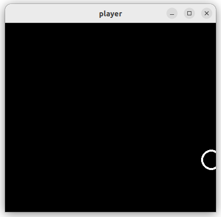
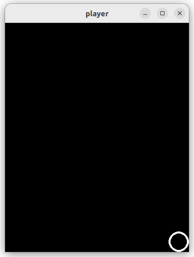
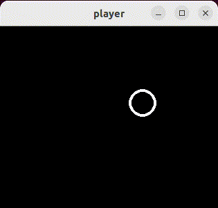

# Pygame Player

Programma [player.py](player.py) laat zien hoe we een speler kunnen
besturen met het toetsenbord. Als we dit programma uitvoeren zien we
een witte cirkel die we kunnen bewegen met de cursor toetsen of met
toetsen 'W','A','S','D'. Lees de
[key.html](https://www.pygame.org/docs/ref/key.html) pagina van pygame
voor meer informatie over het lezen van toetsenbord.

Voor de representatie van de positie van de speler gebruiken we class
`pygame.Vector2` welke een X,Y coordinaat representeert. Met deze
class kunnen we makkelijk rekenen met coordinaten, bijvoorbeeld:

```python
v1 = pygame.Vector2(1, 2)
v2 = pygame.Vector2(10, 20)
v3 = v1 + v2
print(v3) # [11, 22]
print(v3 * 10) # [110, 220]
```

Lees de [math.html](https://www.pygame.org/docs/ref/math.html) pagina
van pygame voor meer informatie over deze Vector2 class en de
verschillende operatoren en functie die we kunnen gebruiken op deze
class.


## Opdracht: Op het window blijven

Een probleem in het [player.py](player.py) programma is dat de speler
van het window af kan bewegen:



Pas het programma aan zodat de speler niet meer gedeeltelijk van het
window af kan bewegen door de positie (Vector2) aan te passen als de
waarde van het X of het Y te groot of te klein wordt. Zorg dat het ook
goed werkt als het window een andere grootte krijgt:




## Opdracht: Acceleratie

Met toetsen passen we nu direct the positie van de speler aan, maar
het spel is leuker als we de snelheid moeten aanpassen in plaats van
de positie. Zet de snelheid van de speler initieel op 0,0 met:

```python
speed = pygame.Vector2(0, 0)
```

Pas in plaats van de positie deze snelheid aan bij het indrukken van
de toetsen:

```python
acceleration = 0.5
if keys[pygame.K_LEFT] or keys[pygame.K_a]:
        speed.x -= acceleration
...
```

Tel in iedere iteratie van de loop deze snelheid op bij de huidige
positie van de speler:

```python
position += speed
```

Vermenigvuldig in iedere iteratie de snelheid met '0.95' om voor een
maximale snelheid te zorgen:

```python
speed *= 0.95
```

Keer ook de snelheid om als de speler van het window af beweegt om de
speler tegen de rand van het window te laten "stuiteren":

```python
if position.x < radius:
    position.x = radius
    speed.x = -speed.x
...
```
Het resultaat zou er ongeveer zo uit moeten zien:


