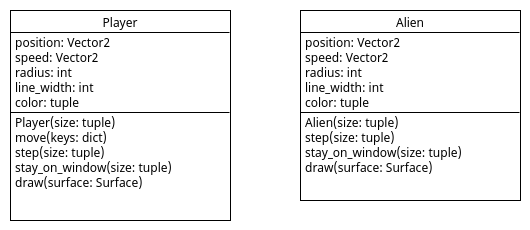

# Aliens

In ons spel hebben we ook tegenspelers nodig, Aliens! Schrijf class
Alien in bestand [Alien.py](Alien.py) zodat we in de `main()` van
bestand [main.py](main.py) 5 aliens kunnen aanmaken.

Baseer de Alien class op de Player class met enkele
verschillen. Een alies krijgt 
- een random positie in het window
- een random speed tussen (-3,-3) en (+3,+3)
- een radius van 10
- een line_width van 0 wat resulteerd in ingekleurde cirkel
- een alien kan niet worden bestuurd met het toetsenbord.

