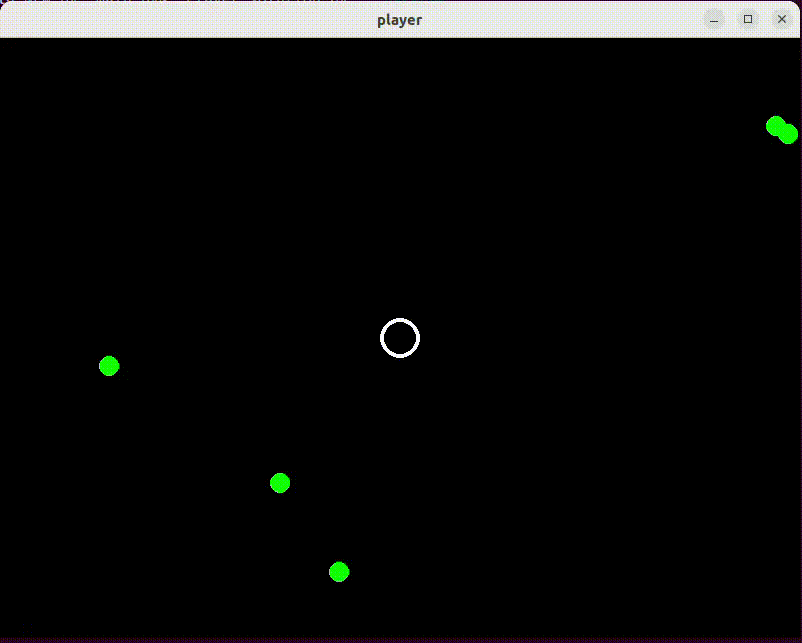

# Polymorphism

In de `main()` functie in bestand
[main.py](../pygame03_aliens/main.py) vinden we ook code
duplicatie. Eerst worden namelijk de `step()` en `draw()` functie van
the Player object aangeroepen:

    player.step(surface.get_size())
    player.draw(surface)
    
en later die van de Alien objecten:

    alien.step(surface.get_size())
    alien.draw(surface)
    
Deze code duplicatie kunnen we voorkomen door gebruik van
'Polymorphism'. Met gebruik van Polymorphism kunnen we code
schrijven die werkt op verschillende types.

# Polymorphism Voorbeeld

Een simpel voorbeeld van Polymorphism is deze code waar we over een
lijst met waarden van verschillende types (`int` en `str`) lopen en elke
waarde bij zichzelf optellen.

    data = [1, 2, "one", "two"]
    for index in range(len(data)):
        data[index] += data[index]
    print(data) # [2, 4, 'oneone', 'twotwo']

Dit geeft mogelijk voor verschillende types een verschillend effect.

# Polymorphism, units list

Voorkom code duplicatie in ons spel met gebruik van Polymorphism door
een lijst van 'units' (in plaats van 'aliens') te maken waarin zowel
het `Player` object als alle `Alien` objecten zitten. Zorg dat we
daarna niet meer op twee plekken de `step()` en `draw()` functie aan
hoeven roepen maar dat het spel wel nog goed werkt.

