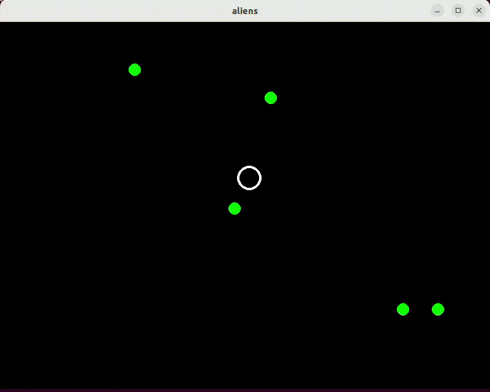
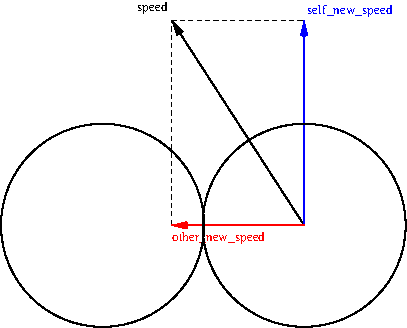

# Unit Interaction

Ons spel heeft interactie nodig tussen de units. We gaan units laten
'stuiteren' als ze met elkaar botsen. Hiervoor voegen we aan de
`main()` in bestand [main.py](main.py) een `has_collision()` test
toe om te detecteren of een stap van een unit tot een botsing leidt en
`handle_collision()` om deze botsing vervolgens af te handelen.

    for unit in units:                        # for each unit
        unit.step(surface.get_size())         # move the unit based on its speed, stay in the window
        for other in units:
            if unit.has_collision(other):     # check for collision with other units
                handle_collision(unit, other) # handle the collision
        unit.draw(surface)                    # draw the unit
        
    def handle_collision(unit, other):
        """ Handles the collision of 'unit' and 'other' by swapping their speed. """ 
        unit.swap_speed(other)
        
## Unit.has_collision()

Schrijf de `has_collision()` methode in bestand [Unit.py](Unit.py) om
een botsing tussen twee units the dectecteren. Of er een botsing is,
is afhankelijk van de afstand tussen de `position` van de twee units
en hun `radius`. Maak voor de dectectie gebruik van methoden van de
`Vector2` class (beschreven in
[math.html](https://www.pygame.org/docs/ref/math.html)) zodat we de
code kort en op een hoog abstractieniveau houden. Gebruik niet meer
dan 3 regels, het kan zelfs met 1 regel.

Omdat een unit niet met zichzelf mag botsen is er al code toegevoegd
om te zorgen dat dit niet kan:

    if other is self: # 'self' does not collide with 'self'
        return False

## Unit.swap_speed()

Schrijf ook de `swap_speed()` methode in bestand [Unit.py](Unit.py) om
de `speed` van twee units om te wisselen (nadat een botsing is
gedetecteerd).

## Het Resultaat

Deze methoden zouden moeten resulteren in 'stuiterende' units.

## Meer Realistisch Stuiteren

Het omwisselen van de snelheid is niet de meest realitische simulatie
van twee stuiterende cirkels. Voor een meer realitische simulatie is
wat wiskunde nodig voor het berekenen van hoeken:

Deze wiskunde is niet erg moeilijk, maar omdat de focus in dit vak op
programmeren en niet op wiskunde ligt, houden we het bij het simpelweg
omwisselen van de snelheid. Als je het leuk vindt kun je zelf een meer
realitische botsingsimulatie schrijven.
