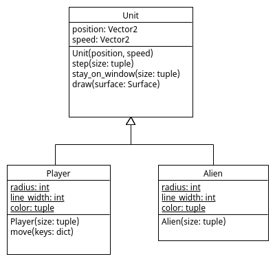

# Class Variables

In een class komen drie verschillende categorieen van variabelen voor:

- local variables
- class variables
- instance variables

Programma [Example.py](Example.py) geeft een voorbeeld van elke categorie:

    class Example:
        b = 100                 # class variable

        def __init__(self):
            a = 200             # local variable
            self.c = 300        # instance variable

        def __str__(self):
            return f"b:{self.b} c:{self.c}"  # 'self.b' and 'self.c' are available in each method

## Local Variable

Een 'local variable' (a) wordt aangemaakt in een methode en wordt
ge-delete onmiddelijk na het uitvoeren van deze methode. Een 'local
variable' is dus alleen binnen één methode beschikbaar. Bij een
'local variable' schrijven we geen voorvoegsel:

    a

## Class Variable

Een 'class variable' (b) wordt aangemaakt bij het definieeren van een
class en wordt pas ge-delete als het hele programma wordt afgesloten
(of als de 'class definition' wordt ge-delete wat zelden
voorkomt). Een 'class variable' is in alle methoden van de class
beschikbaar en wordt gedeeld door alle objecten van een class. Bij een
'class variable' schrijven we in een methode de naam van de class of
'self.' als voorvoegsel:

    Example.b
    self.b

## Instance Variable

Een 'instance variable' (c) wordt aangemaakt voor ieder object (ook
wel 'instance' genoemd) van een class en wordt ge-delete als een
object "out of scope" gaat. Een 'instance variable' is in alle
methoden van de class beschikbaar en ieder object heeft haar eigen
'instance variables'. Bij een 'instance variable' schrijven we in een
methode 'self.' als voorvoegsel:

    self.c

## Gebruik van de Example class

Het verschil tussen deze catergorieen wordt hopelijk duidelijker als
we `Example` class gebruiken in deze code:

    def main():
        print("Example.b:", Example.b) # 'Example.b' is already available after the class is defined 
        e1 = Example()                 # create an object of type Example
        print("e1.c:", e1.c)           # 'e.c' is available only after an object is created 
        e2 = Example()                 # create another object of type Example
        e2.c = 3333                    # change 'e2.c'
        Example.b = 1111               # change 'Example.b'
        print("e1", e1)                # each object has its own 'c' but shares 'b'
        print("e2", e2)
        # as 'e1' and 'e2' go "out of scope" here, they together with their 'c' get deleted

    if __name__ == "__main__":
        main()
        print("Example.b:", Example.b) # however, 'Example.b' is still available

wat tot deze output leidt:

    Example.b: 100
    e1.c: 300
    e1 b:1111 c:300
    e2 b:1111 c:3333
    Example.b: 1111

## Kies de Juiste Categorie

Als we een variable aan een class willen toevoegen moeten we de juiste
categorie kiezen.

- kies in eerste instantie voor 'local variable'
- behalve als dezelfde variable in meerdere methoden nodig is, kies dan voor 'class variable'
- behalve als ieder object haar eigen variabele nodig heeft, kies dan voor 'instance variable'

## Opdracht: Alien class

De `Alien` class van ons spel erft de `radius`, `line_width` en
`color` variabelen van de `Unit` class als 'instance variables', maar
omdat elk `Alien` object dezelfde waarden voor deze variabelen
gebruikt is het beter deze waarden te delen zodat er minder variabelen
(minder geheugen) nodig zijn. Vervang daarom deze 'instance variables'
in de `Unit` class door 'class variables' in de `Alien` class.

Doordat deze 'instance variables' verdwijnen uit de `Unit` class en
dus niet meer worden ge-erft door de `Player` class moet ook de
`Player` class dezelfde 'class variables' krijgen als de `Alien`
class.

Omdat iedere unit wel haar eigen waarden voor de `position` en
`speed` variabelen nodig heeft, blijven dat wel 'instance variables'
in de Unit class.

## UML Class Diagram

In een UML class diagram worden `class variables` onderstreept:

## Interactie

Zorg dat de interactie tussen units onverandert blijft.

