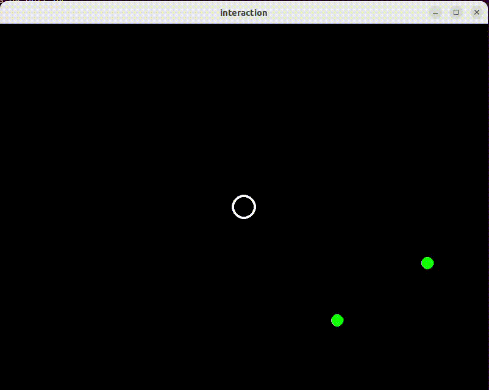

# Spawn Aliens

Een praktische toepassing van 'class variables' is om bij te houden
hoeveel objecten er van een bepaald type in gebruik zijn. Programma
[Counter.py](Counter.py) geeft een voorbeeld:

```python
class Counter:
    count = 0                      # class variable

    def __init__(self):            # gets called when a Counter object is created
        Counter.count += 1
        print("count up:",Counter.count)

    def __del__(self):             # gets called when a Counter object is deleted
        Counter.count -= 1
        print("count down:",Counter.count)

def main():
    my_list = []
    for i in range(3): # adds 3 Counter objects
        my_list.append( Counter() )
    # my_list goes "out of scope" and gets deleted together with objects

if __name__ == "__main__":
    print("count:", Counter.count) # count: 0
    main()
    print("count:", Counter.count) # count: 0
```

Bij de start van het programma heeft `Counter.count` de waarde 0. Elke
keer als een `Counter` object wordt aangemaakt wordt de `__init__()`
methode aangeroepen, daar tellen we 1 op bij `Counter.count`. Elke
keer als een `Counter` object "out of scope" gaat wordt automatisch de
`__del__()` methode aangeroepen, daar tellen we 1 af bij
`Counter.count`. Hierdoor wordt automatisch bijgehouden hoeveel
objecten van `Counter` er in gebruik zijn. Als we het programma
uitvoeren gaat `Counter.count` dus eerst van 0 naar 3 door het
aanmaken toevoegen van `Counter` objecten aan de lijst en weer terug
naar 0 als deze lijst met objecten "out of scope" gaat.

    count: 0
    count up: 1
    count up: 2
    count up: 3
    count down: 2
    count down: 1
    count down: 0
    count: 0

## Opdracht: Spawn Aliens

Voeg aan het spel geleidelijke aliens toe in plaats van aan het begin
al meteen 5 Aliens toe te voegen. De `main()` in bestand
[main.py](main.py) is hiervoor al aangepast. Aan de `units` lijst
wordt nu vooraf aan de loop alleen de `player` toegevoegd, en het
roept in de loop een nieuwe `spawn_aliens()` functie aan voor het
geleidelijk toevoegen van aliens:

```python
def spawn_aliens(units, size):
    """ Spawns Alies in 'units' list based on its 'spawn_chance' and 'remaining' count. """
    if Alien.remaining > 0 and random.random() < Alien.spawn_chance: # Alien spawn condition
        units.append( Alien(size) ) # spawn Alien
```

Pas de `Alien` class aan zodat er in elke tijdstap met een kans van
0.01 een Alien wordt toegevoegd, maar zorg dat er nooit meer dan 10 aliens
in het spel zijn:

```python
class Alien(Unit):
    remaining = 10      # number of Aliens that remain to be added to game
    spawn_chance = 0.01 # chance that we add an Alien in each time step
    ...
```


