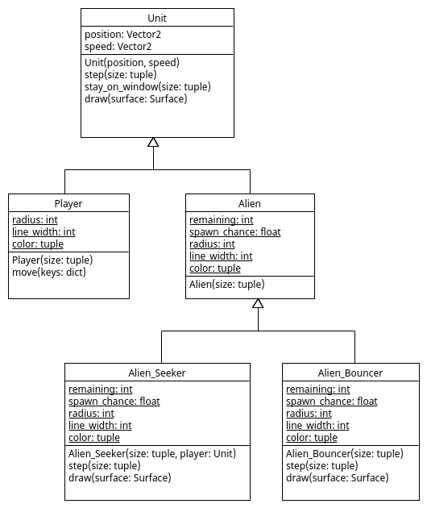

# Different Aliens

Het spel heeft meer soorten Aliens nodig. In bestand
[Alien_Seeker.py](Alien_Seeker.py) is een Alien_Seeker class
gedefinieerd welke inherit van `Alien`. In de 'class variables' zien
we dat er maar 2 object van deze objecten in het spel worden gebracht,
de radius 12 is, en ook dat de kleur iets anders is:

```python
import pygame

from Alien import Alien

class Alien_Seeker(Alien):
    remaining = 2
    spawn_chance = 0.005 # chance that we add an Alien in each time step
    radius = 12
    line_width = 0
    color = (255,255,0) # red+green color

    def __init__(self, size, player):
        """ Initializes an Alien_Seeker at a random position within 'size' and
        random speed between (-3,-3) and (+3,+3). This alien seeks the 'player' unit
        """
        super().__init__(size)
        Alien_Seeker.remaining -= 1
        self.player = player

    def __del__(self):
        """ Increases 'remaining' when an objects gets deleted. """
        Alien_Seeker.remaining += 1
        super().__del__()

    def step(self, size):
        """ Changes 'speed' to move to 'player' and changes the 'position' 
        based on its 'speed'.
        """
        super().step(size) # call 'step()' method of parent
        difference = self.player.position - self.position # difference between 'player' and 'self'
        difference.normalize_ip() # scale difference to length 1
        self.speed += difference*0.05 # change speed a bit in direction of 'unit'

    def draw(self, surface):
        super().draw(surface) # call 'draw()' method of parent
        size = pygame.Vector2(Alien_Seeker.radius*1.2, Alien_Seeker.radius*1.2)
        rect = pygame.Rect(self.position-size/2, size)
        black = (0,0,0)
        pygame.draw.rect(surface, black, rect, 3) # draw a rectangle on top
```

Objecten van deze class krijgen in `__init__()` een 'instance
variable' `player` welke gebruikt wordt om een `Alien_Seeker` object
naar aan te trekken. Dit wordt gedaan door in `step()` methode de
`speed` van een `Alien_Seeker` object steeds een beetje aan te passen
zodat het naar de speler toe beweegt. In de `draw()` methode wordt tot
slot nog een rechthoekje getekend om een groter visueel verschil te
maken.

Bestand [main.py](main.py) is aangepast zodat nu ook objecten van type
Alien_Seeker gespawned worden.

## Opdracht: Alien_Bouncer

Voeg zelf nog een een `Alien_Bouncer` class toe en pas bestand
[main.py](main.py) aan zodat er maximiaal 3 objecten van dit type
Alien gespawned worden. Een `Alien_Bouncer` wordt niet aangetrokken
tot de speler maar tot de grond en heeft een plus-teken in plaats van
een rechthoekje.




