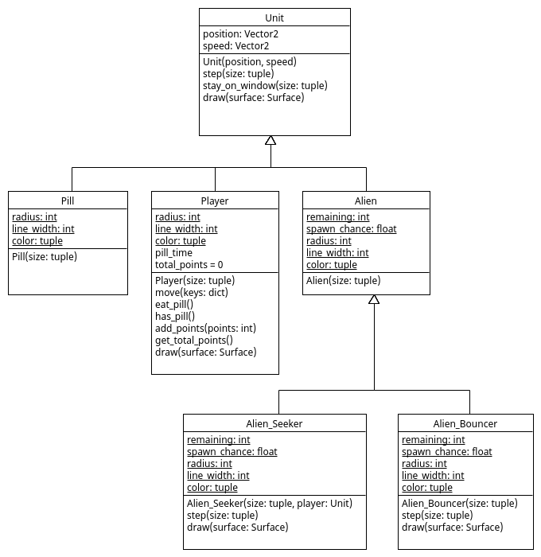

# Type Hierarchy

Unit `Pill` in bestand [Pill](Pill.py) is aan ons spel toegevoegd. Als
de speler met een `Pill` botst krijgt het 1 punt en wordt het rood
voor 7 seconden. 

Om dit te implementeren is in [main.py](main.py) een aanpassing gedaan
aan de `handle_collision()` functie. We hadden hier in if-statements
met `isinstance()` kunnen testen welke units botsen om de juiste
acties te kiezen:

    def handle_collision(unit, other):
        """ Handles the collision of 'unit' and 'other' by swapping their speed. """ 
        if isinstance(unit, Player) and isinstance(other, Pill): # special case for Player+Pill
            other.set_alive(False)
            unit.eat_pill()
            unit.add_points(1)
        else:
            unit.swap_speed(other) # default action

Maar beter is het om geen if-statements te gebruik want dan kan deze
functie erg lang worden als er meer types bijkomen. Ook zou de functie
dan steeds aangepast moeten aangepast worden. Beter is het om gebruik
te maken van de 'type hierarchy' zoals gedefinieerd door de inhertance
relaties:

Dit kunnen we doen na installeren van module 'multimethod':

    pip install multimethod
    
Met 'multimethod' kunnen we vervolgens met decrator `@multimethod` en
type-hints aangeven wat er moet gebeuren in `handle_collision()` voor
verschillende types. We kunnen eerst de default acties van een
botsing definieren:
    
    @multimethod
    def handle_collision(unit1: Unit, unit2: Unit):
        """ Handles the collision of 'unit' and 'other' by swapping their speed. """ 
        unit1.swap_speed(unit2)
        
De default is dat 2 `Units` stuiteren. Daarna kunnen we voor
specifieke subclasses meer specifieke acties definieren. Als een
`Player` en `Pill` stuiteren kiezen we acties zodat de `Pill` verdwijnt
en de `Player` rood wordt en 1 punt krijgt.
        
    @multimethod    
    def handle_collision(unit1: Player, unit2: Pill):
        unit2.set_alive(False)
        unit1.eat_pill()
        unit1.add_points(1)

Omdat een botsing van `Pill` met `Player` hetzelfde is als een botsing
van `Player` met `Pill` definieren we hiervoor ook een
`handle_collision()` functie en die roepen bovenstaande functie aan om
code duplicatie te voorkomen:

    @multimethod
    def handle_collision(unit2: Pill, unit1: Player):
        handle_collision(unit1, unit2)
        
## Opdracht: handle_collision()

Voeg zelf `handle_collision()` functies toe zodat:

- De `Player` 2 punten krijgt als het rood is en met een `Alien`
  botst, de `Alien` verdwijnt na zo'n botsing.

- De 'speed' van een `Alien` omdraait als het met een `Pill` botst, de
  `Pill` behoudt zijn 'positions' na zo'n botsing.
  
- Een `Pill` verdwijnt als een `Alien_Bouncer` er tegenaan botst, de
  `Alien_Bouncer` behoud zijn 'speed' na zo'n botsing.
  
