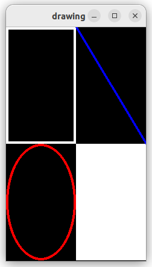
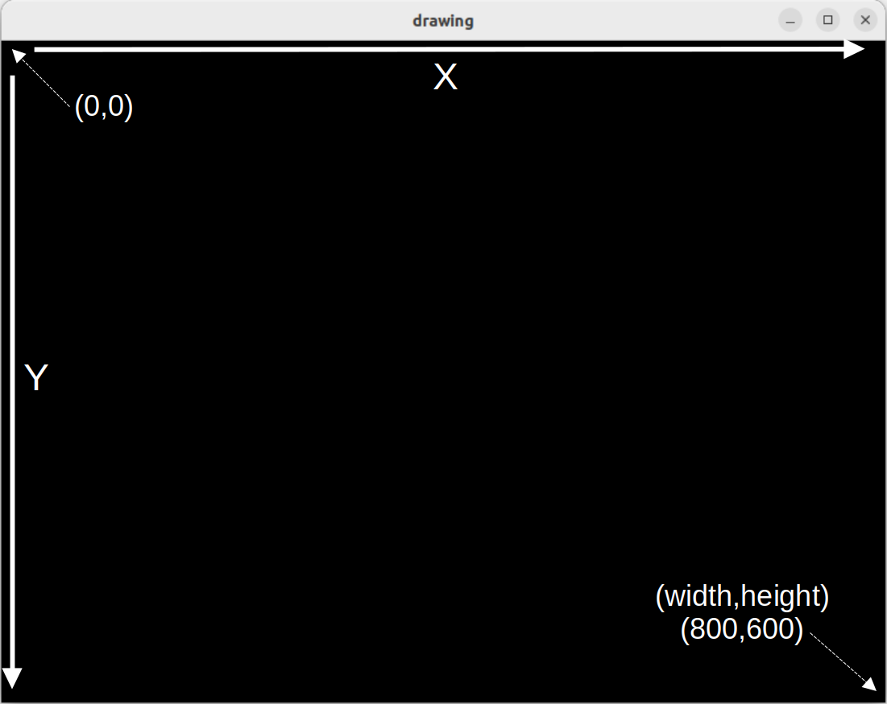
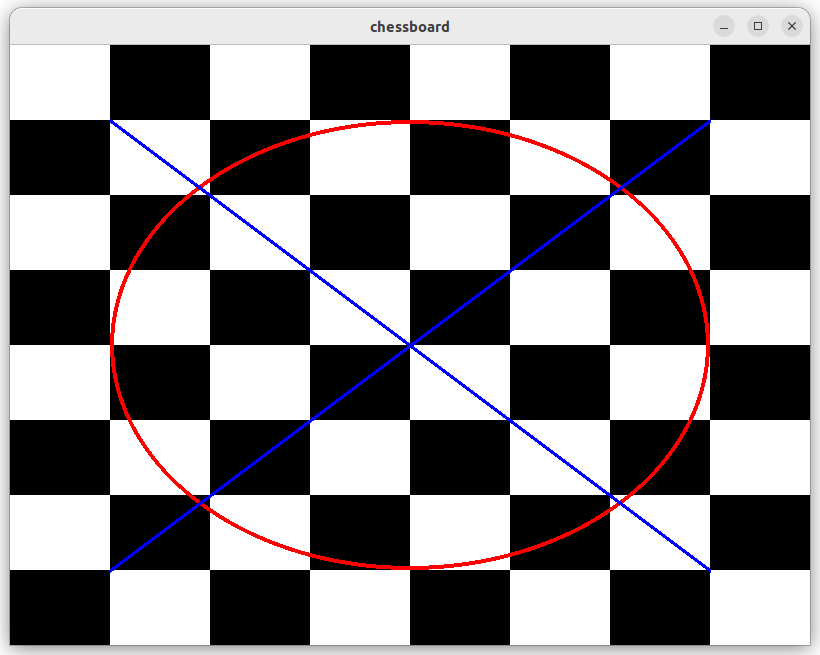
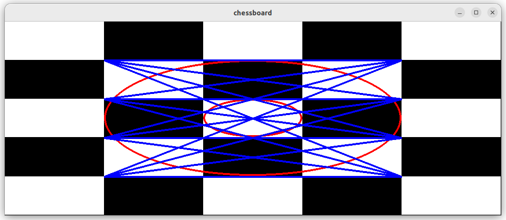

# Pygame Drawing

We gaan ons eigen computerspel maken met gebruik van de `pygame`
module. Installeer eerst `pygame` met:

```console
$ pip install pygame
```
# Draw.py

Programma [draw.py](draw.py) laat zien hoe we kunnen tekening met
pygame. In het programma wordt eerst een window aangemaakt met naam
'drawing'. Vervolgens starten we een while-loop waarin we steeds het
window vullen met de kleur zwart om vervolgens steeds witte
'rectangles', een rode 'ellipse' en blauwe 'line' te tekenen.

In het programma wordt daarnaast een 'clock' object gebruikt om te
zorgen dat de loop niet meer dan 60 keer per seconden wordt
uitgevoerd. De loop stopt als het programma een `pygame.QUIT` event
ontvangt, dat gebeurt als de gebruiker het window sluit.

```python
import pygame

def main():
    pygame.init()
    display = pygame.display.set_mode((800, 600), pygame.RESIZABLE)  # create a display window
    pygame.display.set_caption('drawing')
    clock = pygame.time.Clock()
    background_colour = (0, 0, 0)  # set background_color Red,Green,Blue components (black)

    running = True
    while running: # keep looping 
        display.fill(background_colour)  # fill display with background_colour
        
        for event in pygame.event.get():
            if event.type == pygame.QUIT:  # stop loop if display window is closed
                running = False

        surface = pygame.display.get_surface()
        width, height = surface.get_size()  # get size of display

        
        # draw white rectangles
        white = (255, 255, 255)  # color
        rect = pygame.Rect(0, 0, width / 2, height / 2)  # create a rectangle
        pygame.draw.rect(surface, white, rect, 4)  # draw rectangle with line_width 4
        rect = pygame.Rect(width / 2, height / 2, width / 2, height / 2)  # create a rectangle
        pygame.draw.rect(surface, white, rect, 0)  # draw rectangle filled in

        # draw red ellipse
        red = (255,0,0)
        ellipse = (0, height / 2, width / 2, height / 2)
        pygame.draw.ellipse(surface, red, ellipse, 4)

        # draw blue line
        blue = (0,0,255)
        start_pos = (width / 2      , 0)
        end_pos   = (width          , height / 2)
        pygame.draw.line(surface, blue, start_pos, end_pos, 4)
        
        
        pygame.display.flip()  # update display with drawings
        clock.tick(60)  # run loop at 60 frames per second

if __name__ == "__main__":
    main()
```

Als we dit programma uitvoeren zien we een window met witte
rechthoeken, een rode ellips, en een blauwe lijn die ieder een kwart
van het window beslaan, ook als we het window van grootte veranderen.



## Assenstelsel

In het assenstelsel van `pygame` bevindt de oorsprong, het punt (0,0),
zich in de linker bovenhoek. De X-as is horizontaal en de Y-as
vertikaal. Het punt in de rechter benedenhoek is het coordinaat
(width,height) waarbij 'width' en 'height' de huidige breedte en hoogte
van het window zijn die initieel op 800 en 600 worden gezet, maar
kunnen veranderen.



## Opdracht: Chess

Schrijf nu zelf programma `chess.py` wat een 8x8 schaakbord tekent zoals
weergeven in dit plaatje:



Schrijf het programma zodat het makkelijk aangepast kan worden om
bijvoorbeeld een 5x5 schaakbord te tekenen (tip: maak gebruik van
loops) en dat het ook goed werkt als het window een andere grootte
krijgt:



Bekijk eventueel de
[draw.html](https://www.pygame.org/docs/ref/draw.html) pagina van de
pygame documentatie voor meer informatie over het tekenen van
verschillende vormen.
