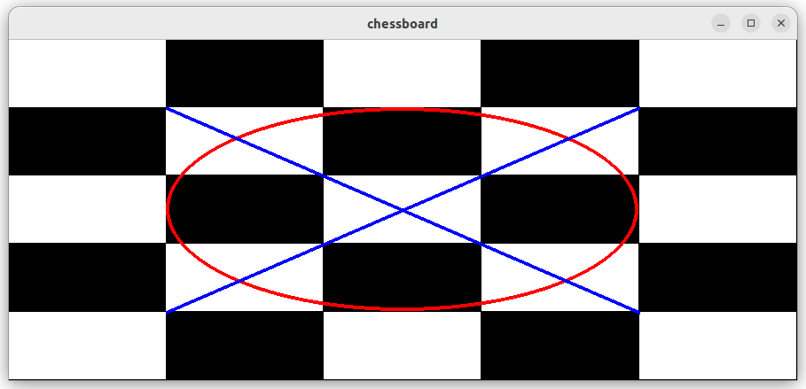

# Pygame Drawing

We gaan ons eigen computerspel maken met gebruik van de `pygame`
module. Installeer `pygame` met:

```console
$ pip install pygame
```

Programma [draw.py](draw.py) laat zien hoe we kunnen tekening met
pygame. Als we dit programma uitvoeren zien we een window met witte
rechthoeken, een rode ellips, en een blauwe lijn die ieder een kwart
van het window beslaan, ook als we het window van grootte veranderen.


## Opdracht: Chess

Schrijf zelf programma `chess.py` wat een 8x8 schaakbord tekent zoals
weergeven in dit plaatje:


Schrijf het programma zodat het makkelijk aangepast kan worden om
bijvoorbeeld een 5x5 schaakbord te tekenen en dat het ook goed werkt
als het window een andere grootte krijgt:



Bekijk hiervoor de [draw.html](https://www.pygame.org/docs/ref/draw.html)
pagina van de pygame documentatie voor het tekenen van verschillende
vormen.
