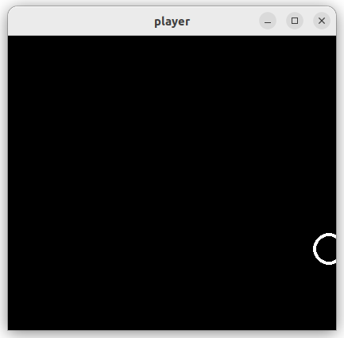
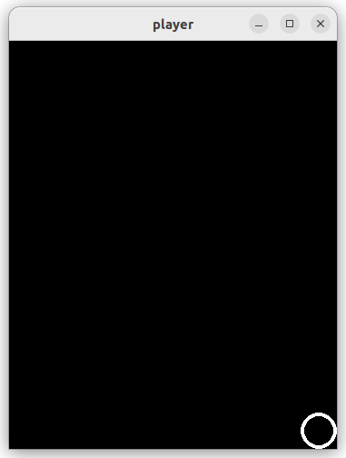

# Pygame Player

Programma [game.py](game.py) laat zien hoe we een speler kunnen
besturen met het toetsenbord. Als we dit programma uitvoeren zien we
een witte cirkel die we kunnen bewegen met de cursor toetsen of met
toetsen 'W','A','S','D'. Lees eventueel de
[key.html](https://www.pygame.org/docs/ref/key.html) pagina van pygame
voor meer informatie over het uitlezen van de staat van het
toestenbord.

Voor de positie van de speler gebruiken we class `pygame.Vector2`
welke een (X,Y) coordinaat representeert. Met deze class kunnen we
makkelijk coordinaten manipuleren, bijvoorbeeld optellen en
vermenigvuldigen:

~~~python
import pygame

v1 = pygame.Vector2(1, 2)   # create a coordinate
v2 = pygame.Vector2(10, 20) # create a coordinate
v3 = v1 + v2                # add two coordinates together
print(v3)                   # prints: [11, 22]
v3 = v3 * 10                # multiply coordinate by 10
print(v3)                   # prints: [110, 220]
~~~

Lees de [math.html](https://www.pygame.org/docs/ref/math.html) pagina
van pygame voor meer informatie over deze Vector2 class en de
verschillende operatoren en functie die we kunnen gebruiken op
objecten van deze class. Deze class gaan we straks gebruiken om onze
eigen classes te maken.

## Opdracht: Op het window blijven

Een probleem in het [game.py](game.py) programma is dat de speler
van het window af kan bewegen:

Pas het programma aan zodat de speler niet meer gedeeltelijk van het
window af kan bewegen door de positie (Vector2) aan te passen als de
waarde van het X- of Y-coordinaat te groot of te klein wordt. Zorg dat
het ook goed werkt als het window een andere grootte krijgt:

## Opdracht: Acceleratie

Met toetsen passen we nu direct de positie van de speler aan, maar het
spel is leuker als we de snelheid van de speler kunnen
aanpassen in plaats van de positie. De snelheid heeft vervolgens in
elke tijdstap weer een effect op de positie. Om dit voor elkaar te
krijgen zetten we eerst vooraf aan de loop de snelheid van de speler
initieel op 0,0 met:

~~~python
speed = pygame.Vector2(0, 0)
~~~

Daarna passen we in de loop bij het indrukken van de toetsen deze
snelheid aan, in plaats van het direct aanpassen van de positie wat we
eerder deden:

~~~python
acceleration = 0.5
if keys[pygame.K_LEFT] or keys[pygame.K_a]:
        speed.x -= acceleration  # accelerate to the left
# do the same thing for other keys
~~~

Tel dan in iedere iteratie van de loop deze snelheid op bij de huidige
positie van de speler zodat de speler beweegt op basis van haar
snelheid:

~~~python
position += speed
~~~

Vermenigvuldig ook in iedere iteratie de snelheid met '0.95' zodat de
speler automatisch afremt en na enige tijd stil komt te staan als er
geen toetsen meer worden ingedrukt:

~~~python
speed *= 0.95
~~~

Keer ook de richting van de snelheid om als de speler van het window
af beweegt om zo de speler tegen de rand van het window te laten
stuiteren:

~~~python
if position.x < radius:
    position.x = radius
    speed.x = -speed.x
# do the same thing for other window borders
~~~

Het resultaat zou er dan ongeveer zo uit moeten zien:

