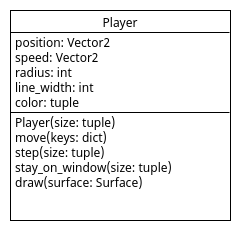
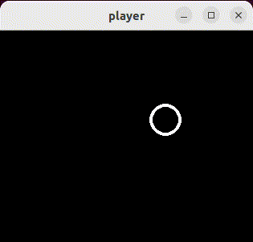

# Abstraction

De `main()` functie in het vorige 'player.py' programma is al behoorlijk
lang geworden doordat het alle low-level details van player bevat. De
details van player bestaan uit waarden/eigenschappen:

```python
position = pygame.Vector2(width // 2, height // 2)
speed = pygame.Vector2(0, 0)
radius = 20
line_width = 4
color = (255, 255, 255)
```

en uit code die deze waarden manipuleren en gebruiken. Object-Oriented
Programming stelt ons in staat om deze details te verbergen zodat we
een player kunnen gebruiken zonder over alle details te hoeven
nadenken. Hierdoor wordt de code duidelijker en het stelt
ons in staat om op een hoger abstractieniveau over code na te
denken. Dit wordt steeds belangrijker naar mate een programma groter
en complexer wordt. 

Dit hogere abstractieniveau bereiken we met Object-Oriented
Programming door details in een class verbergen. Waarden worden
'instance variabelen' van de class en de code gaat naar 'methoden' van
de class.



## Opdracht: Player class

Verberg de details van player in class `Player` in bestand
[Player.py](Player.py) zodat we daarna deze class in de `main()`
functie van [main.py](main.py) kunnen gebruiken nadat we uit bestand
`Player.py` de `Player` class ge-import hebben met:

```python
from Player import Player
```

Vergelijk daarna het abstractieniveau van deze `main()` functie met de
`main()` in het vorige 'player.py' programma. Er zijn alleen dingen
verplaatst maar de code is als het goed is veel leesbaarder geworden.


