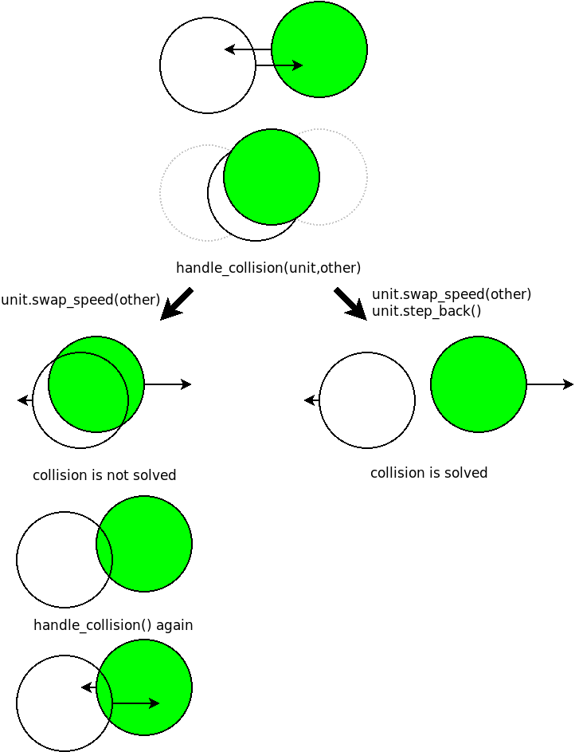
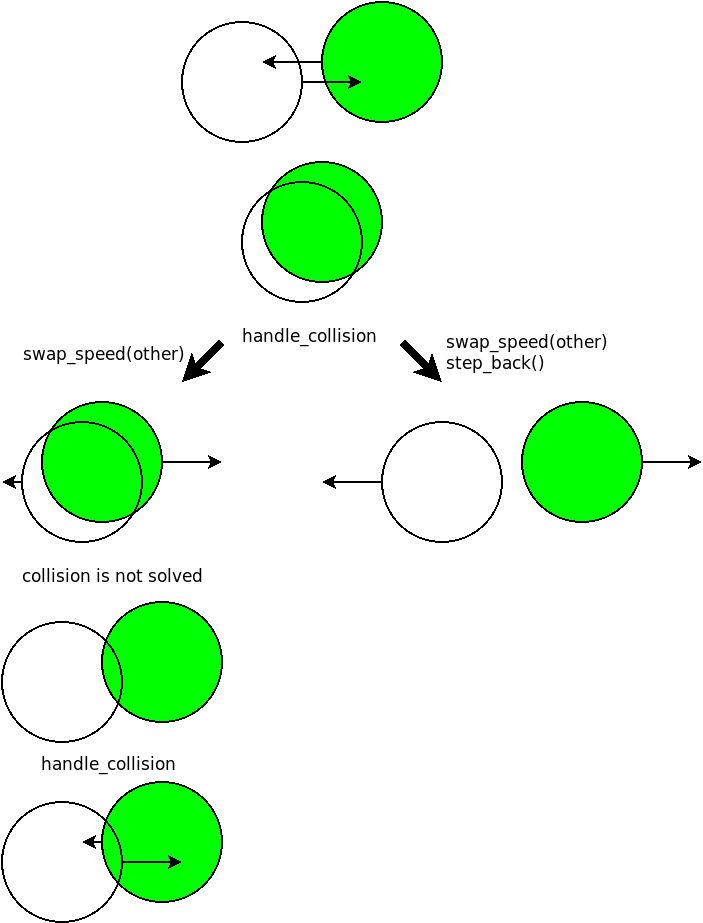

# Sticky Units

Soms stuiteren units niet goed, maar lijken aan elkaar vast te
plakken. Dat is een lastige bug om te begrijpen en op te lossen. Als
je dat eerst zelf wil proberen lees dan nog niet verder.

# Oorzaak 

Het aan elkaar plakken van units kan voorkomen doordat we in de
`handle_collision()` functie alleen met de `swap_speed()` functie de
snelheid wisselen als een unit tegen een andere unit botst. Het kan
gebeuren dat na het wisselen in de volgende tijdstap de botsing in
stand blijft doordat de `speed` van de player lager wordt door een
aanpassing via het toetsenbord of door vermenigvuldigen met `0.95` (om
de speler automatisch af te remmmen). De units blijven dan botsen in
de daaropvolgende tijdstappen zodat het lijkt dat ze aan elkaar
vastplakken.

# Oplossing

Om dit probleem op te lossen kunnen we in de `handle_collision()`
functie in [main.py](main.py) beter naast de `speed` wisselen met
methode `unit.swap_speed(other)`, ook de unit die de botsing
veroorzaakt een stap terugzetten met methode `unit.step_back()`:

~~~python
def handle_collision(unit, other):
    """ Handles the collision of 'unit' and 'other' by swapping their speed. """ 
    unit.swap_speed(other)
    unit.step_back()
~~~

We maken hiervoor in de `step()` methode in [Unit.py](Unit.py) steeds
eerst een kopie van de `position`, die we `previous_position` noemen,
voordat we deze aanpassen. In de `step_back()` methode kunnen we dan
terugstappen wanneer er een botsing plaatsvindt door simpelweg
`position` de waarde van `previous_position` te geven:

~~~python
    def step(self, size):
        """ Changes the position of Unit based on its speed. """
        self.previous_position = self.position
        self.position += self.speed
        self.stay_on_window(size)

    def step_back(self):
        """ Steps back to `previous_position`. """
        self.position = self.previous_position
~~~

# Mutable

Maar er gaat nu nog één ding mis in deze oplossing van het
plakprobleem. Het type van een `position` is namelijk
`pygame.Vector2`, en dat is een 'class'. Een 'class' is net zoals een
'list' een 'mutable' type en zoals we eerder zagen is het gebruik van
alleen een assignment niet voldoende om een onafhankelijke kopie te
maken van een 'mutable' type, zoals ook blijkt in dit voorbeeld:

~~~python
import pygame

position = pygame.Vector2(10, 10)
previous_position = position                   # assignment
position += pygame.Vector2(100, 100)           # change 'position' not 'previous_position'
print("         position:",          position) # [110, 110]
print("previous_position:", previous_position) # [110, 110]  (but both are changed)
~~~

# Opdracht: Copy

Pas de code in [Unit.py](Unit.py) aan zodat `self.previous_position`
wel een onafhankelijke kopie is van `self.position` (dus zodat
`self.previous_position` niet meeverandert als `self.position`
verandert wordt). Denk daarbij aan de pijltjes in PythonTutor. Test
daarna of units nog aan elkaar vastplakken.
