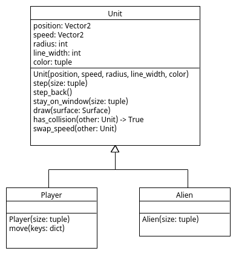

# Sticky Units

Soms stuiteren units niet goed, maar lijken aan elkaar vast te
plakken. Dat is een lastige bug om te begrijpen en op te lossen. Als
je dat eerst zelf wil proberen lees dan nog niet verder.

# Oorzaak 

Het aan elkaar plakken van units kan voorkomen doordat we in de
`handle_collision()` functie alleen met de `swap_speed()` functie de
snelheid wisselen van botsende units. Het kan gebeuren dat na het
wisselen in de volgende tijdstap de botsing in stand blijft doordat we
de `speed` van de player lager wordt door een aanpassing via het
toetsenbord of door vermenigvuldigen met `0.95` (om de speler
automatisch af te remmmen). De units blijven dan botsen in de
daaropvolgende tijdstappen zodat het lijkt dat ze aan elkaar
vastplakken.



# Oplossing

Om dit probleem op te lossen kunnen we in de `handle_collision()`
functie in [main.py](main.py) naast `unit.swap_speed(other)` ook de
`unti.step_back()` functie aanroepen om de botsing direct op te
heffen:

```python
def handle_collision(unit, other):
    """ Handles the collision of 'unit' and 'other' by swapping their speed. """ 
    unit.swap_speed(other)
    unit.step_back()
```

We maken daarvoor in de `step()` functie in [Unit.py](Unit.py) steeds
een kopie van de `position` voordat we deze aanpassen zodat we kunnen
terugstappen naar de vorige positie met de `step_back()` functie als
er een botsing plaatsvindt:

```python
    def step(self, size):
        """ Changes the position of Unit based on its speed. """
        self.previous_position = self.position
        self.position += self.speed
        self.stay_on_window(size)

    def step_back(self):
        self.position = self.previous_position
```

# Opdracht: Mutable

Er gaat nog één ding mis in deze oplossing van het plakprobleem. Het
type van een `position` is namelijk `pygame.Vector2`, en dat is een
'class'. Een 'class' is net zoals een 'list' een 'mutable'
type en zoals we eerder zagen is het gebruik van alleen een assignment:

```python
self.previous_position = self.position
```

niet voldoende om een onafhankelijke kopie te maken van een 'mutable'
type. Pas de code aan zodat `self.previous_position` wel een
onafhankelijke kopie is van `self.position` (dus zodat
`self.previous_position` niet meeverandert als `self.position`
verandert wordt). Denk aan de pijltjes in PythonTutor. Test daarna of
units nog aan elkaar vastplakken.
