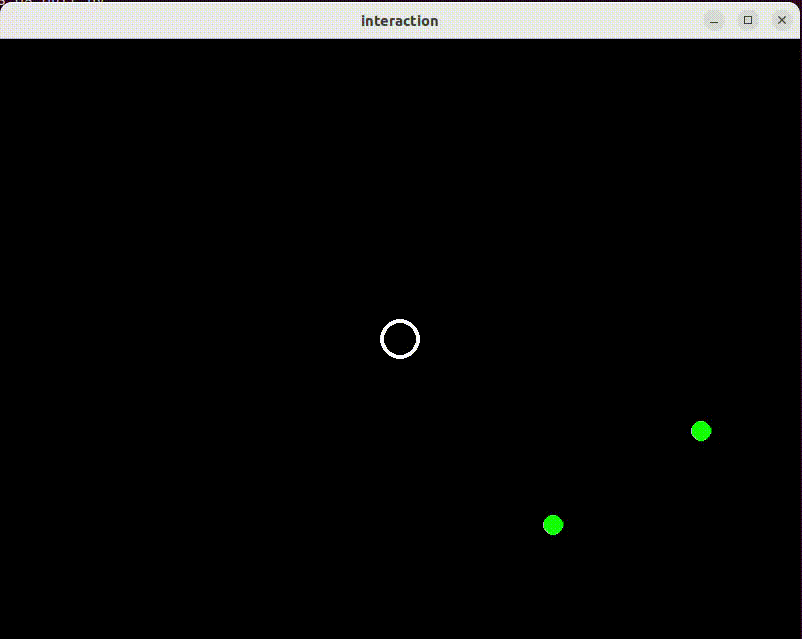

# Spawn Aliens

In plaats van het spel te starten met een vast aantal aliens willen we
beginnen zonder aliens en gedurende het spel aliens toevoegen. Dit
toevoegen van units noemen we 'spawning'.

## Opdracht: Spawn Aliens

Schrijf de `spawn_aliens()` functie in [main.py](main.py) zodat er
elke tijdstap met een kans van 0.05 een Alien aan de `units` list
wordt toegevoegd. Zorg dat er nooit meer dan 15 units in de `units`
list zitten.

