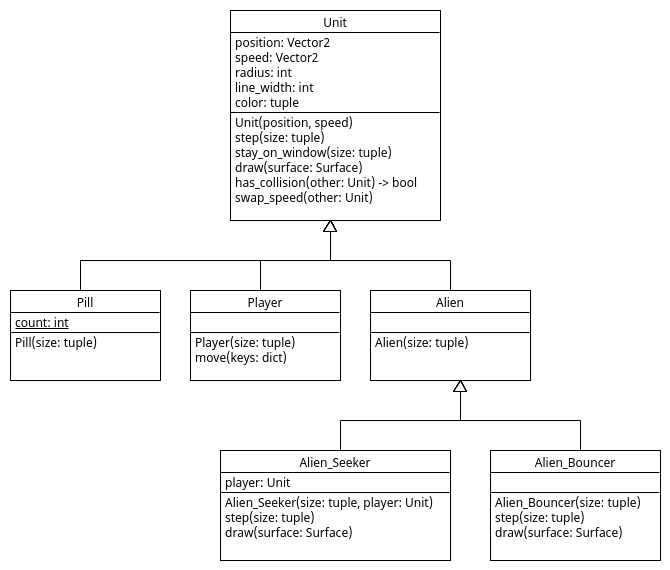

# Pill

We voegen een nieuwe Unit type `Pill` in bestand [Pill.py](Pill.py)
aan ons spel toe die later door de `Player` opgegeten kan worden:

```python
import pygame
import random

from Unit import Unit

class Pill(Unit):
    
    def __init__(self, size):
        """ Initializes a player in the middle of 'size'. """
        width, height = size
        position = pygame.Vector2(random.random() * width,
                                  random.random() * height)
        speed = pygame.Vector2(0, 0)
        super().__init__(position, speed, radius=20, line_width=0, color=(255, 0, 0))
```

Maar we willen zorgen dat we een maximum kunnen zetten op hoeveel
`Pill` objecten er in het spel aanwezig zijn. Hiervoor kunnen we binnen
een class gebruik maken van een 'class variable'.

## Class Variable
Een 'class variable' behoort tot een class en omdat een class maar 1
keer voorkomt in een programma, komt een class variable ook maar 1
keer voor. Dit is anders voor een 'instance variable' want een 'instance
variable' behoort tot een object en omdat er meedere objecten van een
class kunnen voorkomen bij het uitvoeren van een programma, kan elk
object haar eigen 'instance variables' hebben.

Anders gezegd: elk object heeft haar eigen 'instance variables', maar
alle objecten samen delen de 'class variables'.

In programma [Student.py](Student.py) zien we een
voorbeeld van het gebruik van 'class variable' `identifier`:

```python
class Student:
    identifier = 1000 # class variable: shared by all objects of class Student

    def __init__(self):
        Student.identifier += 1 # instance variable: each object gets its own variable
        self.student_nr = Student.identifier # assign unique student_nr

    def __repr__(self):
        return f"student_nr:{self.student_nr} identifier:{Student.identifier}"

students = [Student(), Student(), Student()]
print("students:",students)
```

In dit programma wordt een lijst met 3 `Student` objecten
aangemaakt. In de uitvoer van het programma is te zien dat ieder
object haar eigen `student_nr` 'instance variable' heeft maar alle
objecten delen de `indentifier` 'class variable' die zorgt dat
elke object haar unieke `student_nr` krijgt:

```console
$ python Student.py 
students: [student_nr:1001 identifier:1003, student_nr:1002 identifier:1003, student_nr:1003 identifier:1003]
```

## __del__ dunder method

De `__init__()` methode wordt aangeroepen bij het aanmaken van een
nieuwe object, maar soms is het ook handig om te weten wanneer een
object weer gedelete wordt als het "out of scope" gaat. Hiervoor
kunnen we gebruik maken van de `__del__` methode. In programma
[Greeting.py](Greeting.py) zien we een voorbeeld:

```python
class Greeting:

    def __init__(self):
        print("Hello")

    def __del__(self):
        print("Goodbey")

def main():
    greetings = []
    print("Creating two Greeting objects:")
    greetings.append( Greeting() )
    greetings.append( Greeting() )
    print("List with two Greeting objects goes out of scope and get deleted:")
    
main()
```

Bij een aanmaken van een `Greeting` object in de `__init__()` method
wordt "Hello" geprint en bij het deleten van een object wordt in de
`__del__` method "Goodbey" geprint. De uitvoer van dit programma is
dan ook:

```console
$ python Greeting.py 
Creatings two Greeting objects:
Hello
Hello
List with two Greeting objects goes out of scope and get deleted:
Goodbey
Goodbey
```

## Opdracht: Count Pill Object

Voeg een 'class variable' en een `__del__()` method aan class `Pill`
toe om bij te houden hoeveel `Pill` objecten er in het spel aanwezig
zijn. Zorg dat we met deze `spawn_aliens()` functie in
[main.py](main.py) units kunnen spawnen waarbij wordt gezorgd dat er
maar maximaal 1 `Pill` object in het spel aanwezig kan zijn:

```python
def spawn_aliens(units, size, player):
    """ Spawns Alies in 'units' list based on its 'spawn_chance'. """
    max_nr_units = 15
    alien_spawn_chance = 0.01
    alien_seeker_spawn_chance = 0.003
    alien_bouncer_spawn_chance = 0.003
    pill_spawn_chance = 0.01
    if Pill.count < 1 and random.random() < pill_spawn_chance:
        units.append( Pill(size) ) # spawn Alien_Bouncer
    if len(units) < max_nr_units:
        if random.random() < alien_spawn_chance:
            units.append( Alien(size) ) # spawn Alien
        if random.random() < alien_seeker_spawn_chance:
            units.append( Alien_Seeker(size, player) ) # spawn Alien_Seeker
        if random.random() < alien_bouncer_spawn_chance:
            units.append( Alien_Bouncer(size) ) # spawn Alien_Bouncer
```


