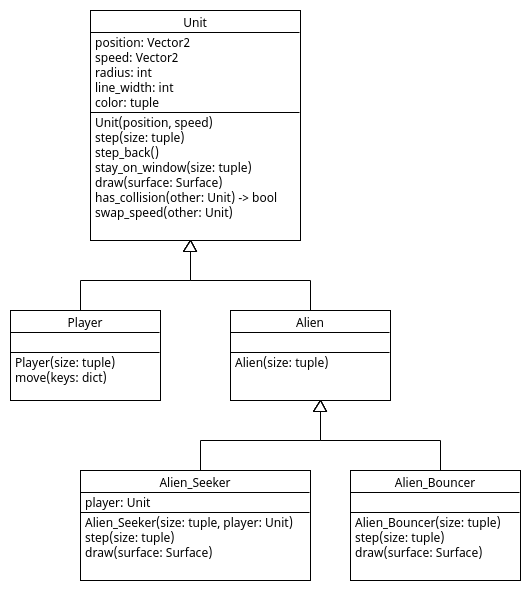
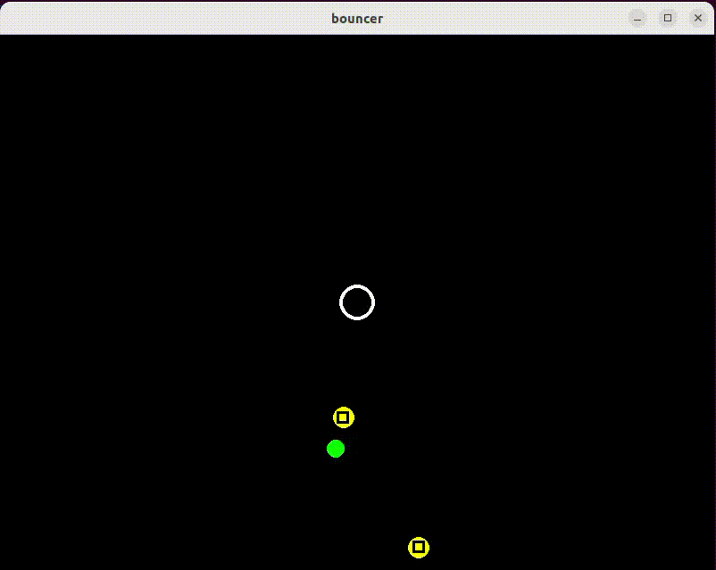

# Different Aliens

Het spel heeft meer soorten Aliens nodig. In bestand
[Alien_Seeker.py](Alien_Seeker.py) is een nieuwe Alien_Seeker class
gedefinieerd welke inherit van `Alien`:

~~~python
import pygame

from Alien import Alien

class Alien_Seeker(Alien):

    def __init__(self, size, player):
        """ Initializes an Alien_Seeker at a random position within 'size' and
        random speed between (-3,-3) and (+3,+3). This alien seeks the 'player' unit
        """
        super().__init__(size)
        self.radius = 12
        self.color = (255, 255, 0)  # red+green color
        self.player = player

    def step(self, size):
        """ Changes 'speed' to move to 'player' and changes the 'position'
        based on its 'speed'.
        """
        super().step(size)  # call 'step()' method of parent
        difference = self.player.position - self.position  # difference between 'player' and 'self'
        difference.normalize_ip()  # scale difference to length 1
        self.speed += difference * 0.05  # change speed a bit in direction of 'player'

    def draw(self, surface):
        super().draw(surface)  # call 'draw()' method of parent
        size = pygame.Vector2(self.radius * 1.2, self.radius * 1.2)
        rect = pygame.Rect(self.position - size / 2, size)
        black = (0, 0, 0)
        pygame.draw.rect(surface, black, rect, 3)  # draw a rectangle on top
~~~

Objecten van dit type krijgen in `__init__()` methode een radius van
`12`, de kleur `(255,255,0)`, en een 'instance variable' `player` waar dit
type alien tot aangetrokken wordt. Dit aantrekken wordt gedaan door in
de `step()` methode de `speed` steeds een beetje aan te passen zodat
objecten van dit type naar de `player` toe bewegen. In de `draw()`
methode wordt tot slot nog een rechthoekje getekend om een groter
visueel verschil te maken.

Bestand [main.py](main.py) is aangepast zodat nu ook objecten van type
Alien_Seeker gespawned worden met een kans van `0.003`.

## Opdracht: Alien_Bouncer

Voeg zelf nog een `Alien_Bouncer` class toe. Een `Alien_Bouncer` wordt
niet aangetrokken tot de speler maar tot de grond (hint: `self.speed.y
+= 0.05`). Het heeft een `radius` van 14, de kleur `(0,255,255)`, en
er wordt een plus-teken getekend in plaats van een rechthoekje. Pas
ook bestand [main.py](main.py) aan zodat er ook objecten van type
Alien_Bouncer gespawned worden met een kans van `0.003`.

