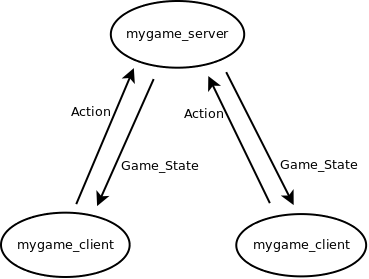
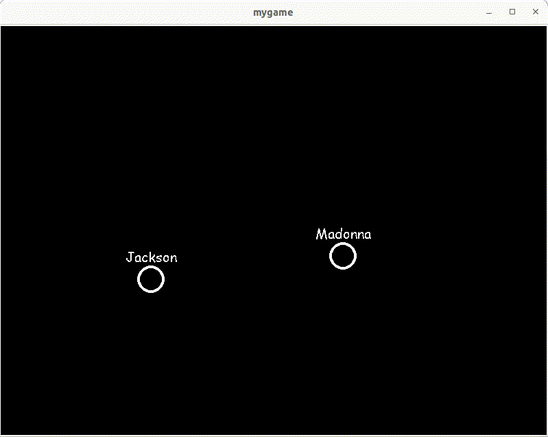

# MyGame Server

We kunnen ook zmq sockets gebruiken om een multiplayer computerspel te
schrijven.

## Protocol

In ons multiplayer computerspel stuurt een client in de elke tijstap
de acties die een gebruiker in het spel maakt naar de server in een
`Action` object. De server ontvangt de acties van alle spelers,
berekent de staat van het spel in de volgende tijdstap, en stuurt de
staat van het spel terug naar elke client in een `Game_State`
object. Elke client tekent vervolgens deze staat waarin dus de acties
van elke speler zit zodat zij gezamelijk hetzelfde spel spelen.



## mygame_client

Bestand [mygame_client.py](mygame_client.py) is een aanpasssing van
'status_client.py' en laat zien hoe elke tijdstap een `Action` object
naar de server wordt gestuurd met de actie van de gebruiker en het
daaropvolgende `Game_State` antwoord wordt getekend.

```python
import sys
import zmq
import pygame

from Action import Action
from Game_State import Game_State

def main(name, port, host):
    # connect to server
    context = zmq.Context()
    socket = context.socket(zmq.REQ)
    socket.connect(f"tcp://{host}:{port}")
    print(f"Connecting to port '{port}' of host '{host}'.")

    # start pygame
    pygame.init()
    display = pygame.display.set_mode((800, 600), pygame.RESIZABLE)
    pygame.display.set_caption('mygame')
    surface = pygame.display.get_surface()
    clock = pygame.time.Clock()
    background_color = (0,0,0)
    name_textures = Name_Textures()
    game_state = None
    
    running = True
    while running:
        display.fill(background_color)
        for event in pygame.event.get():
            if event.type == pygame.QUIT:
                running = False
        
        socket.send_pyobj(get_action(name, pygame.key.get_pressed())) # send action
        if game_state:
            game_state.draw(name,surface,name_textures) # draw while waiting for answer
        game_state = socket.recv_pyobj() # receive game_state
        #print("game_state:",game_state)
        
        pygame.display.flip()
        clock.tick(60) # run at 60 frames per second

def get_action(name,keys):
    acceleration=pygame.Vector2(0,0)
    accel=0.5
    if keys[pygame.K_LEFT] or keys[pygame.K_a]:
        acceleration.x -= accel
    if keys[pygame.K_RIGHT] or keys[pygame.K_d]:
        acceleration.x += accel
    if keys[pygame.K_UP] or keys[pygame.K_w]:
        acceleration.y -= accel
    if keys[pygame.K_DOWN] or keys[pygame.K_s]:
        acceleration.y += accel
    return Action(name, acceleration)

class Name_Textures: # class to generate and store textures of user names

    def __init__(self):
        self.name_textures={}

    def get_texture(self, name):
        if not name in self.name_textures:
            font = pygame.font.SysFont('Comic Sans MS', 20)
            name_texture = font.render(name, False, (255,255,255))
            self.name_textures[name] = name_texture
        return self.name_textures[name]
        
if __name__ == "__main__":
    name = "_"
    port = 2345
    host = "127.0.0.1"
    if len(sys.argv)>1:
        name = sys.argv[1]
    if len(sys.argv)>2:
        port = int(sys.argv[2])
    if len(sys.argv)>3:
        host = sys.argv[3]
    main(name, port, host)
```

## mygame_server

Bestand [mygame_server.py](mygame_server.py) is een aanpasssing van
'status_server.py' en laat zien hoe elke tijdstap de `Action` objecten
van de clients worden ontvangen, de `Game_State` wordt bijgewerkt en
teruggestuurd naar elke client.

```python
import sys
import zmq
import time
import pygame

from Action import Action
from Game_State import Game_State

def main(port, host):
    context = zmq.Context()
    socket = context.socket(zmq.REP)
    socket.bind(f"tcp://{host}:{port}")
    print(f"Waiting for clients on port '{port}' on host '{host}'.")
    prev_time = time.time()
    game_fps = 60
    actions = {}
    game_state = Game_State(pygame.Vector2(800,600))
    while True:
        try:
            action = socket.recv_pyobj(flags=zmq.NOBLOCK)
            #print("action:",action)
            actions[action.get_name()] = action
            socket.send_pyobj(game_state)
        except zmq.ZMQError as e:
            time.sleep(0.0005) # wait a bit
        current_time = time.time()
        elapsed_time = current_time - prev_time
        if elapsed_time > 1/game_fps: # when enough time has passed
            prev_time = current_time
            update_game_state(game_state, actions)

def update_game_state(game_state, actions):
    for name, action in actions.items():
        if name != '_':
            game_state.update(action)
            
if __name__ == "__main__":
    port = 2345
    host = "127.0.0.1"
    if len(sys.argv)>1:
        port = int(sys.argv[1])
    if len(sys.argv)>2:
        host = sys.argv[2]
    main(port, host)
```


## Server en Clients Starten

We starten eerst de mygame_server met:

```console
$ python mygame_server.py 
pygame 2.4.0 (SDL 2.26.4, Python 3.10.6)
Hello from the pygame community. https://www.pygame.org/contribute.html
Waiting for clients on port '2345' on host '127.0.0.1'.
```

En daarna twee clients met een gebruikersnaam als
command-line-argument. Vervolgens kan iedere gebruiker in hetzelfde
spel acties uitvoeren:

<table>
<tr>
<th>myclient_client</th>
<th>myclient_client</th>
</tr>
<tr>
<td>
  
```console
$ python mygame_client.py Jackson 
pygame 2.4.0 (SDL 2.26.4, Python 3.10.6)
Hello from the pygame community. https://www.pygame.org/contribute.html
Connecting to port '2345' of host '127.0.0.1'.
```

</td>
<td>

```console
$ python mygame_client.py Madonna
pygame 2.4.0 (SDL 2.26.4, Python 3.10.6)
Hello from the pygame community. https://www.pygame.org/contribute.html
Connecting to port '2345' of host '127.0.0.1'.
```

</td>
</tr>
</table>


