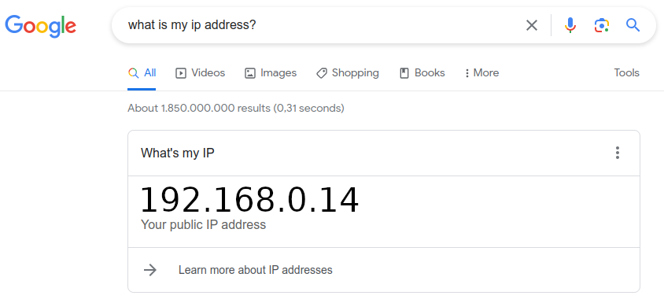
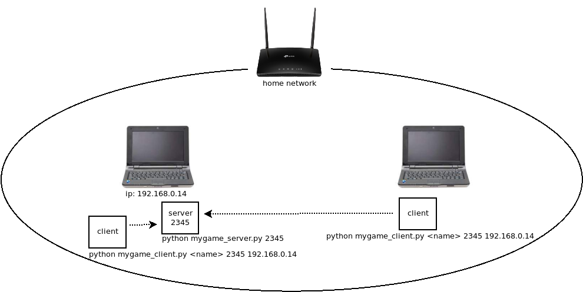
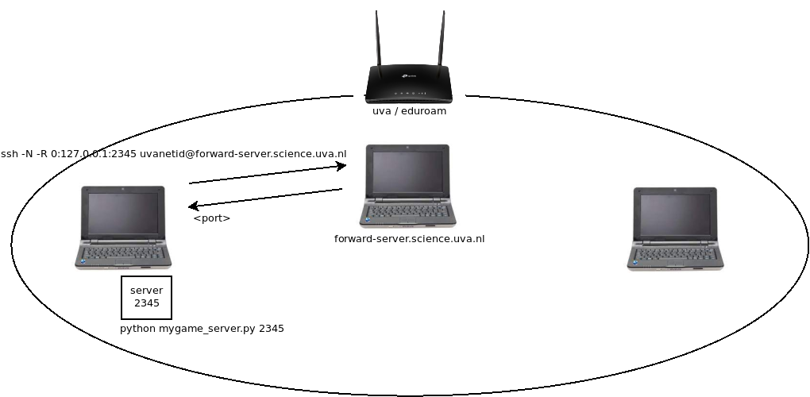
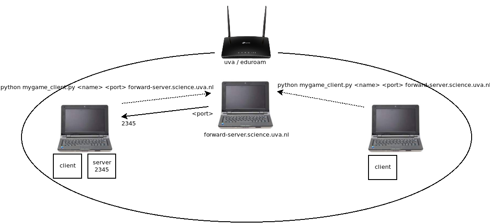

# Meerdere Computer

We willen een multi-player spel gezamelijk op meerdere computers
kunnen spelen.

## Thuis Netwerk

In een netwerk thuis is dat relatief aanvoudig. Op de computer waar de
server gaat runnen moeten we uitvinden wat het IP addres is. Dat kun je het
makkelijkst op die computer gewoon aan google vragen:



Daarna starten we de daar de server bv met port '2345', en starten we
de clients op verschillende computers in dit netwerk met port '2345'
en met als host het IP address bv '192.168.0.14'



## UvA / Eduroam Netwerk

Binnen het 'uva' en 'eduroam' netwerk ligt dit iets
ingewikkelder. Om security-redenen mogen computers in dit netwerk
namelijk niet direct verbindingen met elkaar maken, maar we kunnen
speciaal voor dit vak wel computer 'forward-server.science.uva.nl'
gebruiken om toch te verbinden.

Start eerst de server op je computer met bv port '2345'.

```
$ python mygame_server.py 2345
```

Open op die computer dan een nieuwe terminal en run daar:

```
$ ssh -N -R 0:127.0.0.1:2345 <uvanetid>@forward-server.science.uva.nl
```

waar '\<uvanetid\>' je studentnummer is. Type je password en daarna zie
je als antwoord bv:

```
Allocated port 39785 for remote forward to 127.0.0.1:2345
```

Dat betekent dat nu iedereen in het netwerk kan verbinden met
`forward-server.science.uva.nl` en port `39785` en dan wordt
doorgestuurd (ge-forward) naar jouw computer op poort `2345` zolang de
'ssh' verbinding in stand blijft.



Dat betekent dat we nu op computers in dit netwerk dus clients kunnen
laten verbinden met jouw server op poort `2345` met:

```
$ python mygame_client.py <name> 39785 forward-server.science.uva.nl
```



## SSH voor Windows

Om 'ssh' in Windows te gebruiken moet je een 'Windows PowerShell'
starten. Hierin kun je wel 'ssh' gebruiken terwijl dat niet in de
standaard command promt (cmd) kan. Zoek hiervoor op "powershell" in de
search box in of rond het Windows 'Start Menu'.
