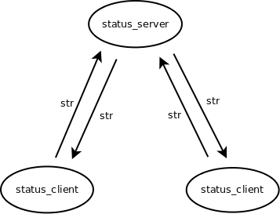

# Status Server

We passen de server iets aan zodat het de status van verschillende
gebruikers kan doorgeven. Gebruikers kunnen hierdoor via de server met
elkaar communiceren. Programma [status_server.py](status_server.py) is
een server die van elke client een string met een gebruikersnaam en
status krijgt. De server onthoudt alle strings in een dictionary, en
stuurt deze als antwoord naar elke client.

~~~python
import sys
import zmq
    
def split(line):
    index = line.find(':')
    return line[:index], line[index:]
    
def states_to_string(states):
    s = ""
    for name, state in states.items():
        s += "- " + name + state + '\n'
    return s
    
def main(port, host):
    context = zmq.Context()
    socket = context.socket(zmq.REP)
    socket.bind(f"tcp://{host}:{port}")
    print(f"Waiting for clients on port '{port}' on host '{host}'.")
    states = {}
    while True:
        line = socket.recv_string()
        name, status = split(line)
        if name != '_':
            print(f"received name: '{name}' status: '{status}'")
            states[name] = status
        socket.send_string(states_to_string(states))
    
    
if __name__ == "__main__":
    port = 2345
    host = "127.0.0.1"
    if len(sys.argv) > 1:
        port = int(sys.argv[1])
    if len(sys.argv) > 2:
        host = sys.argv[2]
    main(port, host)
~~~

Programma [status_client.py](status_client.py) is een client waarmee
een gebruiker haar status kan doorgeven en daarna de status van alle
gebruikers ontvangt en print.

~~~python
import sys
import zmq
import time
    
def main(name, port, host):
    context = zmq.Context()
    socket = context.socket(zmq.REQ)
    socket.connect(f"tcp://{host}:{port}")
    print(f"Connecting to port '{port}' of host '{host}'.")
    count = 0
    while True:
        if name != "_":
            line = input(f"{name}: ")  # blocks
            socket.send_string(f"{name}: {line}")  # send state
        else:
            time.sleep(2)  # every 2 seconds
            socket.send_string("_:")  # request state
        states = socket.recv_string() # receive answer
        print("-----------------", count)
        print(states)
        count += 1

if __name__ == "__main__":
    name = "_"
    port = 2345
    host = "127.0.0.1"
    if len(sys.argv) > 1:
        name = sys.argv[1]
    if len(sys.argv) > 2:
        port = int(sys.argv[2])
    if len(sys.argv) > 3:
        host = sys.argv[3]
    main(name, port, host)
~~~

## Server en Clients Starten

We starten eerst de status_server met:

~~~console
$ python status_server.py 
Waiting for clients on port '2345' on host '127.0.0.1'.
received name: 'Jackson' status: ': I'm BAD'
received name: 'Madonna' status: ': I am a material girl'
~~~

En daarna twee clients met een gebruikersnaam als
command-line-argument. Vervolgens kan iedere gebruiker zijn of haar
status doorgeven:

<table>
<tr>
<th>status_client</th>
<th>status_client</th>
</tr>
<tr>
<td>
  
~~~console
$ python status_client.py Jackson 
Connecting to port '2345' of host '127.0.0.1'.
Jackson: I'm BAD 
----------------- 0
- Jackson: I'm BAD

Jackson: 
~~~

</td>
<td>

~~~console
$ python status_client.py Madonna
Connecting to port '2345' of host '127.0.0.1'.
Madonna: I am a material girl
----------------- 0
- Jackson: I'm BAD
- Madonna: I am a material girl

Madonna: 
~~~

</td>
</tr>
</table>

Omdat de client moet wachten op invoer van de gebruiker moet een
gebruiker wel steeds een nieuwe status intypen voordat het de nieuwe
status van andere gebruikers kan ontvangen. Daarom kan je ook in de
client de speciale naam "_" opgeven. Met deze naam wordt niet op
invoer van de gebruiker gewacht, in plaats daarvan wordt elke twee
seconden de status van alle gebruikers bij de server opgevraagd:

~~~console
$ python status_client.py _
Connecting to port '2345' of host '127.0.0.1'.
----------------- 0
- Jackson: I'm BAD
- Madonna: I am a material girl

----------------- 1
- Jackson: I'm BAD
- Madonna: I am a material girl

----------------- 2
- Jackson: I'm BAD
- Madonna: I am a material girl
~~~

## Protocol

De client en server wisselen simpelweg strings uit. Een client stuurt
haar naam en status als string gescheiden door ":". De server stuurt
als antwoord een string met de naam en de laatse status van elke
client.

## Opdracht: Spelen

Lees de code en speel even met clients en server.
